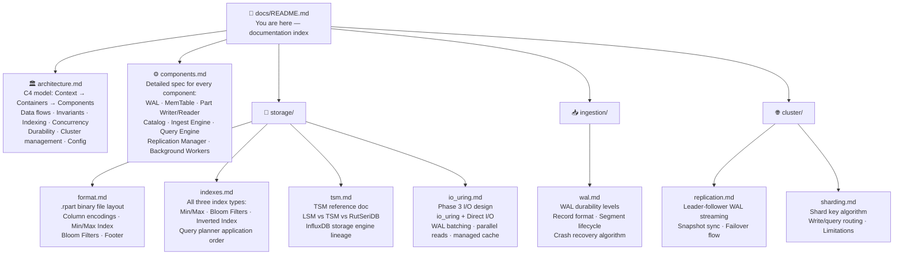
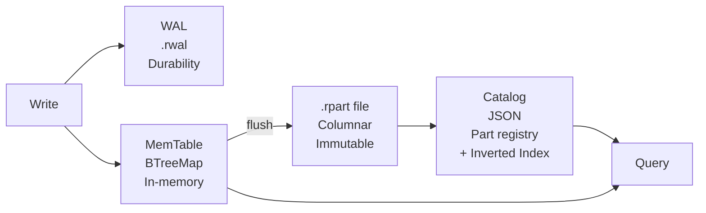
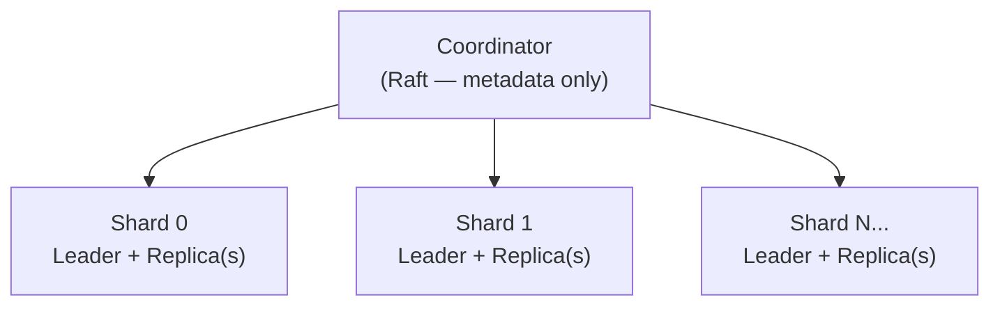

# RutSeriDB — Documentation

> **Version:** 0.1 (Draft) · **Last Updated:** 2026-04-17

Welcome to the RutSeriDB documentation. RutSeriDB is a distributed, scalable time-series database written in Rust, designed for high-throughput ingestion and efficient time-range analytical queries across a multi-node cluster.

---

## Quick Navigation

---

## Document Map

### Core Architecture

| Document | What to read it for |
|----------|---------------------|
| [architecture.md](./architecture.md) | **Start here.** Full system overview using the C4 model. Understand system boundaries, how components relate, all data flows, invariants, indexing strategy, concurrency model, durability guarantees, cluster management, and configuration. |
| [components.md](./components.md) | Deep-dive into each individual component. Read this when implementing or debugging a specific subsystem. |

### Storage Engine

| Document | What to read it for |
|----------|---------------------|
| [storage/format.md](./storage/format.md) | Binary layout of `.rpart` files. Read when implementing the Part writer/reader, or understanding how data is laid out on disk. |
| [storage/indexes.md](./storage/indexes.md) | How indexes work: Min/Max (all columns), Bloom Filters (tags + fields), and the Inverted Index (tag→Part IDs in Catalog). Read when implementing the query planner or the Index Builder worker. |
| [storage/tsm.md](./storage/tsm.md) | Reference document explaining InfluxDB's TSM engine and how RutSeriDB's storage design relates to it. Read for design context and to understand why we chose true columnar over per-series columnar. |
| [storage/io_uring.md](./storage/io_uring.md) | Phase 3 I/O performance design: io_uring + Direct I/O for WAL, Part reads, and Part writes. Read when implementing Phase 3 or reasoning about I/O latency. |

### Ingestion

| Document | What to read it for |
|----------|---------------------|
| [ingestion/wal.md](./ingestion/wal.md) | WAL file format, durability levels (`Async` / `Sync` / `SyncBatch`), crash recovery algorithm, and interaction with replication. Read when implementing WAL or reasoning about data loss guarantees. |

### Cluster

| Document | What to read it for |
|----------|---------------------|
| [cluster/replication.md](./cluster/replication.md) | How WAL entries stream from shard leaders to replicas. Snapshot sync for re-joining replicas. Failover and leader promotion. |
| [cluster/sharding.md](./cluster/sharding.md) | How writes and queries are routed to the correct shard. Shard key algorithm, shard map, trade-offs, and v2 improvements. |

---

## Key Concepts at a Glance

### Data Model

RutSeriDB stores **time-series rows**. Each row has:
- A **timestamp** (nanoseconds since Unix epoch)
- A set of **tags** — string key-value pairs that identify the time series (e.g. `host=web-01, region=us-east`)
- A set of **fields** — typed measurement values (float, int, bool, string)

Tags vs fields:
- **Tags** → low cardinality, used for grouping and filtering, determine shard routing
- **Fields** → the actual measurements (cpu usage, memory, temperature, …)

### Storage Pipeline

### Cluster Topology

- **Coordinator** nodes manage metadata (table schemas, shard assignments) via Raft consensus
- **Storage Nodes** hold the actual data — each shard's data lives on `replication_factor` nodes
- Data is sharded by `hash(primary_tags) % num_shards` — different time-series live on different shards
- This is the same pattern as **Kafka KRaft**: Raft for metadata, leader-follower streaming for data

### Index Stack

Queries prune data in three layers before doing any column I/O:

---

## Implementation Phases

| Phase | Focus | Status |
|-------|-------|--------|
| **Phase 0** | Single-node: WAL · MemTable · Shard Actor+oneshot · .rpart format · Catalog · Local query engine · All indexes · Background workers | 🔲 Not started |
| **Phase 1** | Distribution: Shard routing · Coordinator Raft catalog · Query fan-out · WAL replication | 🔲 Not started |
| **Phase 2** | Hardening: Prometheus metrics · Admin API · Failover · Shard rebalancing | 🔲 Not started |
| **Phase 3** | I/O Performance: io_uring + Direct I/O · WAL batch submit · Parallel column reads · Managed buffer pool | 🔲 Not started |

---

## Design Decisions (Summary)

| # | Decision | Choice | Why |
|---|----------|--------|-----|
| D1 | Write concurrency | Shard Actor task + `oneshot` per request + group commit | No Tokio thread blocking during WAL fsync; N clients → 1 fsync |
| D2 | Replication | Async WAL streaming | Simpler than per-shard Raft; TSDB tolerates bounded lag |
| D3 | Shard assignment | Hash of primary tags | Static, deterministic, no rehashing |
| D4 | Time partition | Hourly | Balances file count vs. selectivity |
| D5 | Compression | LZ4 | Speed > ratio for hot TSDB data |
| D6 | Durability default | SyncBatch 10 ms | Safety + throughput balance |
| D7 | Disk format | Custom columnar `.rpart` | Full control; Parquet-inspired but simpler |
| D8 | Cluster consistency | **CP + AP hybrid** — Raft (schema/shard map) + SWIM Gossip (membership) | Gossip is leaderless and AP; Raft only where strong consistency is truly needed |
| D9 | Query execution | Coordinator fan-out | Simple; Coordinator not a write bottleneck |
| D10 | Index types | Min/Max + Bloom + Inverted | Zero write-path overhead; async backfill |
| D11 | Ingest write model | Actor + `oneshot` + group commit drain | Zero thread blocking; free cancellation; natural group commit |

Full rationale for each: [architecture.md § Design Decision Log](./architecture.md#design-decision-log)

---

## Frequently Asked Questions

**Q: Do all nodes store the same data?**
No. Data is sharded — each storage node only stores data for its assigned shards. Raft is only used for cluster *metadata*, not time-series data. See [cluster/sharding.md](./cluster/sharding.md).

**Q: Why not LSM Tree + SSTable?**
TSDB writes are already sequential (timestamps increase monotonically), so LSM's random-write optimization isn't needed. RutSeriDB uses a TSM-inspired design (time-partitioned immutable files) with true columnar storage for better analytical query performance. See [storage/tsm.md](./storage/tsm.md).

**Q: How many index types are supported?**
Three: Min/Max per column (all columns), Bloom Filters (tags + low-cardinality fields), and an Inverted Index (tag→Part IDs in the Catalog). See [storage/indexes.md](./storage/indexes.md).

**Q: What happens during a node failure?**
The Coordinator detects the failure via missed heartbeats (5 s), then promotes the replica with the highest replication offset to shard leader. See [cluster/replication.md](./cluster/replication.md).

**Q: Is this similar to Kafka KRaft?**
Yes — the high-level pattern is identical: Raft for metadata consensus (Coordinator ≈ KRaft controllers), leader-follower streaming for data (Storage Nodes ≈ Kafka brokers), data partitioned by hash (shards ≈ partitions).

**Q: Why use both Raft and SWIM Gossip together?**
Raft (CP) is used for things that must be exactly consistent everywhere: table schemas and the shard-to-node map. SWIM Gossip (AP) is used for node liveness and failure detection — it propagates in O(log N) rounds, works even when the Raft leader is unreachable, and has no leader election overhead. Once gossip declares a node Dead, Raft is triggered only for leader election of the affected shards. This is the same pattern used by CockroachDB and Consul.

**Q: How does the ingest write path avoid blocking Tokio threads?**
Each ingest request creates a `oneshot::channel` (a "queue of 1" for the response), packages the batch with the sender into the shard's `mpsc` dispatch queue, then parks at `rx.await`. The Shard Actor drains all pending requests, coalesces them into one WAL write, does a single `fsync()`, inserts into MemTable, then fires `tx.send(OK)` for every waiting client simultaneously. This means N clients share one `fsync` (group commit) with no thread blocking and free cancellation detection. See [components.md § Ingest Engine](./components.md).
