# RutSeriDB — Architecture (C4 Model)

> **Version:** 0.1 (Draft) · **Last Updated:** 2026-04-17 · **Status:** In Review

This document describes the architecture of **RutSeriDB**, a distributed, scalable time-series database built in Rust. It follows the [C4 model](https://c4model.com/) (Context → Containers → Components → Code) and covers key design decisions, invariants, data flows, and concurrency strategy.

---

## Table of Contents

1. [Goals & Non-Goals](#goals--non-goals)
2. [C1 — System Context](#c1--system-context)
3. [C2 — Container Diagram](#c2--container-diagram)
4. [C3 — Component Diagrams](#c3--component-diagrams)
5. [Data Flows](#data-flows)
6. [Core Invariants](#core-invariants)
7. [Indexing](#indexing)
8. [Concurrency & Threading Model](#concurrency--threading-model)
9. [Memory Management](#memory-management)
10. [Durability & Recovery](#durability--recovery)
11. [Cluster Management](#cluster-management)
12. [Configuration Reference](#configuration-reference)
13. [Design Decision Log](#design-decision-log)
14. [Implementation Checklist](#implementation-checklist)
15. [Open Questions](#open-questions)
16. [Future Work](#future-work)

---

## Goals & Non-Goals

### Goals (v1)

| # | Goal |
|---|------|
| G1 | Horizontal scalability — ingestion and storage scale with more nodes |
| G2 | High write throughput with configurable durability |
| G3 | Efficient time-range and tag-based queries |
| G4 | Fault tolerance — cluster survives minority node failures |
| G5 | SQL-like query surface over time-series data |
| G6 | Operational simplicity — single binary per role, no external dependencies |

### Non-Goals (v1)

| # | Non-Goal | Reason |
|---|----------|--------|
| NG1 | Full SQL compatibility | TSDBs have domain-specific query patterns |
| NG2 | Multi-tenant isolation | Single database instance per cluster |
| NG3 | Arbitrary user-defined secondary indexes | B-tree / hash indexes on arbitrary field columns are out of scope; supported indexes are listed in [storage/indexes.md](./storage/indexes.md) |
| NG4 | ACID transactions across shards | Eventual consistency on replicas is acceptable |
| NG5 | Kubernetes operator / cloud-native autoscaling | Out of scope for v1 |

---

## C1 — System Context

Who interacts with RutSeriDB and what external systems does it depend on?

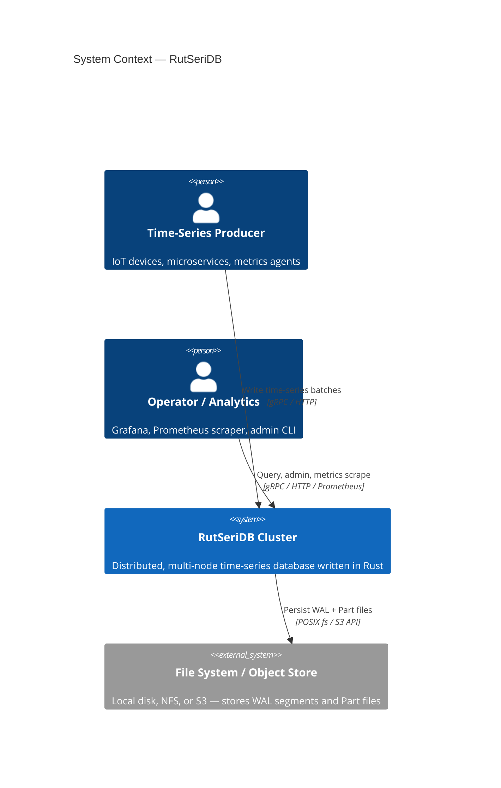

### External Interfaces

| Interface | Protocol | Direction | Description |
|-----------|----------|-----------|-------------|
| Write API | gRPC / HTTP/2 | Inbound | Batch ingest of time-series rows |
| Query API | gRPC / HTTP/2 | Inbound | SQL-like queries, streaming results |
| Admin API | HTTP REST | Inbound | Cluster management, health, schema ops |
| Metrics Export | Prometheus text | Outbound | Internal observability metrics |
| Storage | POSIX fs / S3 | Outbound | Durable WAL segments + columnar Part files |

---

## C2 — Container Diagram

A **container** is a deployable unit. RutSeriDB uses three roles, all compiled from one binary (`rutseridb --role=…`).

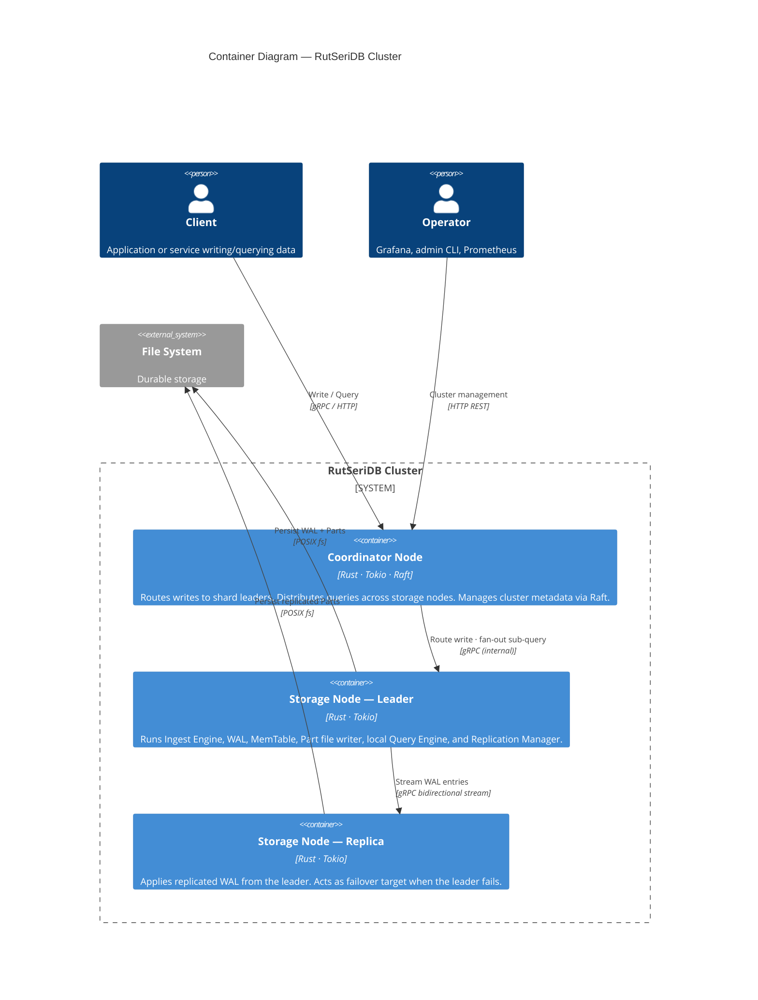

### Container Summary

| Container | Role | Instances | Notes |
|-----------|------|-----------|-------|
| **Coordinator** | Routing, catalog, query fan-out | 1–3 (odd, for Raft quorum) | Raft group replicates metadata only |
| **Storage Node** | Ingest, store, replicate, query locally | ≥ 1 per shard | Each shard has 1 leader + N replicas |
| **Dev mode** | All roles in one process | 1 | `--role=dev` for local development |

---

## C3 — Component Diagrams

### Coordinator Node

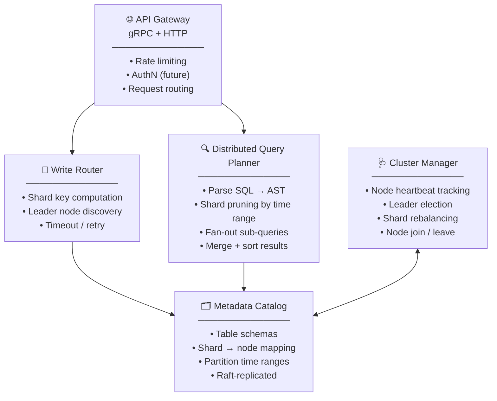

---

### Storage Node

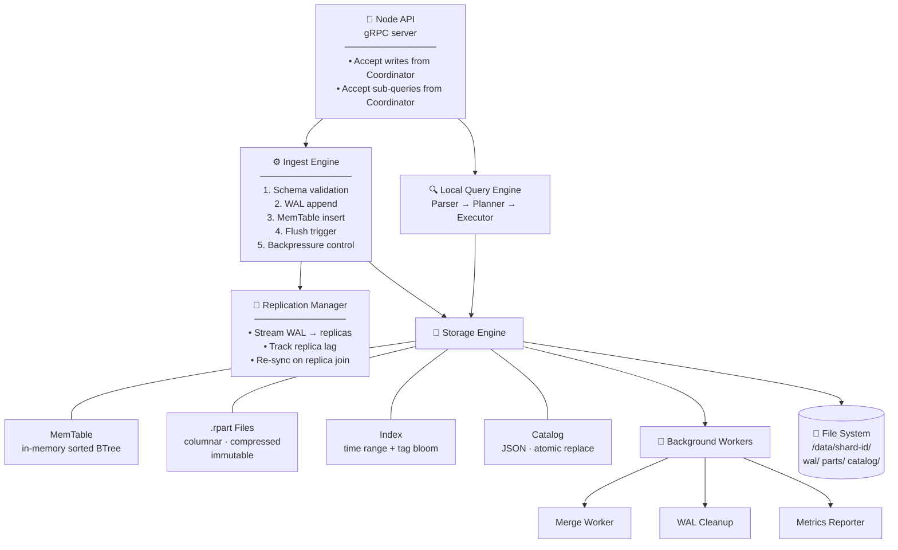

---

### Query Engine — Distributed Execution Model

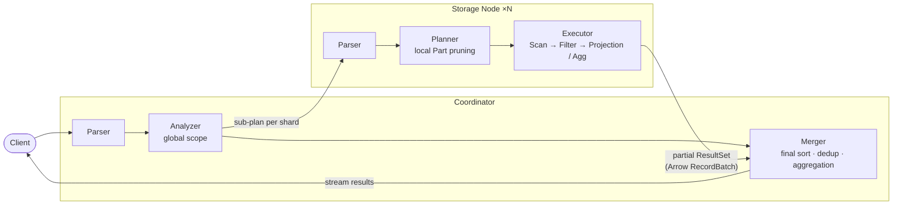

---

## Data Flows

### Ingestion Path

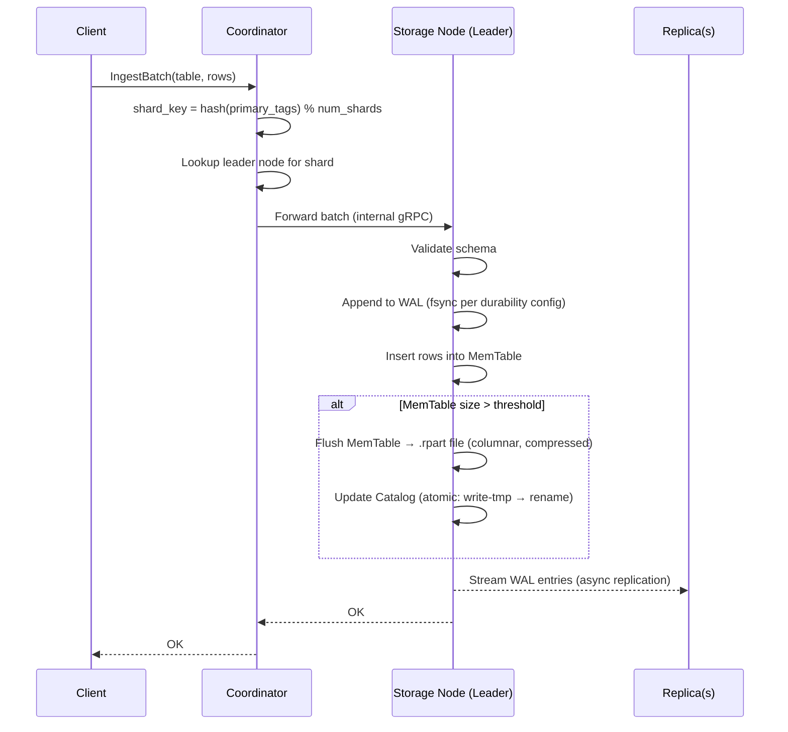

**Steps in detail:**

| Step | Description |
|------|-------------|
| 1. Shard routing | `shard_key = hash(primary_tags) % num_shards`; resolve leader |
| 2. Schema validation | Check column types, required primary tags |
| 3. WAL append | Serialize batch; write to WAL; fsync per durability level |
| 4. MemTable insert | Insert rows into in-memory sorted structure by `(timestamp, tag_hash)` |
| 5. Flush decision | Triggered when MemTable bytes > threshold (default 64 MB) |
| 6. Part creation | Columnar `.rpart` file written (compressed, immutable) via atomic rename |
| 7. Catalog update | Atomic entry added for the new Part |
| 8. Replication | WAL tail streamed asynchronously to replica nodes |
| 9. Acknowledge | `OK` returned to coordinator → client |

---

### Query Path

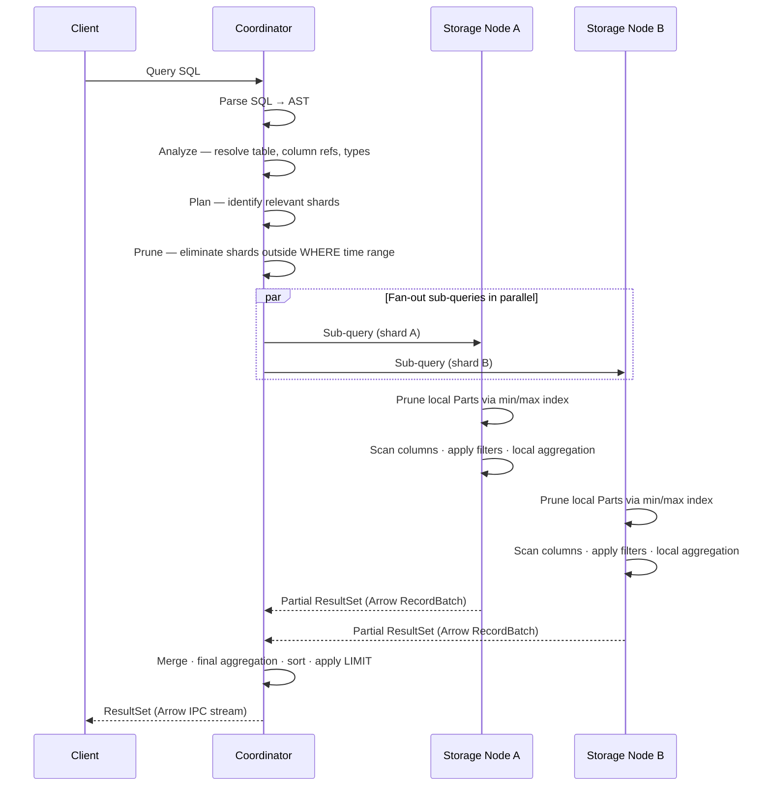

---

### Replication Flow

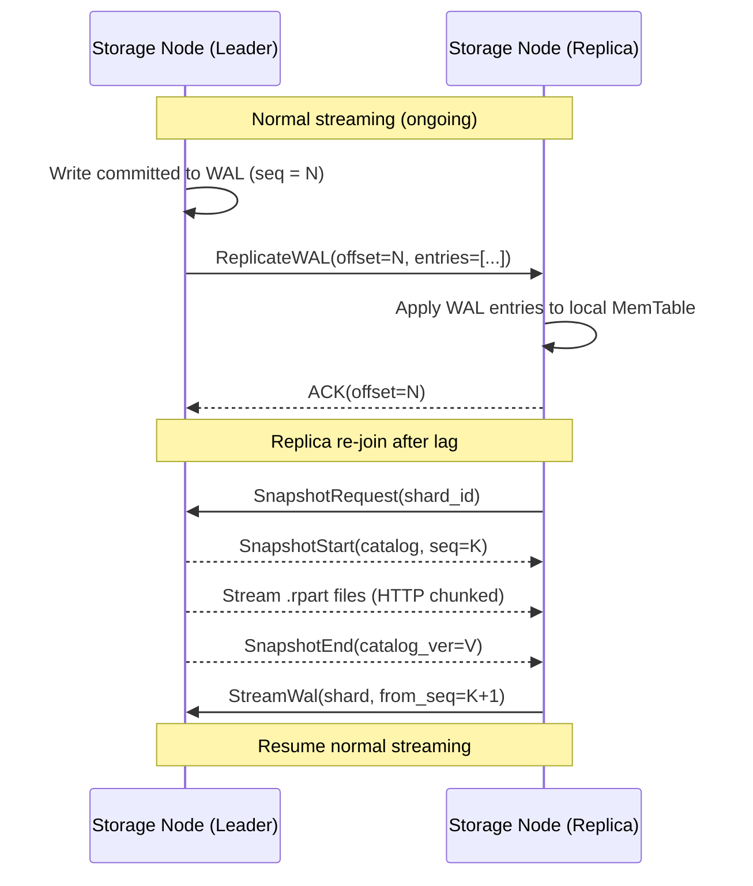

---

## Core Invariants

| ID | Invariant | Enforcement |
|----|-----------|-------------|
| I1 | **Timestamp ordering** — within a single Part, rows sorted by `timestamp` ascending | MemTable maintains sorted order; Part writer verifies on flush |
| I2 | **Part immutability** — once written, a Part file is never modified | Parts written atomically (write-tmp → rename); no update API |
| I3 | **WAL-before-acknowledge** — no write ACK'd until WAL persisted on leader | Shard Actor sends `oneshot::send(OK)` only after WAL fsync completes |
| I4 | **Single writer per shard** — at most one task mutates a shard's MemTable at a time | Per-shard `mpsc` dispatch queue + dedicated Shard Actor task (replaces Mutex) |
| I5 | **Catalog consistency** — catalog reflects all committed Parts | Catalog update is final step of flush; atomic file replace |
| I6 | **Shard key stability** — a row's shard never changes after first write | Shard key function is frozen at cluster creation |
| I7 | **Monotone replication offset** — replica's applied offset never decreases | WAL protocol rejects out-of-order entries |

---

## Indexing

RutSeriDB supports three index types. All are **read-path only** — they never affect write throughput or Part immutability. See [storage/indexes.md](./storage/indexes.md) for full specifications.

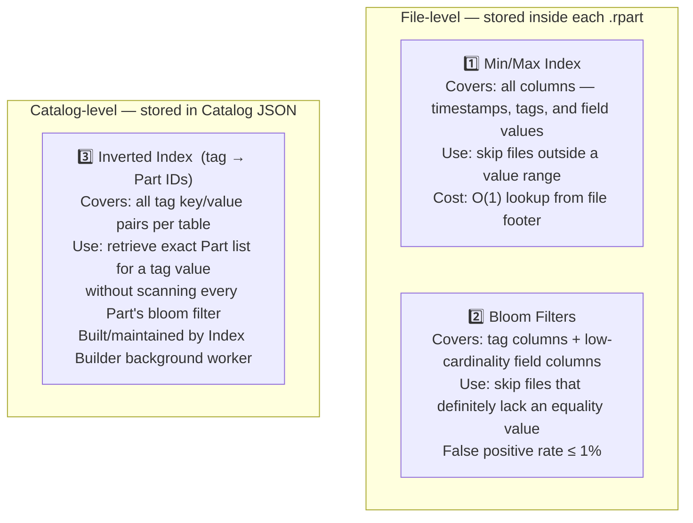

### Index Application Order in the Query Planner

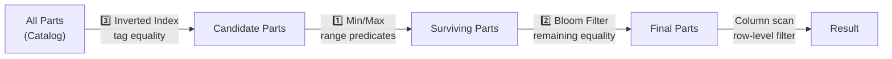

---

## Concurrency & Threading Model

### Per-Node Thread Architecture

| Thread / Pool | Count | Responsibility |
|---------------|-------|----------------|
| **Async Runtime** (Tokio) | `num_cpus` workers | Accept connections, orchestrate async tasks; client handlers park at `rx.await` |
| **Shard Actor** (per shard) | 1 Tokio task per shard | Drains dispatch queue, coalesces batches, WAL append+fsync, MemTable insert, fires oneshot ACKs |
| **Blocking I/O Pool** | `num_cpus / 2` | Part file reads/writes (`spawn_blocking`) |
| **Replication** | 1 per replica peer | WAL streaming, ACK handling |
| **Background** | 1 | Merge, WAL cleanup, metrics, Index Builder |

### Design Options Considered

| Option | Pros | Cons | Decision |
|--------|------|------|----------|
| **Actor task + oneshot per request** | Zero blocking; natural group commit; cancellation-safe | Slightly more complex dispatch routing | ✅ v1 |
| Mutex per shard | Simple | Blocks Tokio thread during WAL fsync (~1ms) | ❌ Replaced |
| Sharded fine-grained writers | Higher write throughput | Complex partitioning logic | Deferred v2 |
| Lock-free MemTable | Maximum concurrency | High implementation complexity | Deferred v2 |

**Rationale:** The Actor+oneshot model avoids blocking Tokio threads entirely during WAL fsync, enables natural group commit (drain queue → one fsync covers N clients), and provides free cancellation detection when clients disconnect (dropped `rx` → `tx.send()` returns `Err`).

---

## Memory Management

### Per-Node Memory Budgets

| Component | Default | Configurable |
|-----------|---------|--------------|
| MemTable (per shard) | 64 MB | Yes |
| Read Buffer Pool | 128 MB | Yes |
| Index / Bloom Cache | 32 MB | Yes |
| Replication Buffer | 16 MB | Yes |
| **Node Total Target** | ~256 MB | Yes |

### Backpressure Strategy

| Condition | Response |
|-----------|----------|
| MemTable full | Block new writes; trigger async flush |
| Read buffer exhausted | Queue queries; apply timeout |
| Index cache full | Evict LRU entries |
| Replication buffer full | Apply backpressure to ingest |

---

## Durability & Recovery

### Write Durability Levels

| Level | Behaviour | Latency | Safety |
|-------|-----------|---------|--------|
| `Async` | WAL buffered, no fsync | ~μs | Data loss possible on crash |
| `Sync` | WAL + fsync per batch | ~ms | Durable after ACK |
| `SyncBatch` *(default)* | fsync on background timer | ~ms amortized | Durable within configured window |

**Default:** `SyncBatch` with a 10 ms window.

### Crash Recovery Flow

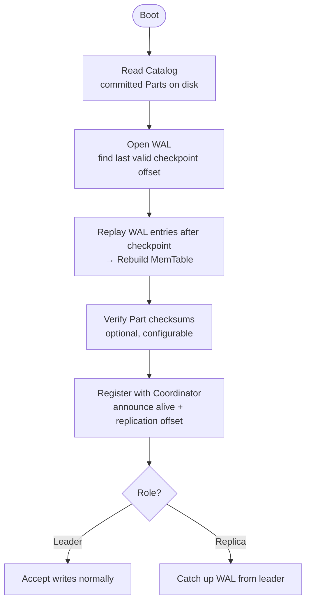

**Guarantee:** All acknowledged writes at the configured durability level are recovered after a crash.

---

## Cluster Management

### Topology Model

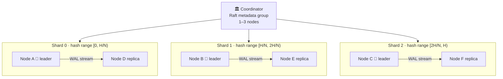

### Key Cluster Operations

| Operation | Mechanism |
|-----------|-----------|
| **Leader election** | Coordinator promotes replica with highest replication offset |
| **Node join** | New node registers; receives shard assignment; starts WAL sync |
| **Node failure** | Coordinator detects via heartbeat timeout (5 s); promotes replica |
| **Shard rebalancing** | Coordinate Part migration + catalog update *(v2)* |
| **Scaling out** | Add nodes; assign new shards and migrate data *(v2)* |

### Heartbeat & Failure Detection

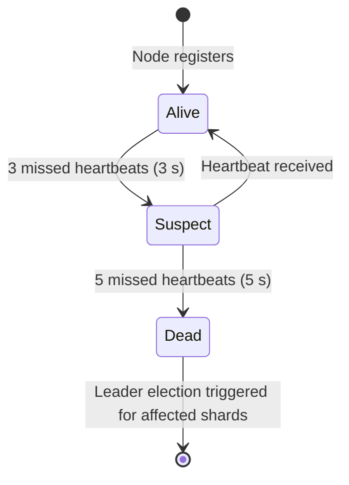

### Shard Key Computation

Each write batch is routed by hashing the **primary tag set**:

- Tags sorted alphabetically (deterministic)
- xxHash64 over `key=value\0` pairs
- Result: `hash % num_shards` → shard index

`num_shards` is fixed at cluster creation. Changing it requires a full data migration.

---

## Configuration Reference

All configuration is provided via a TOML file. Key sections:

| Section | Key Parameters |
|---------|---------------|
| `[cluster]` | `node_id`, `role`, `advertise_addr`, `coordinator`, `num_shards`, `replication_factor` |
| `[storage]` | `data_dir` |
| `[memory]` | `memtable_size_bytes`, `read_buffer_size_bytes`, `index_cache_size_bytes`, `replication_buffer_bytes` |
| `[durability]` | `level` (`async`/`sync`/`sync_batch`), `interval_ms` |
| `[threads]` | `async_worker_threads`, `blocking_io_threads`, `background_enabled` |
| `[merge]` | `enabled`, `max_parts_per_partition`, `target_part_size_bytes` |
| `[indexes]` | `inverted.enabled`, `inverted.tag_columns`, `inverted.max_values_per_key` |
| `[io_uring]` | `enabled` (Phase 3), `sqpoll` (advanced), `registered_buffer_count`, `wal_direct_io`, `part_direct_io` |
| `[tables.<name>]` | `partition_duration`, `compression`, `primary_tags` |

---

## Design Decision Log

| # | Decision | Choice | Alternatives | Rationale |
|---|----------|--------|--------------|-----------|
| D1 | Concurrency model | Single writer per shard | Global single writer, lock-free | Parallelism across shards; simplicity within |
| D2 | Replication model | Async WAL streaming (leader-follower) | Raft per shard, synchronous replication | Simpler than per-shard Raft; acceptable for TSDB |
| D3 | Shard assignment | Hash of primary tag set | Range-based, consistent hashing ring | Simpler; static `num_shards` avoids rehashing |
| D4 | Partition granularity | Hourly | Daily, 15-min | Balances file count vs. query selectivity |
| D5 | Default compression | LZ4 | Zstd, None | Speed over ratio for time-series hot data |
| D6 | Durability default | SyncBatch 10 ms | Sync, Async | Balances safety and write throughput |
| D7 | Storage format | Custom `.rpart` (columnar) | Parquet, Apache Arrow | Full control; learning objective |
| D8 | Coordinator consensus | Raft (single group, metadata only) | etcd external, ZooKeeper | No external deps; metadata is small |
| D9 | Query distribution | Coordinator fan-out | Push-down-only, Spark-like | Simpler model; Coordinator is not a write bottleneck |
| D10 | Index types | Min/Max (all columns) + Bloom Filters (tags + low-cardinality fields) + Inverted (tag→Parts in Catalog) | Full B-tree / hash secondary indexes | Zero write-path cost for file-level indexes; inverted index backfill is async |
| D11 | Ingest write concurrency | Actor task per shard + `oneshot` per request + group commit drain | Mutex per shard, thread per client | Actor never blocks Tokio thread; drain queue → one `fsync` covers N clients; free cancellation via dropped `rx` |

---

## Implementation Checklist

### Phase 0 — Single Node, No Replication

- [ ] `RutSeriConfig` + all sub-configs; TOML loading and validation
- [ ] WAL: append, fsync, CRC verification, replay
- [ ] MemTable: sorted by timestamp; configurable flush threshold
- [ ] **Shard Actor** + per-shard `mpsc` dispatch queue
  - [ ] `oneshot::channel` per ingest request (client parks at `rx.await`)
  - [ ] Drain queue before each `fsync` (group commit)
  - [ ] Cancellation safety: detect dropped `rx` via `tx.send()` returning `Err`
- [ ] `.rpart` columnar file writer + reader (with LZ4)
  - [ ] Min/Max Index for all columns (built at flush time)
  - [ ] Bloom Filters for tag columns + configured field columns (built at flush time)
- [ ] Local Catalog: JSON, atomic replace
  - [ ] Inverted index schema in Catalog
- [ ] Local Query Engine: parse → plan → scan → aggregate
  - [ ] Index-aware planner (apply Inverted → Min/Max → Bloom in order)
- [ ] gRPC / HTTP API server (ingest + query endpoints)
- [ ] Background workers: Merge, WAL cleanup, Metrics, **Index Builder**

### Phase 1 — Distribution

- [ ] Shard key computation
- [ ] Coordinator: Raft-replicated Metadata Catalog
- [ ] Coordinator: Write Router
- [ ] Coordinator: Query fan-out + result merger
  - [ ] Inverted index lookup in distributed query planning
- [ ] Storage Node: internal gRPC server
- [ ] Storage Node: WAL replication (leader → replica streaming)
  - [ ] Inverted index replicated as part of Catalog replication
- [ ] Cluster Manager: heartbeat, leader election, node registration

### Phase 2 — Operations & Hardening

- [ ] Prometheus metrics endpoint
- [ ] Admin API (cluster status, table stats, shard info)
- [ ] Automatic leader promotion on node failure
- [ ] Shard rebalancing
- [ ] Per-table resource quotas

### Phase 3 — I/O Performance (io_uring + Direct I/O)

See [storage/io_uring.md](./storage/io_uring.md) for the full design.

- [ ] WAL writer: switch to `tokio-uring`; batch writes per `SyncBatch` window; `O_DIRECT | O_DSYNC`
  - [ ] Pad WAL records to 512-byte boundaries for Direct I/O alignment
- [ ] `.rpart` v2 format: 4096-byte aligned column block offsets
  - [ ] Update Part writer to emit aligned format
  - [ ] Reader: detect v2 and use `O_DIRECT`; fall back to buffered I/O for v1
- [ ] Part reader: `io_uring` batch submit for all columns per query
  - [ ] Register read buffer pool with kernel (`IORING_REGISTER_BUFFERS`)
  - [ ] Parallel LZ4 decode with Rayon after completions
- [ ] Part writer (flush): `O_DIRECT` to prevent cold-data page cache pollution
- [ ] Managed read buffer pool (LRU, keyed by `part_id + col_idx`)
  - [ ] Expose pool hit/miss ratio via Prometheus metrics

---

## Open Questions

| # | Question | Impact |
|---|----------|--------|
| Q1 | **Shard count mutability** — Can `num_shards` change post-creation? Requires full rehash. | High |
| Q2 | **Follower reads** — Allow stale reads from replicas to reduce leader load? | Medium |
| Q3 | **Cross-shard transactions** — Should multi-table or multi-shard atomic writes ever be supported? | Medium |
| Q4 | **Hot config reload** — Can table configs or memory limits be updated at runtime? | Low |
| Q5 | **Object storage (S3)** — Should `.rpart` files be tiered to S3 for cold data? | Medium |
| Q6 | **Compaction policy** — Time-based TTL + LRU eviction for old Parts? | Medium |

---

## Future Work

- **Follower reads** — stale reads from replicas with bounded lag
- **S3 tiering** — automatic offload of cold Parts to object storage
- **io_uring + Direct I/O** — batch WAL writes, parallel column reads, O_DIRECT Part flush to eliminate cache pollution; see [storage/io_uring.md](./storage/io_uring.md)
- **Kubernetes operator** — automated cluster lifecycle management
- **Multi-tenancy** — namespace isolation with per-tenant quotas
- **Native Grafana datasource plugin**
- **Continuous aggregation** — pre-compute rollups at ingest time
- **PromQL / InfluxQL compatibility** — broader ecosystem adoption

---

## Related Documents

| Document | Description |
|----------|-------------|
| [components.md](./components.md) | Detailed component specifications |
| [storage/format.md](./storage/format.md) | `.rpart` file format |
| [storage/indexes.md](./storage/indexes.md) | Index design — Min/Max, Bloom Filters, Inverted Index |
| [ingestion/wal.md](./ingestion/wal.md) | WAL format and durability guarantees |
| [cluster/replication.md](./cluster/replication.md) | Replication protocol details |
| [cluster/sharding.md](./cluster/sharding.md) | Shard key design and routing |
| [storage/tsm.md](./storage/tsm.md) | TSM reference — how RutSeriDB's storage relates to InfluxDB's TSM engine |
| [storage/io_uring.md](./storage/io_uring.md) | Phase 3 io_uring + Direct I/O design — WAL batching, parallel column reads, managed buffer pool |
