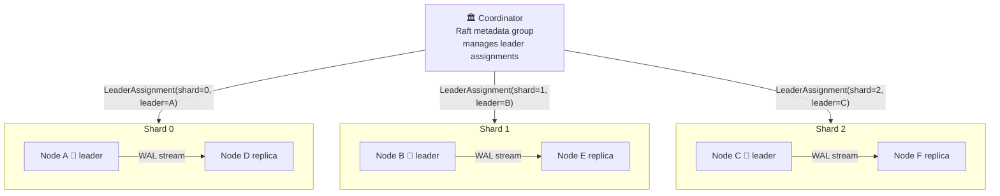
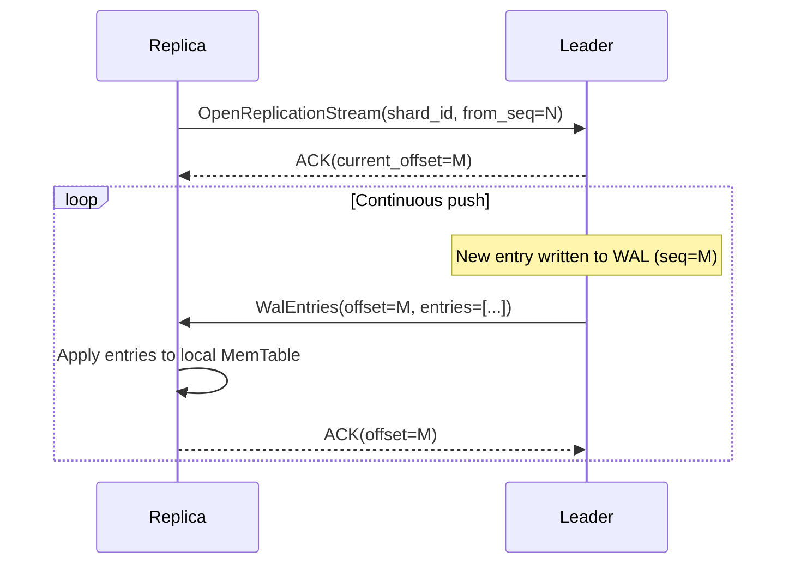
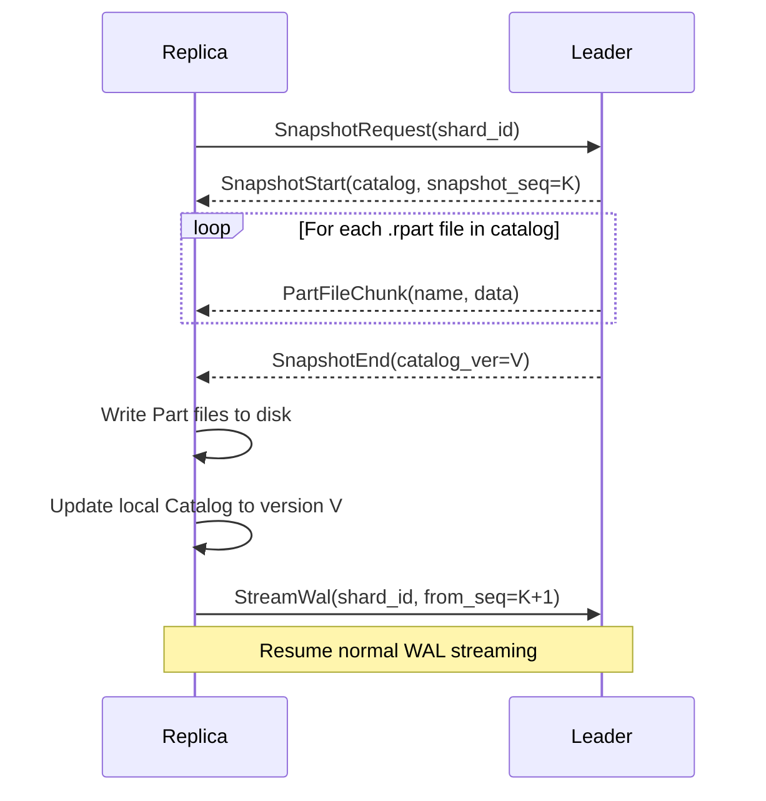
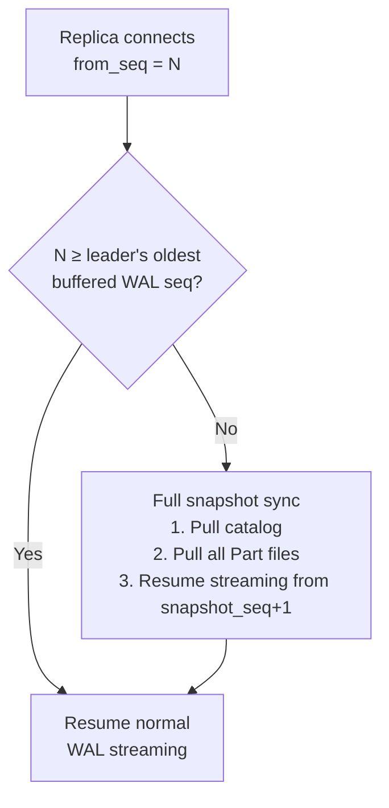
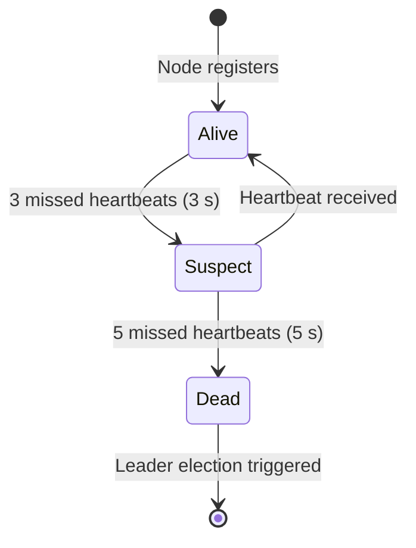
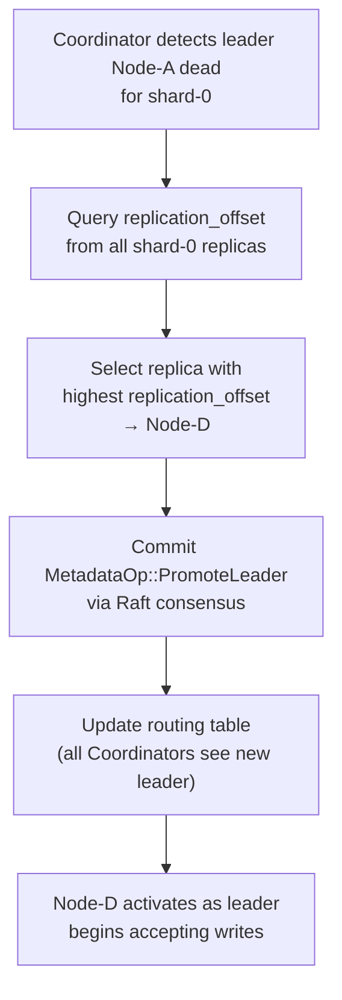

# RutSeriDB — Replication Protocol

> **Related:** [architecture.md](../architecture.md) · [components.md](../components.md)
> **Version:** 0.1 (Draft)

---

## Model

RutSeriDB uses **asynchronous leader-follower replication** per shard. Leader assignment is managed by a single Raft group on the Coordinator (not a per-shard Raft instance).

---

## Normal Operation — WAL Streaming

The leader pushes WAL entries immediately after writing them to its own log. The replica applies entries in-order and ACKs after each batch.

### Transport

| Property | Detail |
|----------|--------|
| Protocol | gRPC bidirectional streaming |
| Buffer | Leader keeps last `replication_buffer_bytes` of WAL in memory |
| ACK frequency | After each batch application |

---

## Snapshot Sync (Replica Re-Join)

When a replica's `from_seq` is older than the leader's oldest buffered WAL entry, a full snapshot sync is required before resuming streaming.

### When Snapshot Sync is Triggered

---

## Failover

### Detection

The Coordinator detects node failures via missed heartbeats:

### Promotion Flow

### Data Safety Note

If Node-A had WAL entries **not yet replicated** to Node-D at the time of failure, those entries are lost. This is an explicit trade-off of the async replication model:

> Only writes acknowledged by the **leader's WAL** (per durability config) are guaranteed. Replica lag is best-effort.

---

## gRPC Service Interface

The Replication Manager exposes the following service on each Storage Node:

| RPC | Direction | Description |
|-----|-----------|-------------|
| `StreamWal(shard_id, from_seq)` | Leader → Replica | Bidirectional streaming WAL push |
| `SnapshotRequest(shard_id)` | Replica → Leader | Initiate snapshot sync |

---

## Consistency Guarantees

| Guarantee | Detail |
|-----------|--------|
| **Read-your-writes** | Reads routed to leader only (default) — guaranteed |
| **Monotonic reads** | Leader-only reads are monotonic by definition |
| **Stale reads** *(opt-in, v2)* | Follower reads allowed with configurable max-lag threshold |
| **Replication lag** | No hard bound; replica is best-effort async |
| **Max data loss window** | Time since last replication ACK — typically < 100 ms on LAN |
