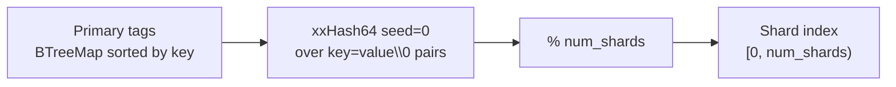
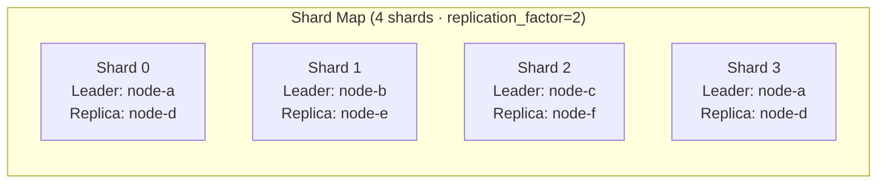
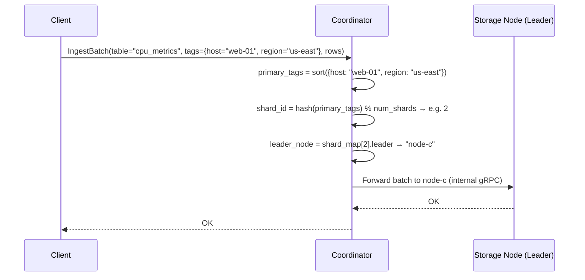
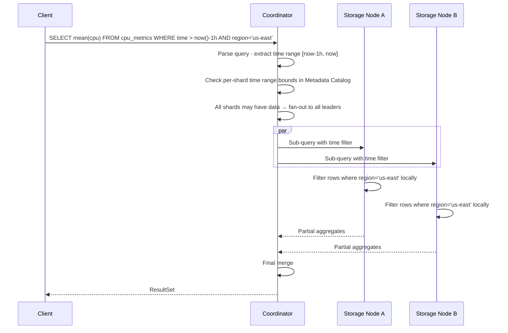
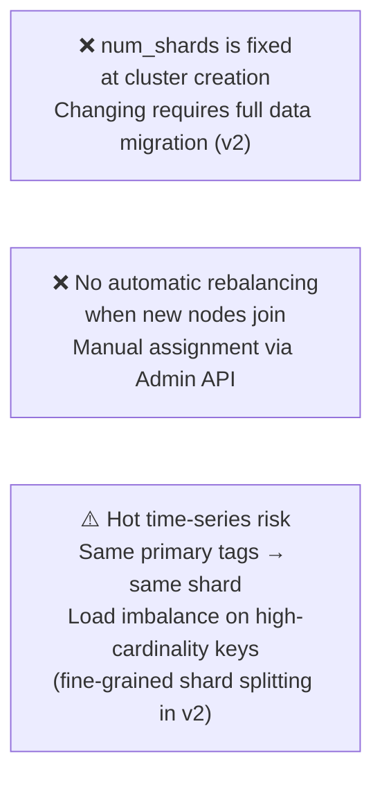

# RutSeriDB — Sharding Design

> **Related:** [architecture.md](../architecture.md) · [replication.md](./replication.md)
> **Version:** 0.1 (Draft)

---

## Shard Key Function

A **shard key** deterministically maps a time-series (identified by its primary tag set) to one specific shard, which is then served by a leader Storage Node.

### Algorithm

### Properties

| Property | Value |
|----------|-------|
| Hash algorithm | xxHash64 (fast, excellent distribution) |
| Input | Sorted `key=value\0` concatenation of primary tag pairs |
| Output | Integer in `[0, num_shards)` |
| Determinism | Same tags → same shard, on any node, forever |
| Stability | `num_shards` is fixed at cluster creation |

---

## Primary Tags

Each table declares a **primary tag set** — the tags used to compute the shard key. These must be provided at table creation and are immutable.

| Config | Example |
|--------|---------|
| `tables.cpu_metrics.primary_tags` | `["host", "region"]` |

All writes to the table must include every primary tag. Other tags are secondary (stored in data but not used for routing).

---

## Shard Map

The Coordinator maintains the authoritative shard map in its Raft state machine.

> Nodes can lead multiple shards. In the example above, `node-a` leads both shard 0 and shard 3.

---

## Routing a Write

---

## Routing a Query

> **Optimization (v2):** If the query filters on *all* primary tags with equality predicates, the Coordinator can compute the exact `shard_id` and route to a **single** shard — avoiding the fan-out entirely.

---

## Shard Count Trade-offs

| `num_shards` | Pros | Cons |
|--------------|------|------|
| Too few (1–2) | Simple routing; fewer files | Write hotspot; limited parallelism |
| Too many (100+) | Very parallel | Many small files; high catalog overhead |
| **Recommended (v1)** | **8–64** | Balances parallelism and file count |

**Rule of thumb:** `num_shards = 2 × expected_storage_node_count` at cluster creation.

---

## Limitations (v1)

---

## Future Improvements (v2)

| Feature | Description |
|---------|-------------|
| **Consistent hashing ring** | Minimize data movement when `num_shards` changes |
| **Shard splitting** | Split a hot shard into two with data migration |
| **Automatic rebalancing** | Coordinator detects imbalance and migrates shards |
| **Tag-based routing shortcut** | Skip fan-out when all primary tags are equality-filtered |
