# RutSeriDB — Component Specifications

> **Related:** [architecture.md](./architecture.md)
> **Version:** 0.1 (Draft)

Detailed specifications for every component from the C3 diagrams.

---

## Table of Contents

1. [WAL (Write-Ahead Log)](#wal-write-ahead-log)
2. [MemTable](#memtable)
3. [Part Writer / Reader](#part-writer--reader)
4. [Local Catalog](#local-catalog)
5. [Ingest Engine](#ingest-engine)
6. [Local Query Engine](#local-query-engine)
7. [Replication Manager](#replication-manager)
8. [Coordinator — Write Router](#coordinator--write-router)
9. [Coordinator — Distributed Query Planner](#coordinator--distributed-query-planner)
10. [Coordinator — Cluster Manager](#coordinator--cluster-manager)
11. [Background Workers](#background-workers)

---

## WAL (Write-Ahead Log)

### Purpose

Guarantees durability of unflushed writes. The WAL is the canonical source of truth for data not yet promoted to Part files.

### Segment Lifecycle

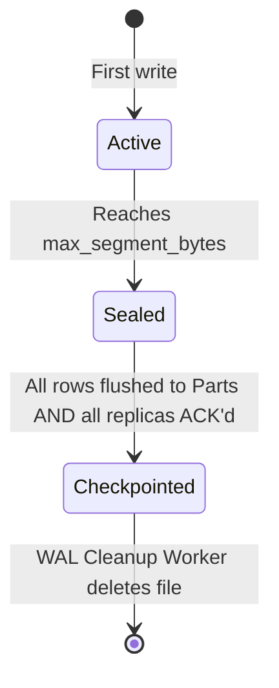

### File Layout

Each shard maintains a directory of numbered segment files:

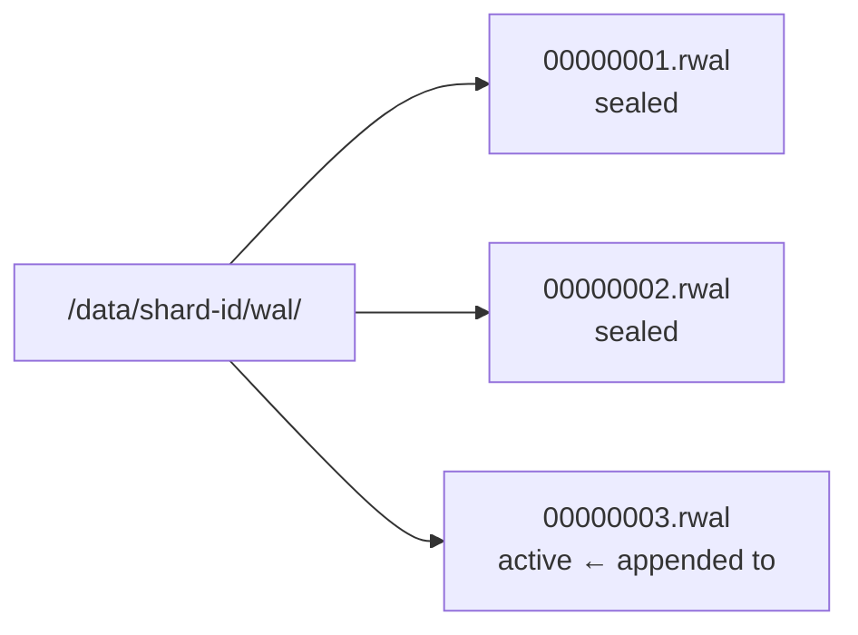

### Record Structure

Each entry in a segment is a framed record:

| Field | Size | Description |
|-------|------|-------------|
| Magic | 4 B | `RWAL` — sanity marker |
| Seq | 8 B | Monotonically increasing u64, per-shard |
| Len | 4 B | Byte length of Payload |
| Payload | variable | Serialized `WalEntry` |
| CRC32 | 4 B | Integrity check over `[Seq ‖ Len ‖ Payload]` |

### Entry Types

| Entry | Description |
|-------|-------------|
| `Write { table, rows }` | A batch of time-series rows to be inserted |
| `Checkpoint { seq, catalog_ver }` | Marks that all entries ≤ `seq` are safely flushed to Parts |

### Durability Levels

| Level | Behaviour | Latency | Safety |
|-------|-----------|---------|--------|
| `Async` | Buffer in OS page cache; no fsync | ~μs | Data loss on crash |
| `Sync` | fsync after every `Write` entry | ~ms | Durable after ACK |
| `SyncBatch` *(default)* | Background timer fsync every N ms | ~ms amortized | Durable within window |

### Replay Algorithm

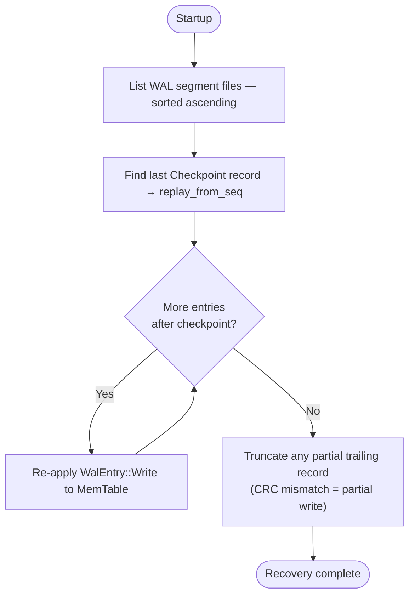

---

## MemTable

### Purpose

In-memory write buffer sorted by `(timestamp, tag_hash)` for efficient merge-flush into Part files.

### Data Structure

An ordered map keyed by `MemKey { timestamp: i64, tag_hash: u64 }`. Sort order is first by timestamp (ascending), then by tag hash to break ties deterministically.

### Concurrency Model

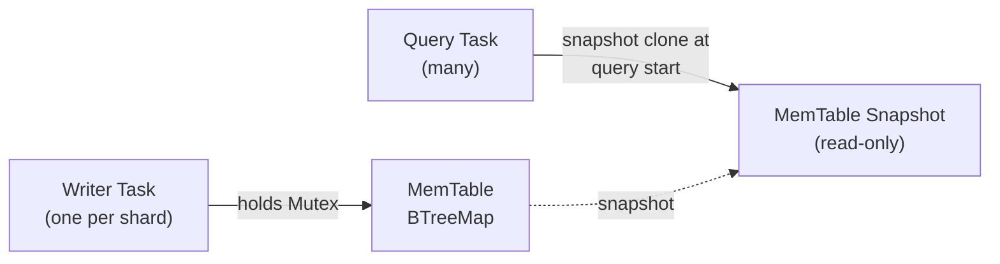

### Flush Triggers

| Condition | Action |
|-----------|--------|
| Bytes used > `memtable_size_bytes` | Trigger immediate flush |
| Row count > configured max *(optional)* | Trigger immediate flush |
| Manual flush via Admin API | Trigger flush |
| Graceful shutdown | Flush all shards |

---

## Part Writer / Reader

### Purpose

Converts a MemTable snapshot into an immutable, columnar, compressed `.rpart` file.

### Write Protocol

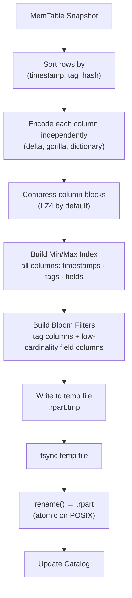

### Read Protocol (Projection + Predicate Pushdown)

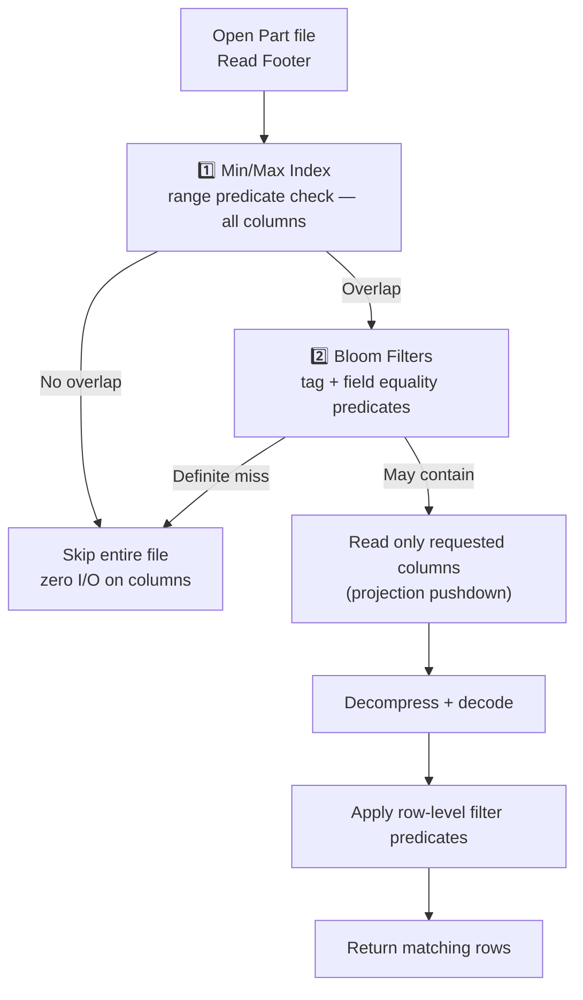

### Column Encodings

| Column Type | Encoding | Compression |
|-------------|----------|-------------|
| `timestamp` | Delta i64 | LZ4 |
| Integer field | Delta-of-delta | LZ4 |
| Float field | Gorilla XOR (IEEE 754) | LZ4 |
| Tag (low cardinality) | Dictionary (u16 codes) | LZ4 |
| String field | Raw bytes | LZ4 |

---

## Local Catalog

### Purpose

Tracks all committed Part files for a shard. The query engine relies on this for Part discovery and time-range pruning.

### Update Protocol

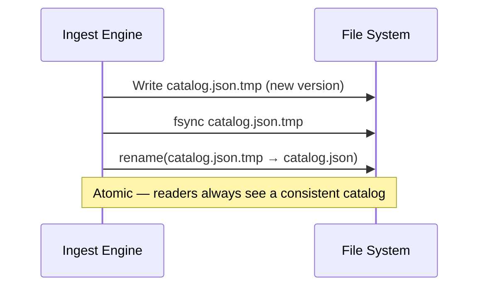

### Schema Overview

The catalog stores, per table:
- Table schema (tag names, field types)
- List of `PartMeta` records: `{ id, path, min_ts, max_ts, size_bytes, row_count, created_at }`
- **Inverted index** — maps `(tag_key, tag_value) → [part_id, ...]` for O(1) Part discovery by tag equality
- A monotonically increasing `version` counter

See [storage/indexes.md](./storage/indexes.md) for the full inverted index design.

---

## Ingest Engine

### Purpose

Handles the full write path for one shard via a **Shard Actor** model:
- Client handler tasks create a `oneshot::channel` per request and push `(batch, tx)` into the shard's dispatch queue
- The client task immediately parks at `rx.await` — releasing the Tokio worker thread
- The Shard Actor drains all pending requests, coalesces them, does ONE WAL fsync, then fires all `tx.send(OK)` simultaneously

### Dispatch Queue + Oneshot Flow

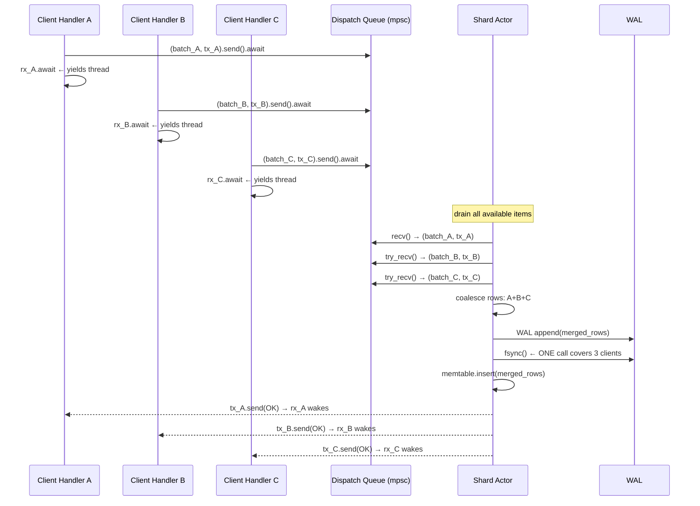

### Shard Actor Loop

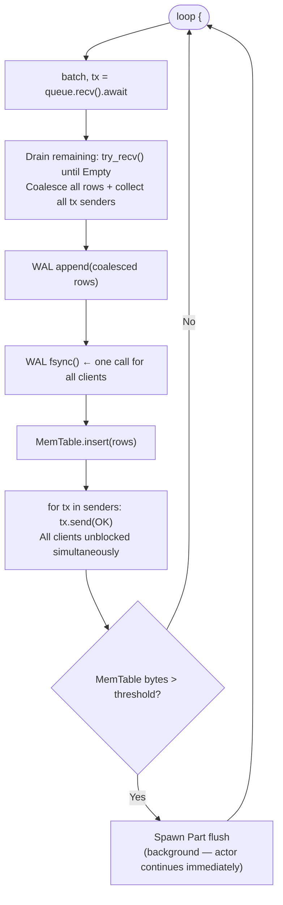

### Cancellation Safety

If a client disconnects before the actor fires the ACK:
- `rx` (the `oneshot::Receiver`) is dropped when the client task is cancelled
- `tx.send(OK)` returns `Err(SendError)` — actor discards silently
- The rows may still be written (WAL already fsynced) — idempotent retry handles duplicates

### Internal gRPC Interface

The Storage Node exposes these endpoints to the Coordinator:

| RPC | Description |
|-----|-------------|
| `WriteBatch(table, shard_id, rows)` | Ingest a batch of rows |
| `FlushShard(shard_id)` | Force a flush (admin / shutdown) |

---

## Local Query Engine

### Purpose

Executes sub-queries from the Coordinator. Scans local Parts + MemTable snapshot, returns partial results.

### Pipeline

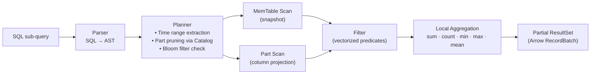

### Supported Operations (v1)

| Operation | Supported |
|-----------|-----------|
| `WHERE time > / < / BETWEEN` | ✅ |
| `WHERE tag = 'value'` | ✅ |
| Field comparison filters | ✅ |
| `SUM · COUNT · MIN · MAX · MEAN` | ✅ |
| `GROUP BY tag` | ✅ |
| `ORDER BY time` | ✅ |
| `LIMIT` | ✅ |
| `JOIN` across tables | ❌ v2 |
| Subqueries | ❌ v2 |

---

## Replication Manager

### Purpose

Streams WAL entries from a shard leader to its replicas. Tracks per-replica lag and triggers snapshot sync when needed.

### Normal Streaming

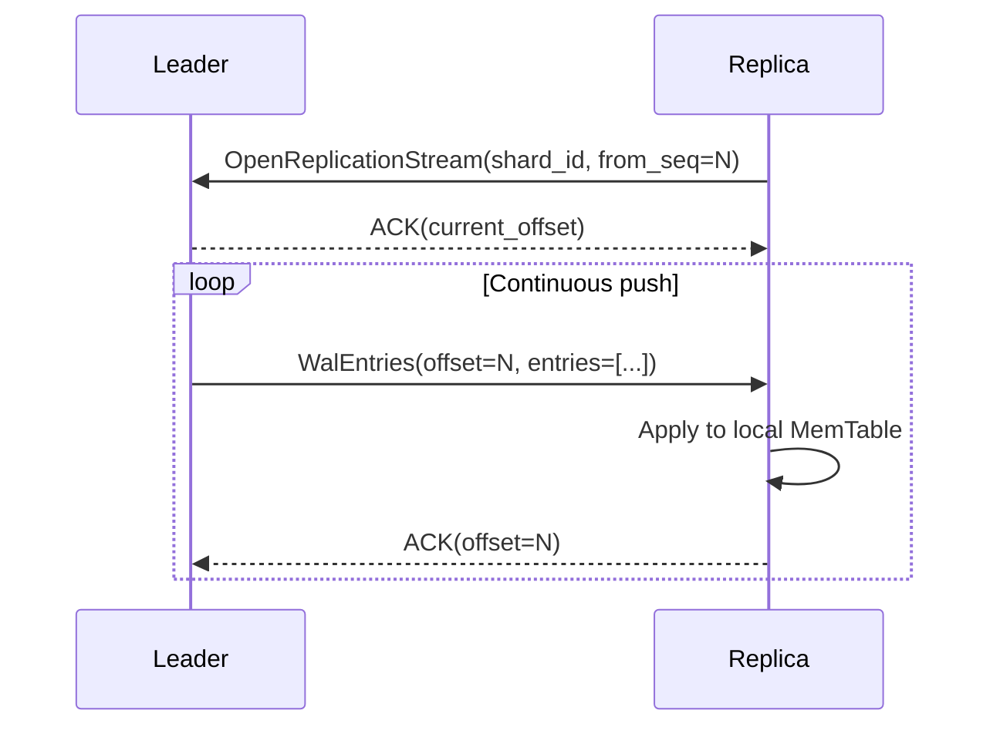

### Snapshot Sync Decision

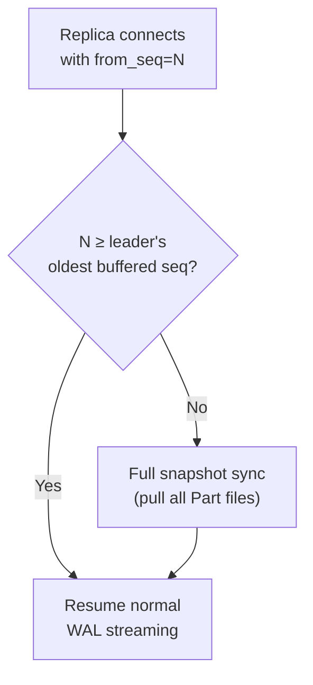

---

## Coordinator — Write Router

### Purpose

Routes incoming write batches to the correct shard leader.

### Routing Algorithm

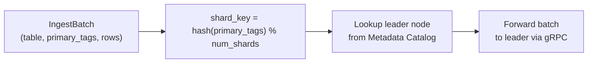

### Failure Handling

| Scenario | Action |
|----------|--------|
| Leader unreachable | Return error to client; Cluster Manager triggers election |
| Leader timeout | Return `DEADLINE_EXCEEDED`; client retries |
| Rebalancing in progress | Buffer writes ≤ 500 ms; retry after migration |

---

## Coordinator — Distributed Query Planner

### Purpose

Translates a client SQL query into per-shard sub-queries, fans them out, and merges results.

### Planner Steps

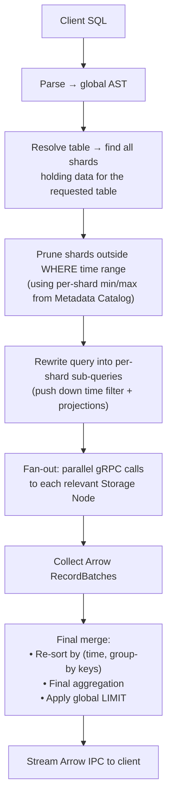

---

## Coordinator — Cluster Manager

### Purpose

Maintains authoritative cluster topology via a Raft state machine (single group, metadata only).

### Metadata Operations

| Operation | Description |
|-----------|-------------|
| `RegisterNode` | Record a new node's address |
| `DeregisterNode` | Remove a departed node |
| `AssignShard` | Map a shard to leader + replica nodes |
| `PromoteLeader` | Elect a new shard leader after failure |
| `RegisterTable` | Record a new table schema |

### Heartbeat & Failure State Machine

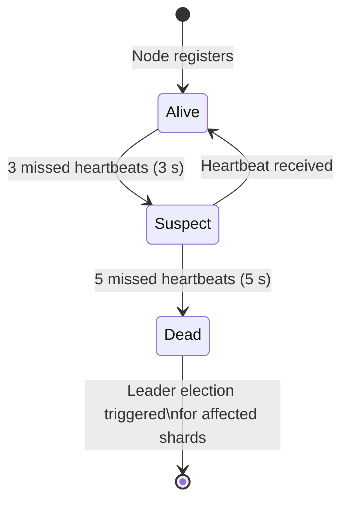

---

## Background Workers

All workers run in a dedicated background pool on each Storage Node.

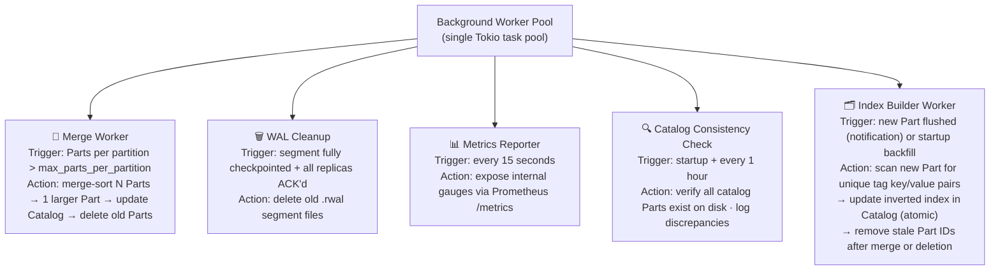

### Index Builder — Detailed Flow

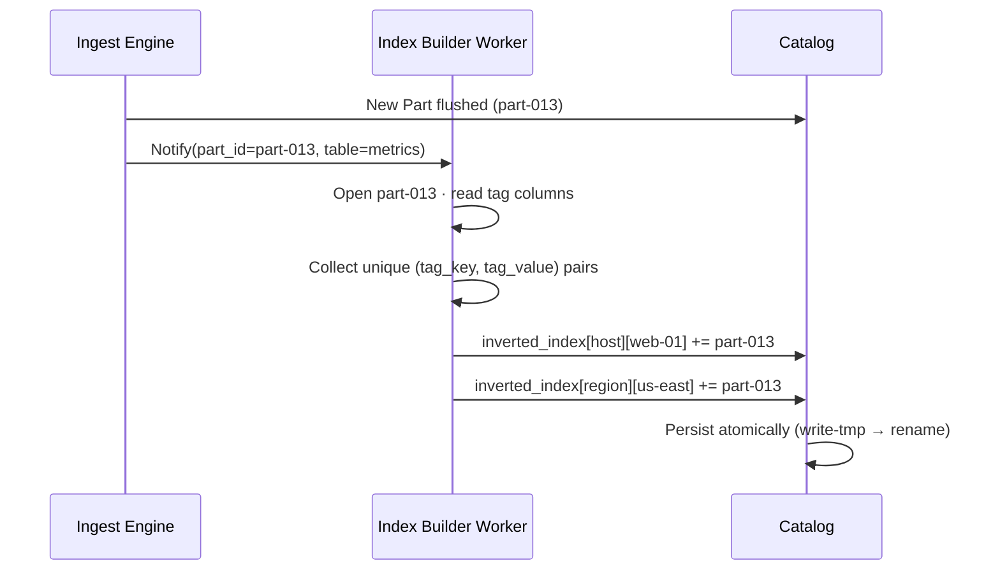
