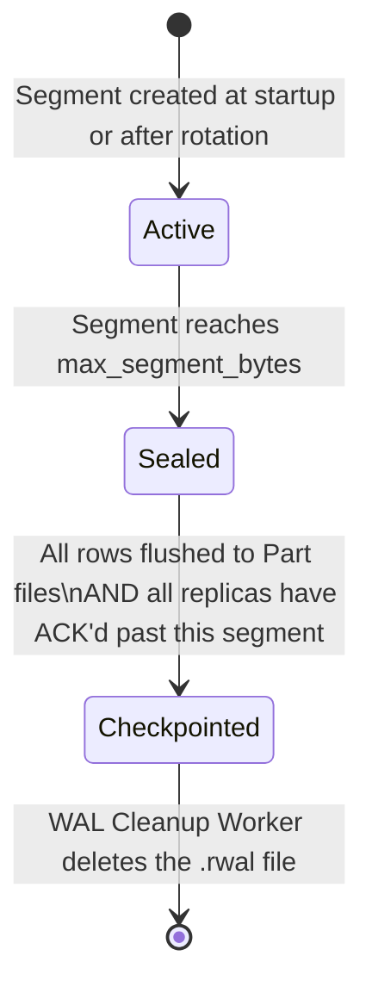
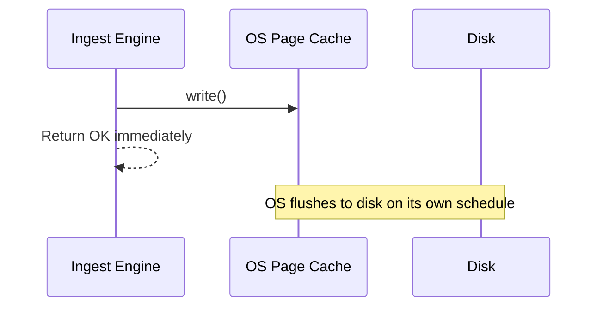
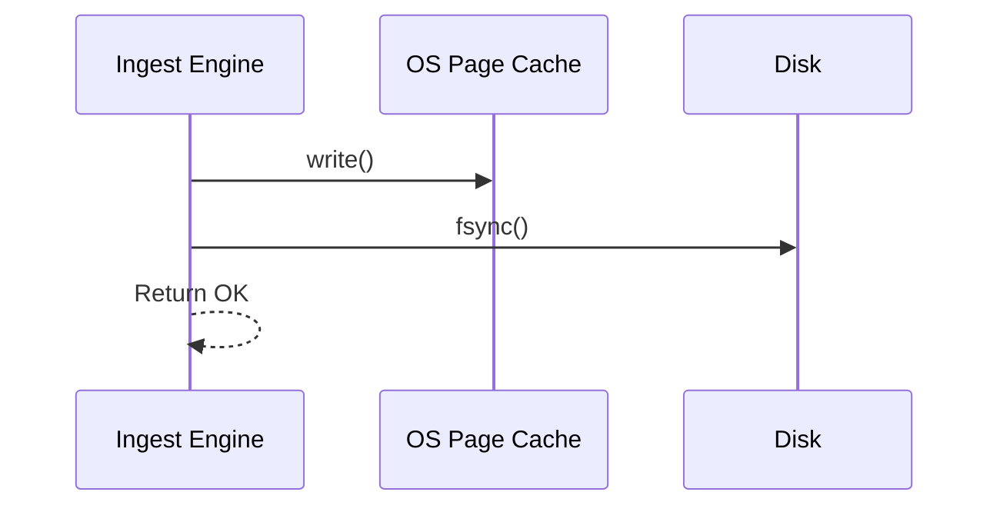
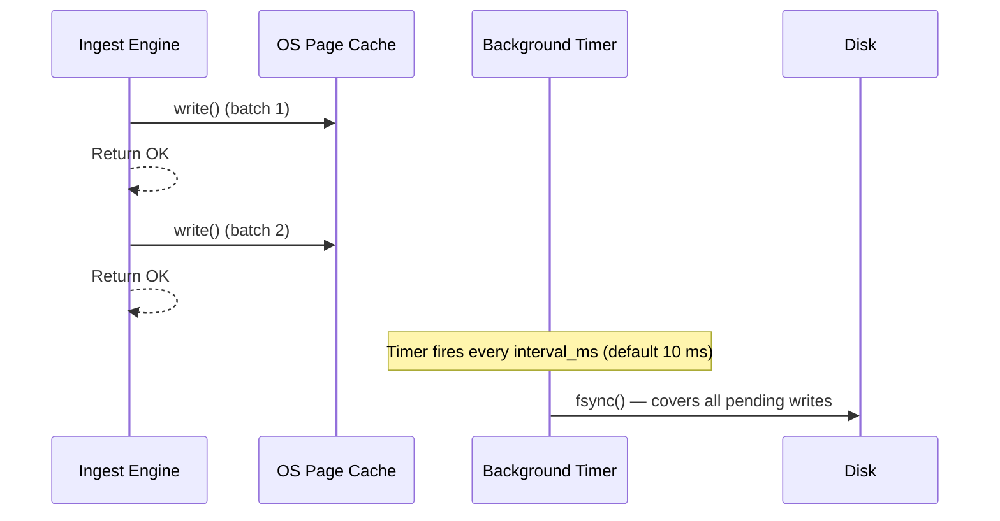
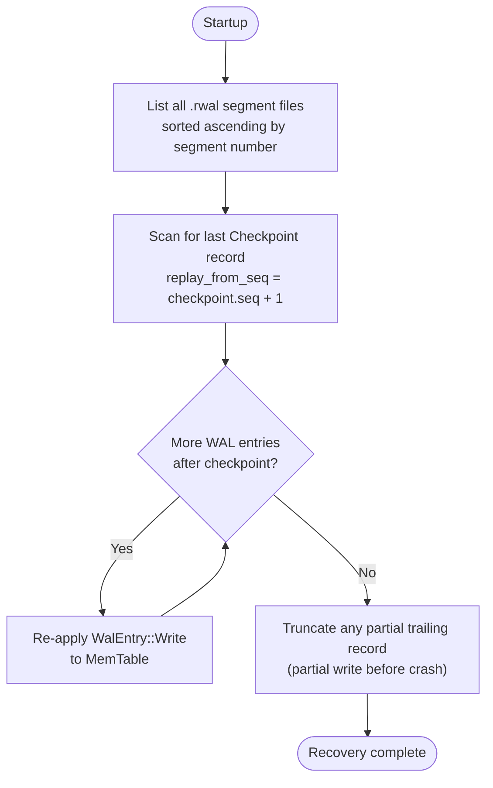
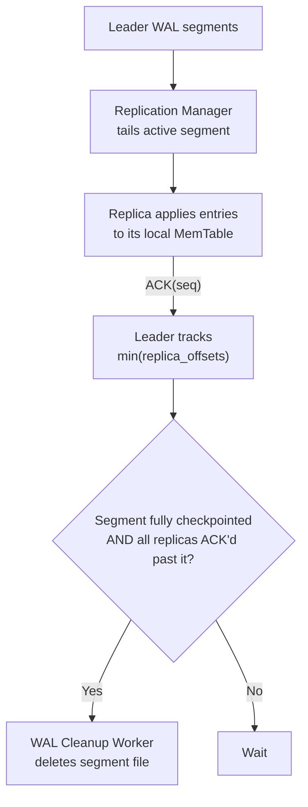

# RutSeriDB — WAL: Durability Guarantees

> **Related:** [architecture.md](../architecture.md) · [components.md](../components.md)
> **Version:** 0.1 (Draft)

---

## Purpose

The Write-Ahead Log (WAL) ensures that **no acknowledged write is ever lost**, even if the process crashes before flushing the MemTable to a Part file. The WAL is written first on every ingest request and is the primary recovery mechanism on startup.

---

## WAL File Lifecycle

### Segment Sizing Parameters

| Config Key | Default | Description |
|------------|---------|-------------|
| `wal.max_segment_bytes` | 64 MB | Seal active segment when this size is reached |
| `wal.max_segments` | 16 | Alert if more than this many unsealed segments accumulate |

---

## Durability Levels

### `Async`

- **Throughput:** Highest (~μs latency per batch)
- **Risk:** Up to several seconds of data loss on power failure
- **Use case:** Non-critical metrics where occasional loss is acceptable

---

### `Sync`

- **Throughput:** Lowest (~2–10 ms per batch, disk-seek bound)
- **Risk:** Zero loss for acknowledged writes
- **Use case:** Critical measurements; financial or compliance data

---

### `SyncBatch` *(default)*

- **Throughput:** High (~1 ms amortized; thousands of batches per fsync)
- **Risk:** Up to `interval_ms` of data loss
- **Use case:** Most time-series workloads *(default: 10 ms window)*

---

## WAL Record Format

Each physical record in a `.rwal` segment:

| Field | Size | Description |
|-------|------|-------------|
| Magic | 4 B | `RWAL` — sanity sentinel |
| Seq | 8 B | u64, monotonically increasing per shard, never resets |
| Len | 4 B | u32, byte length of Payload |
| Payload | variable | Serialized `WalEntry` |
| CRC32 | 4 B | IEEE polynomial over `[Seq ‖ Len ‖ Payload]` |

A **truncated trailing record** (from a crash mid-write) is detected by CRC mismatch and silently discarded.

---

## WAL Entry Types

| Entry | Purpose |
|-------|---------|
| `Write { table, rows }` | A batch of rows to append to the table |
| `Checkpoint { seq, catalog_ver }` | Marks that all WAL entries ≤ `seq` are safely stored in Part files |

---

## Crash Recovery

**Key property:** Recovery is **idempotent** — Parts are written atomically before the Checkpoint record is appended, so replaying already-flushed entries is always safe.

---

## Replication and WAL Cleanup

The WAL is also the **replication source** shipped to follower nodes. This affects when segments can be safely deleted.

**Cleanup rule:** A segment is deleted only when **both** conditions are met:
1. All its entries have been checkpointed (flushed to Parts)
2. All tracked replicas have ACK'd past its last sequence number

---

## Guarantees Summary

| Guarantee | Condition |
|-----------|-----------|
| No loss of ACK'd writes | `Sync` or `SyncBatch` within configured window |
| Crash recovery up to last checkpoint | Always |
| Monotone sequence numbers | Enforced; replay rejects duplicates |
| Partial record tolerance | CRC mismatch → truncate and discard |
| Replica consistency | Replica lag bounded by replication buffer size |
