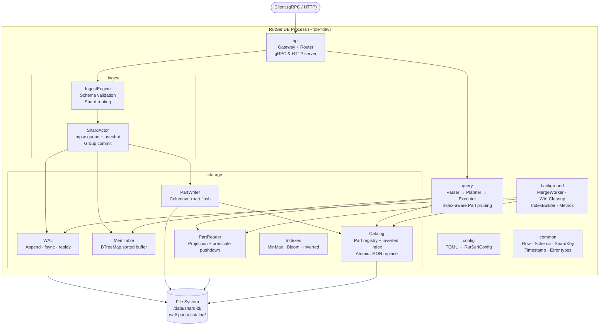
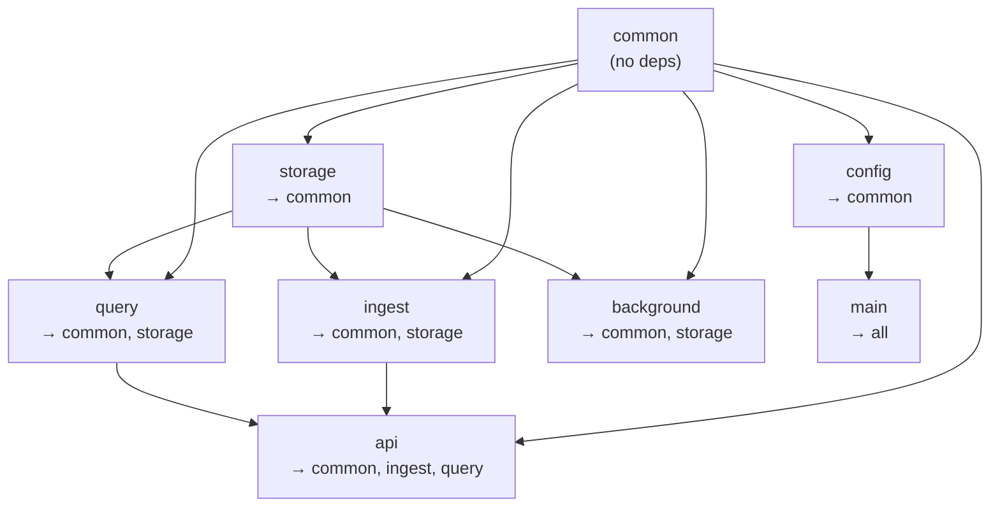

# RutSeriDB — Software Architecture & Skeleton Code Plan

> **Scope:** Phase 0 (single-node, no replication) — module boundaries designed for Phase 1 extension  
> **Derived from:** All 9 docs in `/docs`  
> **Resolved:** HTTP/axum first · `sqlparser` crate · Arrow RecordBatch for ResultSet

---

## 1. High-Level Architecture

### Component Interaction (Phase 0)



### Phase 0 → Phase 1 Boundary

Phase 0 builds a **fully functional single-node TSDB**. Phase 1 adds distribution on top without rewriting Phase 0 internals:

| What Phase 0 delivers | What Phase 1 adds (SWE team) |
|----------------------|-----------------------------|
| `IngestEngine` validates schema + routes to local ShardActors | **Coordinator WriteRouter** wraps `IngestEngine`, forwards to remote StorageNodes via gRPC |
| `QueryEngine` scans local Parts + MemTable | **Coordinator DistributedQueryPlanner** fans-out sub-queries to N StorageNodes, merges Arrow RecordBatches |
| `ShardActor` owns WAL + MemTable + flush for one shard | Same code runs on remote StorageNode — no changes needed |
| `Catalog` tracks local Parts | **Raft-replicated MetadataCatalog** on Coordinator wraps the same `CatalogOps` trait |
| No cluster awareness | **SWIM Gossip** module for failure detection + **Raft** module for metadata consensus |
| No replication | **ReplicationManager** streams WAL entries leader→replica (new `replication/` module) |
| Single-process `--role=dev` | `--role=coordinator` / `--role=storage` split the modules across processes |

> **Key insight:** Phase 0 modules communicate through traits (`WalWrite`, `CatalogOps`, `MemTableOps`, etc.). Phase 1 wraps those same traits with network-aware implementations — the storage layer code doesn't change.

New modules the SWE team adds in Phase 1:
```
src/
  coordinator/           # NEW — Phase 1
    write_router.rs      # Shard key → remote StorageNode gRPC call
    query_planner.rs     # Fan-out sub-queries, merge Arrow batches
    metadata_catalog.rs  # Raft-replicated schema + shard map
    cluster_manager.rs   # SWIM gossip + leader election
  replication/           # NEW — Phase 1
    manager.rs           # WAL streaming leader → replica
    snapshot.rs          # Full snapshot sync for re-joining replicas
```

---

### Data Flow — Write Path

```
Client → API → IngestEngine.ingest(batch)
  → compute shard_id = hash(primary_tags) % num_shards
  → dispatch_queue[shard_id].send((batch, oneshot::tx))
  → client parks at rx.await

ShardActor loop:
  → recv() + drain try_recv() — collect N batches
  → WAL.append(coalesced_rows)
  → WAL.fsync()
  → MemTable.insert(rows)
  → for each tx: tx.send(Ok) — unblock N clients
  → if MemTable.bytes > threshold: spawn flush task
```

### Data Flow — Read Path

```
Client → API → QueryEngine.execute(sql)
  → Parser: SQL → AST
  → Planner:
      1. Inverted Index lookup (tag equality → Part IDs)
      2. Min/Max Index check (time/value range → prune Parts)
      3. Bloom Filter check (remaining equality → prune Parts)
  → Executor:
      → PartReader.read(surviving_parts, projected_columns)
      → MemTable.snapshot() — scan in-memory data
      → merge + filter + aggregate
  → Return ResultSet
```

---

## 2. Project Structure

```
RutSeriDB/
├── Cargo.toml                    # Workspace root
├── docs/                         # Existing documentation (unchanged)
│
└── src/
    ├── main.rs                   # Binary entry: parse CLI, load config, boot server
    ├── lib.rs                    # Re-export all modules for integration tests
    │
    ├── common/                   # Shared types — NO business logic
    │   │                         # ⚠ OPEN for extension: any engineer may add files here
    │   ├── mod.rs
    │   ├── types.rs              # Timestamp, Row, FieldValue, TagSet, ShardId
    │   ├── schema.rs             # TableSchema, ColumnDef, ColumnType
    │   ├── error.rs              # RutSeriError enum (unified error hierarchy)
    │   └── shard_key.rs          # hash(primary_tags) % num_shards
    │
    ├── config/                   # Configuration loading
    │   ├── mod.rs
    │   └── config.rs             # RutSeriConfig, sub-configs, TOML deserialization
    │
    ├── storage/                  # Durable storage layer
    │   ├── mod.rs
    │   ├── wal/
    │   │   ├── mod.rs
    │   │   ├── writer.rs         # WalWriter: append, fsync, rotate segments
    │   │   ├── reader.rs         # WalReader: replay for crash recovery
    │   │   └── entry.rs          # WalEntry, WalRecord (magic, seq, CRC)
    │   ├── memtable/
    │   │   ├── mod.rs
    │   │   └── memtable.rs       # MemTable: BTreeMap<MemKey, Row>, snapshot, size tracking
    │   ├── part/
    │   │   ├── mod.rs
    │   │   ├── writer.rs         # PartWriter: MemTable snapshot → .rpart (columnar + compressed)
    │   │   ├── reader.rs         # PartReader: projection pushdown, predicate filtering
    │   │   ├── format.rs         # FileHeader, ColumnHeader, Footer — binary layout constants
    │   │   └── encoding.rs       # DeltaI64, Gorilla XOR, Dictionary — encode/decode
    │   ├── catalog/
    │   │   ├── mod.rs
    │   │   └── catalog.rs        # Catalog: Part registry, inverted index, atomic JSON replace
    │   └── index/
    │       ├── mod.rs
    │       ├── minmax.rs         # MinMaxIndex: per-column min/max, build + check
    │       ├── bloom.rs          # BloomFilter: blocked bloom, build + may_contain
    │       └── inverted.rs       # InvertedIndex: tag→PartIDs map, add/remove/lookup
    │
    ├── ingest/                   # Write path orchestration
    │   ├── mod.rs
    │   ├── engine.rs             # IngestEngine: validate schema, route to shard
    │   └── shard_actor.rs        # ShardActor: mpsc queue, group commit, flush trigger
    │
    ├── query/                    # Query execution
    │   ├── mod.rs
    │   ├── parser.rs             # SQL → AST (hand-written or sqlparser crate)
    │   ├── planner.rs            # AST → PhysicalPlan (index-aware Part pruning)
    │   ├── executor.rs           # PhysicalPlan → ResultSet (scan + filter + aggregate)
    │   └── ast.rs                # AST node types: Select, Filter, Aggregation, etc.
    │
    ├── background/               # Background workers
    │   ├── mod.rs
    │   ├── merge_worker.rs       # Merge N Parts → 1 larger Part
    │   ├── wal_cleanup.rs        # Delete checkpointed WAL segments
    │   ├── index_builder.rs      # Backfill inverted index for new Parts
    │   └── metrics.rs            # Internal gauges (Prometheus-compatible)
    │
    └── api/                      # Network-facing server
        ├── mod.rs
        ├── server.rs             # Start gRPC + HTTP server, route to handlers
        ├── write_handler.rs      # IngestBatch RPC → IngestEngine
        └── query_handler.rs      # Query RPC → QueryEngine
```

> [!IMPORTANT]
> **Flat module per concern.** Each directory owns exactly one domain. Cross-module communication happens only through the trait interfaces defined below — never via direct struct access.

---

## 3. Module Responsibilities

### 3.1 `common` — Shared Types

| Does | Does NOT |
|------|----------|
| Define `Row`, `FieldValue`, `TagSet`, `Timestamp`, `ShardId` | Contain any I/O or business logic |
| Define `TableSchema`, `ColumnDef`, `ColumnType` | Import from any other module |
| Define `RutSeriError` unified error enum | Make decisions about storage, query, or networking |
| Implement `shard_key::compute(tags, num_shards) → ShardId` | |

> **Open for extension:** Any engineer may add new files to `common/` for shared types that multiple modules need. The only rule: `common/` must never import from any other module in the project.

### 3.2 `config` — Configuration

| Does | Does NOT |
|------|----------|
| Parse TOML → `RutSeriConfig` with all sub-configs | Validate semantic correctness beyond types |
| Provide typed accessors for every config section | Hold runtime state |
| Define defaults matching the architecture doc | |

### 3.3 `storage::wal` — Write-Ahead Log

| Does | Does NOT |
|------|----------|
| Append `WalEntry` records with magic/seq/CRC framing | Decide when to flush MemTable |
| fsync per configured durability level | Know about MemTable or Catalog |
| Rotate segments when `max_segment_bytes` exceeded | |
| Replay records for crash recovery | |
| Expose `checkpoint(seq)` to mark flushed entries | |

### 3.4 `storage::memtable` — In-Memory Buffer

| Does | Does NOT |
|------|----------|
| Insert rows sorted by `(timestamp, tag_hash)` | Write to disk |
| Track byte size for flush threshold | Know about WAL or Part files |
| Create read-only snapshots for queries | Decide when to flush (caller decides) |
| Clear after successful flush | |

### 3.5 `storage::part` — Part Files (.rpart)

| Does | Does NOT |
|------|----------|
| Write columnar .rpart from MemTable snapshot (atomic: tmp → rename) | Manage the Catalog |
| Read projected columns with predicate pushdown | Know about WAL or MemTable |
| Encode/decode columns (delta, gorilla, dictionary, LZ4) | Decide which files to read (Planner decides) |
| Build MinMax index and Bloom filters at flush time | |

### 3.6 `storage::catalog` — Part Registry

| Does | Does NOT |
|------|----------|
| Track all committed PartMeta records per table | Read/write Part file contents |
| Maintain inverted index (tag → Part IDs) | Know about WAL |
| Atomic JSON replace (write-tmp → rename) | Make query planning decisions |
| Expose `list_parts(table)`, `lookup_inverted(tag, value)` | |

### 3.7 `storage::index` — Index Structures

| Does | Does NOT |
|------|----------|
| Build MinMax, Bloom, Inverted indexes from column data | Read files from disk (receives data in-memory) |
| Check predicates against indexes (prune decisions) | Own persistence (Part owns file-level; Catalog owns inverted) |
| Blocked Bloom Filter with ≤1% FPR | |

### 3.8 `ingest` — Write Path Orchestration

| Does | Does NOT |
|------|----------|
| Validate schema (column types, required primary tags) | Implement WAL, MemTable, or Part logic |
| Compute shard key, dispatch to correct ShardActor | Serve queries |
| ShardActor: drain queue, group commit, WAL+MemTable, fire ACKs | Own the data structures (delegates to storage) |
| Trigger flush when MemTable exceeds threshold | |
| Detect client cancellation via dropped `oneshot::Receiver` | |

### 3.9 `query` — Query Execution

| Does | Does NOT |
|------|----------|
| Parse SQL → AST | Modify any data |
| Plan: index-aware Part pruning (Inverted → MinMax → Bloom) | Know about WAL |
| Execute: scan Parts + MemTable snapshot, filter, aggregate | Manage Part files |
| Return `ResultSet` (Vec of rows / Arrow RecordBatch future) | |

### 3.10 `background` — Background Workers

| Does | Does NOT |
|------|----------|
| MergeWorker: merge N small Parts into 1, update Catalog | Handle client requests |
| WALCleanup: delete checkpointed segments | Block the ingest path |
| IndexBuilder: scan new Parts, update inverted index in Catalog | Own shard-level concurrency (ShardActor does) |
| Metrics: expose gauges | |

### 3.11 `api` — Network Server

| Does | Does NOT |
|------|----------|
| Accept gRPC / HTTP connections | Implement ingest or query logic |
| Deserialize requests, call IngestEngine / QueryEngine | Know about WAL, MemTable, Parts |
| Serialize responses, stream results | |
| Rate limiting, backpressure (future) | |

---

## 4. Key Interfaces / Contracts

### 4.1 Core Trait: `WalWriter`

```rust
// storage/wal/writer.rs

/// Append-only write-ahead log for a single shard.
/// Guarantees: entries are sequentially numbered, CRC-verified, and
/// persisted according to the configured durability level.
pub trait WalWrite: Send + Sync {
    /// Append a batch of rows to the WAL. Returns the sequence number
    /// assigned to this entry.
    fn append(&mut self, entry: &WalEntry) -> Result<u64, RutSeriError>;

    /// Force durable persistence of all buffered entries.
    fn fsync(&mut self) -> Result<(), RutSeriError>;

    /// Record that all entries ≤ seq have been flushed to Part files.
    fn checkpoint(&mut self, seq: u64) -> Result<(), RutSeriError>;

    /// Returns the current (latest written) sequence number.
    fn current_seq(&self) -> u64;
}
```

### 4.2 Core Trait: `WalReader`

```rust
// storage/wal/reader.rs

/// Reads WAL segments for crash recovery.
pub trait WalRead: Send {
    /// Replay all entries after the last checkpoint.
    /// Calls `on_entry` for each valid WalEntry in order.
    fn replay<F>(&self, on_entry: F) -> Result<u64, RutSeriError>
    where
        F: FnMut(u64, WalEntry) -> Result<(), RutSeriError>;
}
```

### 4.3 Core Trait: `MemTable`

```rust
// storage/memtable/memtable.rs

/// Sorted in-memory write buffer for a single shard.
pub trait MemTableOps: Send {
    /// Insert rows into the sorted structure.
    fn insert(&mut self, rows: Vec<Row>) -> Result<(), RutSeriError>;

    /// Current memory usage in bytes.
    fn size_bytes(&self) -> usize;

    /// Create a frozen, read-only snapshot for queries.
    /// The MemTable can continue accepting writes after this call.
    fn snapshot(&self) -> MemTableSnapshot;

    /// Clear all data (called after successful flush).
    fn clear(&mut self);
}
```

### 4.4 Core Trait: `PartWriter`

```rust
// storage/part/writer.rs

/// Writes a MemTable snapshot to an immutable .rpart file.
/// Atomic: writes to tmp file, fsyncs, then renames.
pub trait PartWrite: Send {
    /// Flush a MemTable snapshot to disk.
    /// Returns metadata about the newly created Part.
    fn flush(
        &self,
        snapshot: MemTableSnapshot,
        schema: &TableSchema,
        shard_dir: &Path,
    ) -> Result<PartMeta, RutSeriError>;
}
```

### 4.5 Core Trait: `PartReader`

```rust
// storage/part/reader.rs

/// Reads columnar data from .rpart files with projection
/// and predicate pushdown.
pub trait PartRead: Send + Sync {
    /// Read projected columns from a Part, applying predicates.
    /// Returns only rows that survive all filters.
    fn read(
        &self,
        part_path: &Path,
        projection: &[String],        // column names to read
        predicates: &[Predicate],      // filters to push down
    ) -> Result<Vec<Row>, RutSeriError>;

    /// Read only the MinMax index from the footer (no column I/O).
    fn read_minmax(&self, part_path: &Path) -> Result<MinMaxIndex, RutSeriError>;

    /// Read Bloom filters from the file.
    fn read_bloom(&self, part_path: &Path) -> Result<Option<BloomFilterSet>, RutSeriError>;
}
```

### 4.6 Core Trait: `CatalogOps`

```rust
// storage/catalog/catalog.rs

/// Persistent registry of all committed Part files for a shard.
/// Includes the inverted index for tag → Part ID lookups.
pub trait CatalogOps: Send + Sync {
    /// Register a newly flushed Part.
    fn add_part(&mut self, table: &str, meta: PartMeta) -> Result<(), RutSeriError>;

    /// Remove a Part (after merge or deletion).
    fn remove_part(&mut self, table: &str, part_id: &Uuid) -> Result<(), RutSeriError>;

    /// List all Parts for a table.
    fn list_parts(&self, table: &str) -> Vec<&PartMeta>;

    /// Lookup inverted index: which Parts contain this tag value?
    fn lookup_inverted(&self, table: &str, tag_key: &str, tag_value: &str) -> Vec<Uuid>;

    /// Update inverted index entries for a Part.
    fn update_inverted(
        &mut self,
        table: &str,
        part_id: &Uuid,
        tag_entries: Vec<(String, String)>,
    ) -> Result<(), RutSeriError>;

    /// Persist catalog to disk atomically.
    fn persist(&self, shard_dir: &Path) -> Result<(), RutSeriError>;

    /// Load catalog from disk.
    fn load(shard_dir: &Path) -> Result<Self, RutSeriError> where Self: Sized;
}
```

### 4.7 ShardActor Dispatch Interface

```rust
// ingest/shard_actor.rs

/// Message sent to a ShardActor via its mpsc dispatch queue.
pub struct ShardCommand {
    pub batch: IngestBatch,
    pub response_tx: oneshot::Sender<Result<(), RutSeriError>>,
}

/// Handle used by IngestEngine to send work to a specific shard.
#[derive(Clone)]
pub struct ShardHandle {
    tx: mpsc::Sender<ShardCommand>,
}

impl ShardHandle {
    /// Send a batch to this shard's actor. Returns a future that
    /// resolves when the actor has durably committed the write.
    pub async fn write(&self, batch: IngestBatch) -> Result<(), RutSeriError> {
        let (tx, rx) = oneshot::channel();
        self.tx.send(ShardCommand { batch, response_tx: tx }).await?;
        rx.await?
    }
}
```

### 4.8 IngestEngine Interface

```rust
// ingest/engine.rs

/// Top-level ingest API called by the API layer.
pub trait Ingest: Send + Sync {
    /// Validate schema, compute shard key, dispatch to ShardActor,
    /// and await durable commit before returning.
    async fn ingest(&self, table: &str, rows: Vec<Row>) -> Result<(), RutSeriError>;
}
```

### 4.9 QueryEngine Interface (Arrow-based)

```rust
// query/mod.rs
use arrow::record_batch::RecordBatch;

/// Top-level query API called by the API layer.
pub trait QueryExec: Send + Sync {
    /// Parse SQL, plan with index pruning, execute, return Arrow RecordBatches.
    /// Arrow is used from Phase 0 so the SWE team can directly stream batches
    /// over gRPC in Phase 1 (distributed query merge) without refactoring.
    async fn execute(&self, sql: &str) -> Result<Vec<RecordBatch>, RutSeriError>;
}
```

### 4.10 Module Dependency Graph (enforced by imports)



> [!WARNING]
> **Circular dependency guard:** `storage` must NEVER import from `ingest`, `query`, or `api`. The `ingest` and `query` modules must NEVER import from each other. All shared types flow through `common`.

---

## 5. Skeleton Code

Full skeleton files will be created for every module listed in the project structure. Each file will contain:
- Struct definitions with documented fields
- Method signatures with `todo!()` bodies
- Docstrings explaining responsibilities
- `// TODO(engineer):` markers for implementation work

### Files to create (22 files):

| # | File | Owner | Estimated LOC |
|---|------|-------|---------------|
| 1 | `src/lib.rs` | — | ~20 |
| 2 | `src/main.rs` | — | ~40 |
| 3 | `src/common/mod.rs` | — | ~10 |
| 4 | `src/common/types.rs` | Engineer A | ~80 |
| 5 | `src/common/schema.rs` | Engineer A | ~50 |
| 6 | `src/common/error.rs` | Engineer A | ~40 |
| 7 | `src/common/shard_key.rs` | Engineer A | ~30 |
| 8 | `src/config/mod.rs` | — | ~5 |
| 9 | `src/config/config.rs` | Engineer B | ~120 |
| 10 | `src/storage/mod.rs` | — | ~15 |
| 11 | `src/storage/wal/mod.rs` | — | ~5 |
| 12 | `src/storage/wal/entry.rs` | Engineer C | ~50 |
| 13 | `src/storage/wal/writer.rs` | Engineer C | ~100 |
| 14 | `src/storage/wal/reader.rs` | Engineer C | ~70 |
| 15 | `src/storage/memtable/mod.rs` | — | ~5 |
| 16 | `src/storage/memtable/memtable.rs` | Engineer D | ~80 |
| 17 | `src/storage/part/mod.rs` | — | ~10 |
| 18 | `src/storage/part/format.rs` | Engineer E | ~80 |
| 19 | `src/storage/part/encoding.rs` | Engineer E | ~100 |
| 20 | `src/storage/part/writer.rs` | Engineer E | ~90 |
| 21 | `src/storage/part/reader.rs` | Engineer E | ~90 |
| 22 | `src/storage/catalog/mod.rs` | — | ~5 |
| 23 | `src/storage/catalog/catalog.rs` | Engineer F | ~120 |
| 24 | `src/storage/index/mod.rs` | — | ~10 |
| 25 | `src/storage/index/minmax.rs` | Engineer G | ~60 |
| 26 | `src/storage/index/bloom.rs` | Engineer G | ~70 |
| 27 | `src/storage/index/inverted.rs` | Engineer G | ~60 |
| 28 | `src/ingest/mod.rs` | — | ~5 |
| 29 | `src/ingest/engine.rs` | Engineer H | ~80 |
| 30 | `src/ingest/shard_actor.rs` | Engineer H | ~120 |
| 31 | `src/query/mod.rs` | — | ~5 |
| 32 | `src/query/ast.rs` | Engineer I | ~60 |
| 33 | `src/query/parser.rs` | Engineer I | ~50 |
| 34 | `src/query/planner.rs` | Engineer I | ~80 |
| 35 | `src/query/executor.rs` | Engineer I | ~80 |
| 36 | `src/background/mod.rs` | — | ~5 |
| 37 | `src/background/merge_worker.rs` | Engineer J | ~60 |
| 38 | `src/background/wal_cleanup.rs` | Engineer J | ~40 |
| 39 | `src/background/index_builder.rs` | Engineer J | ~50 |
| 40 | `src/background/metrics.rs` | Engineer J | ~30 |
| 41 | `src/api/mod.rs` | — | ~5 |
| 42 | `src/api/server.rs` | Engineer K | ~60 |
| 43 | `src/api/write_handler.rs` | Engineer K | ~40 |
| 44 | `src/api/query_handler.rs` | Engineer K | ~40 |

---

## 6. Cargo.toml Dependencies (Phase 0)

```toml
[package]
name = "rutseridb"
version = "0.1.0"
edition = "2024"

[dependencies]
# Async runtime
tokio = { version = "1", features = ["full"] }

# HTTP server
axum = "0.8"

# Serialization
serde = { version = "1", features = ["derive"] }
serde_json = "1"
toml = "0.8"

# Arrow columnar format (ResultSet)
arrow = { version = "54", features = ["json"] }

# Hashing
xxhash-rust = { version = "0.8", features = ["xxh64"] }
crc32fast = "1"

# Compression
lz4_flex = "0.11"

# IDs
uuid = { version = "1", features = ["v4", "serde"] }

# Logging
tracing = "0.1"
tracing-subscriber = "0.3"

# Error handling
thiserror = "2"

# CLI
clap = { version = "4", features = ["derive"] }

# SQL parsing
sqlparser = "0.52"

# Bloom filter
# TODO(engineer): evaluate `fastbloom` or hand-roll blocked bloom

[dev-dependencies]
tempfile = "3"
```

---

## 7. Design Rationale

### Why this structure?

| Decision | Rationale |
|----------|-----------|
| **Single crate, not workspace** | Phase 0 is a single binary. Module boundaries provide the same isolation without multi-crate overhead. Easy to split into a workspace in Phase 1 if needed. |
| **Traits for all storage interfaces** | Enables mock implementations for unit testing ingest/query without touching disk. Engineers can work on WAL, MemTable, Part independently. |
| **`common` has zero dependencies** | Prevents circular imports. Every module can depend on `common`. If two modules need the same type, it goes in `common`. |
| **ShardActor as an async Tokio task** | Matches architecture doc D11. `mpsc` + `oneshot` pattern avoids blocking Tokio threads during WAL fsync. Group commit emerges naturally from queue draining. |
| **Index structs separated from Part** | MinMax/Bloom are built by PartWriter at flush time but checked by the QueryPlanner. Separating them lets the planner import `index` without importing `part`. |
| **Background workers as separate module** | Workers share no state with each other. Each is an independent async task. The module boundary ensures they only interact with the system through the trait interfaces. |
| **`api` is a thin shell** | The API layer does no business logic — only request parsing, dispatching to IngestEngine/QueryEngine, and response serialization. This makes it trivial to swap gRPC ↔ HTTP or add new transports. |

### Why Phase 0 first?

The architecture doc's Implementation Checklist starts with Phase 0 (single-node). The module boundaries are designed so that:
- Phase 1 (distribution) adds `coordinator/` and `replication/` modules without changing storage or ingest internals
- The `ShardActor` and `Catalog` interfaces remain identical — only the Coordinator's routing layer gets added on top
- The `api` layer can be extended with internal gRPC endpoints for Coordinator ↔ StorageNode communication

---

## 8. Verification Plan

### Automated Tests
- `cargo check` — all skeleton code compiles with `todo!()` bodies
- `cargo test` — unit test stubs compile and can be expanded incrementally
- `cargo clippy` — no warnings on skeleton

### Manual Verification
- Verify module dependency graph: no circular imports
- Verify every trait method signature matches the architecture docs
- Verify every TODO marker is actionable and unambiguous

---

## Resolved Questions

| # | Question | Decision |
|---|----------|----------|
| Q1 | gRPC or HTTP-first? | ✅ **axum HTTP/JSON** for Phase 0; gRPC added in Phase 1 |
| Q2 | SQL parser approach? | ✅ **`sqlparser` crate** with our own AST wrapper types |
| Q3 | Arrow for ResultSet? | ✅ **Arrow `RecordBatch`** from Phase 0 — enables seamless Phase 1 streaming |
