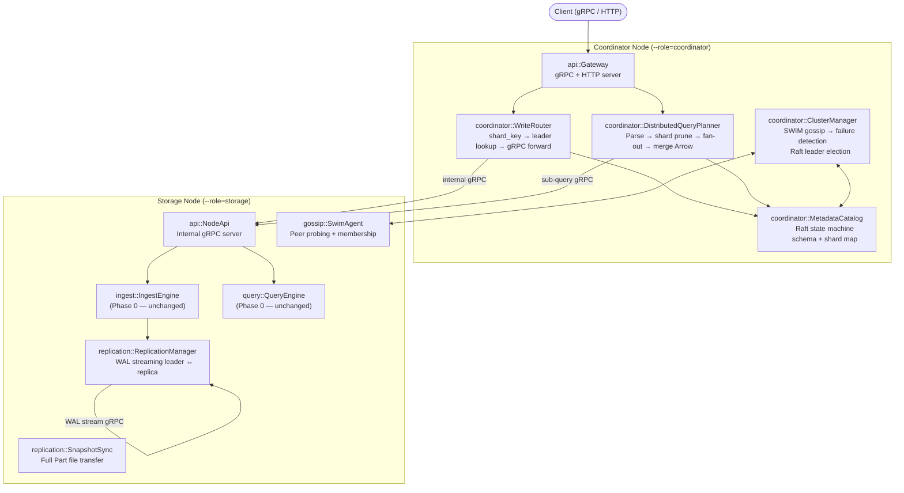
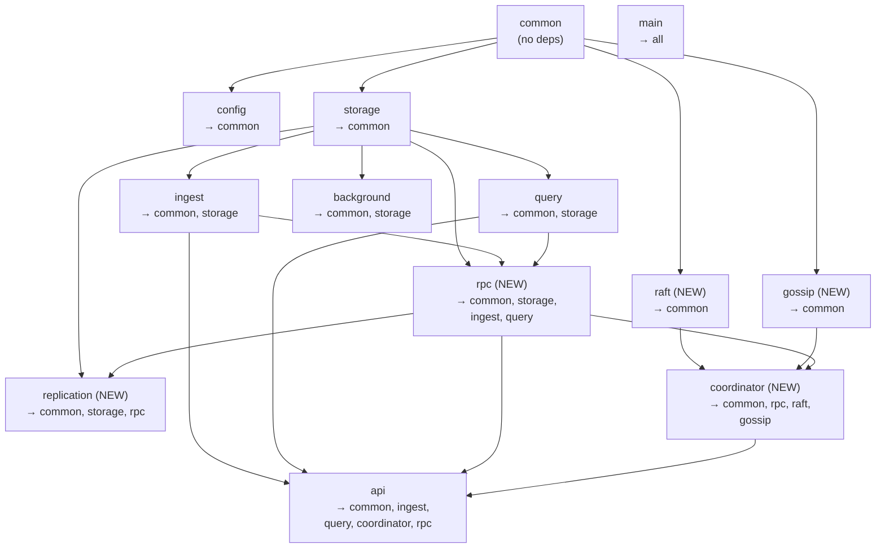

# RutSeriDB — Phase 1: Distribution (Design & Skeleton Plan)

> **Scope:** Phase 1 adds distribution on top of Phase 0 — no Phase 0 internals are modified  
> **Derived from:** `architecture.md`, `components.md`, `cluster/replication.md`, `cluster/sharding.md`  
> **Prerequisites:** Phase 0 trait interfaces exist (compiled, not necessarily implemented)

---

## 1. High-Level Architecture — Phase 1 Overlay

Phase 1 wraps Phase 0 modules with network-aware routing. The storage layer code **does not change**.



### Phase 0 → Phase 1 Integration Points

| Phase 0 module | Phase 1 wraps it with | Integration |
|---|---|---|
| `IngestEngine` | `coordinator::WriteRouter` | WriteRouter calls `IngestEngine` on the remote StorageNode via gRPC |
| `QueryEngine` | `coordinator::DistributedQueryPlanner` | DQP sends sub-SQL to each StorageNode's `QueryEngine`, merges Arrow |
| `Catalog` (local) | `coordinator::MetadataCatalog` | MetadataCatalog is a Raft-replicated superset — tracks shard→node map + table schemas |
| `ShardActor` (local) | Unchanged — runs on StorageNode | No modification needed |
| `api::server` | Extended with role-based routing | Coordinator routes externally; StorageNode exposes internal gRPC |

---

## 2. New Modules — Project Structure

```
src/
├── coordinator/                    # NEW — Phase 1
│   ├── mod.rs
│   ├── write_router.rs            # Shard key → leader lookup → gRPC forward
│   ├── query_planner.rs           # Parse → shard prune → fan-out → Arrow merge
│   ├── metadata_catalog.rs        # Raft state machine: schema + shard map + assignments
│   └── cluster_manager.rs         # SWIM gossip integration + Raft leader election trigger
│
├── replication/                    # NEW — Phase 1
│   ├── mod.rs
│   ├── manager.rs                 # WAL streaming: leader pushes entries to replicas
│   └── snapshot.rs                # Full snapshot sync for re-joining replicas
│
├── gossip/                         # NEW — Phase 1
│   ├── mod.rs
│   ├── swim.rs                    # SWIM protocol: ping, ping-req, suspect/dead FSM
│   └── membership.rs              # Node membership table, state transitions
│
├── rpc/                            # NEW — Phase 1
│   ├── mod.rs
│   ├── proto.rs                   # Hand-defined message types (no protobuf compiler needed)
│   ├── client.rs                  # gRPC client wrappers for node-to-node communication
│   └── server.rs                  # Internal gRPC service implementations
│
└── raft/                           # NEW — Phase 1
    ├── mod.rs
    ├── state_machine.rs           # MetadataStateMachine: apply(op) → Result
    ├── log.rs                     # Raft log storage (append, truncate, snapshot)
    └── node.rs                    # RaftNode: propose, tick, handle messages
```

### Modified Phase 0 Files

| File | Change |
|------|--------|
| `src/lib.rs` | Add `pub mod coordinator`, `pub mod replication`, `pub mod gossip`, `pub mod rpc`, `pub mod raft` |
| `src/main.rs` | Role-based startup: `--role=coordinator` / `--role=storage` / `--role=dev` |
| `src/common/error.rs` | Add error variants: `Cluster`, `Replication`, `Raft`, `Rpc`, `NodeUnreachable`, `LeaderNotFound` |
| `src/common/types.rs` | Add types: `NodeId`, `NodeInfo`, `ShardAssignment`, `NodeRole`, `NodeState` |
| `src/config/config.rs` | Add `GossipConfig`, `ConsistencyConfig`, `RaftConfig` sub-configs |
| `Cargo.toml` | Add `tonic`, `prost`, `bytes` dependencies |

---

## 3. Module Responsibilities

### 3.1 `coordinator::write_router` — Write Routing

| Does | Does NOT |
|------|----------|
| Compute shard key from primary tags | Validate schema (StorageNode does) |
| Lookup leader node from MetadataCatalog shard map | WAL append (StorageNode does) |
| Forward batch to leader via internal gRPC | Know about MemTable or Part files |
| Handle leader-unreachable → return error to client | Perform leader election |
| Buffer writes briefly during rebalancing (≤500 ms) | |

### 3.2 `coordinator::query_planner` — Distributed Query

| Does | Does NOT |
|------|----------|
| Parse SQL → AST (reuses Phase 0 parser) | Execute scans (StorageNode does) |
| Resolve table → find all shards with data | Manage Part files |
| Prune shards outside WHERE time range (shard-level min/max from MetadataCatalog) | Build or check indexes |
| Rewrite query into per-shard sub-queries (push down time filter + projections) | |
| Fan-out parallel gRPC calls to relevant StorageNodes | |
| Collect Arrow RecordBatches, final merge + sort + aggregation + LIMIT | |

### 3.3 `coordinator::metadata_catalog` — Raft State Machine

| Does | Does NOT |
|------|----------|
| Store authoritative schema for all tables | Store Part file contents |
| Store shard → {leader, replicas} mapping | Track per-shard inverted index (local Catalog does) |
| Apply Raft commands: RegisterNode, DeregisterNode, AssignShard, PromoteLeader, RegisterTable | Make ingest decisions |
| Replicate metadata across 1–3 Coordinator nodes | Run on StorageNodes |

#### Metadata Operations (Raft Log Entries)

```rust
pub enum MetadataOp {
    RegisterNode { node_id: NodeId, addr: String },
    DeregisterNode { node_id: NodeId },
    AssignShard { shard_id: u32, leader: NodeId, replicas: Vec<NodeId> },
    PromoteLeader { shard_id: u32, new_leader: NodeId },
    RegisterTable { table: String, schema: TableSchema, primary_tags: Vec<String> },
}
```

### 3.4 `coordinator::cluster_manager` — Failure Detection + Election

| Does | Does NOT |
|------|----------|
| Subscribe to SWIM gossip events (Suspect, Dead) | Perform actual gossip protocol (gossip module does) |
| On Dead event: query all replicas for replication offset | Stream WAL entries |
| Select replica with highest offset → propose PromoteLeader via Raft | Manage data files |
| Handle node join → propose AssignShard via Raft | |

### 3.5 `replication::manager` — WAL Streaming

| Does | Does NOT |
|------|----------|
| Leader: push WAL entries to replicas after local fsync | Perform leader election |
| Replica: apply received entries to local MemTable + WAL | Know about Coordinator |
| Track per-replica replication offset | Make routing decisions |
| Detect when replica is too far behind → trigger snapshot sync | |
| Keep last `replication_buffer_bytes` of WAL in memory | |

#### gRPC Service

| RPC | Direction | Description |
|-----|-----------|-------------|
| `StreamWal(shard_id, from_seq)` | Bidirectional | Continuous WAL push, replica ACKs |
| `SnapshotRequest(shard_id)` | Replica → Leader | Initiate full snapshot sync |
| `GetReplicationOffset(shard_id)` | Coordinator → Any | Query current offset for failover |

### 3.6 `replication::snapshot` — Re-Join Sync

| Does | Does NOT |
|------|----------|
| Leader: stream Catalog + all Part files to replica | Handle normal WAL streaming |
| Replica: receive and write Part files to disk | Decide when to start (manager decides) |
| Replica: update local Catalog to snapshot version | |
| Resume normal streaming from `snapshot_seq + 1` | |

### 3.7 `gossip::swim` — SWIM Gossip Protocol

| Does | Does NOT |
|------|----------|
| Direct probe (ping every 1s) | Make cluster management decisions |
| Indirect probe via 3 random peers (ping-req) | Store metadata (MetadataCatalog does) |
| Maintain Alive → Suspect → Dead state machine | Run Raft consensus |
| Gossip membership changes to random peers | |
| Emit events: `NodeSuspect(id)`, `NodeDead(id)`, `NodeAlive(id)` | |

#### SWIM Parameters

| Parameter | Default | Config key |
|-----------|---------|------------|
| Probe interval | 1 s | `gossip.probe_interval_ms` |
| Indirect probes | 3 peers | `gossip.fanout` |
| Suspect timeout | 2 s | `gossip.suspect_timeout_ms` |
| Full propagation | O(log N) rounds | — |

### 3.8 `raft` — Metadata Consensus

| Does | Does NOT |
|------|----------|
| Implement Raft log: append, truncate, compact | Handle data plane (WAL, Parts) |
| Leader election for the metadata group | Run per-shard (one Raft group for all metadata) |
| Apply committed entries to MetadataStateMachine | Know about time-series data |
| Snapshot + restore for state machine | |

### 3.9 `rpc` — Node-to-Node Communication

| Does | Does NOT |
|------|----------|
| Define gRPC message types for internal communication | Handle client-facing API (api module does) |
| Provide typed client wrappers: `StorageNodeClient`, `CoordinatorClient` | Implement business logic |
| Implement gRPC service trait for StorageNode endpoints | |
| Connection pooling + timeout management | |

---

## 4. Key Interfaces / Contracts

### 4.1 `WriteRouter` Trait

```rust
// coordinator/write_router.rs

/// Routes write batches to the correct shard leader.
pub trait WriteRoute: Send + Sync {
    /// Compute shard, lookup leader, forward via gRPC.
    async fn route_write(
        &self,
        table: &str,
        rows: Vec<Row>,
    ) -> Result<(), RutSeriError>;
}
```

### 4.2 `DistributedQueryPlanner` Trait

```rust
// coordinator/query_planner.rs

/// Fan-out queries to StorageNodes, merge Arrow results.
pub trait DistributedQuery: Send + Sync {
    /// Parse SQL, determine relevant shards, fan-out sub-queries,
    /// collect Arrow RecordBatches, merge/sort/aggregate, return.
    async fn execute_distributed(
        &self,
        sql: &str,
    ) -> Result<Vec<RecordBatch>, RutSeriError>;
}
```

### 4.3 `MetadataStateMachine` Trait

```rust
// raft/state_machine.rs

/// Raft state machine for cluster metadata.
pub trait MetadataStateMachineOps: Send + Sync {
    /// Apply a committed metadata operation.
    fn apply(&mut self, op: MetadataOp) -> Result<(), RutSeriError>;

    /// Create a snapshot of the current state.
    fn snapshot(&self) -> Result<Vec<u8>, RutSeriError>;

    /// Restore state from a snapshot.
    fn restore(&mut self, data: &[u8]) -> Result<(), RutSeriError>;

    /// Lookup the leader for a shard.
    fn get_shard_leader(&self, shard_id: u32) -> Option<NodeId>;

    /// Get all shard assignments.
    fn get_shard_map(&self) -> Vec<ShardAssignment>;

    /// Get table schema.
    fn get_table_schema(&self, table: &str) -> Option<TableSchema>;
}
```

### 4.4 `ReplicationStream` Trait

```rust
// replication/manager.rs

/// Manages WAL replication for a shard.
pub trait Replicate: Send + Sync {
    /// Start pushing WAL entries to a replica (leader side).
    async fn start_push(&self, shard_id: u32, replica: NodeId) -> Result<(), RutSeriError>;

    /// Apply received WAL entries (replica side).
    async fn apply_entries(
        &mut self,
        shard_id: u32,
        entries: Vec<WalEntry>,
    ) -> Result<u64, RutSeriError>;

    /// Get current replication offset for a shard.
    fn replication_offset(&self, shard_id: u32) -> u64;
}
```

### 4.5 `GossipEvents` — SWIM Event Interface

```rust
// gossip/swim.rs

/// Events emitted by the SWIM gossip protocol.
pub enum GossipEvent {
    NodeAlive(NodeId),
    NodeSuspect(NodeId),
    NodeDead(NodeId),
    NodeJoined(NodeId, NodeInfo),
}

/// SWIM gossip agent running on every node.
pub trait GossipAgent: Send + Sync {
    /// Start the gossip protocol (spawns background probing task).
    async fn start(&self) -> Result<(), RutSeriError>;

    /// Subscribe to gossip events.
    fn subscribe(&self) -> tokio::sync::broadcast::Receiver<GossipEvent>;

    /// Get current membership view.
    fn members(&self) -> Vec<(NodeId, NodeState)>;

    /// Announce this node to seed peers.
    async fn join(&self, seeds: Vec<String>) -> Result<(), RutSeriError>;
}
```

### 4.6 Internal gRPC Service (StorageNode)

```rust
// rpc/server.rs

/// gRPC service exposed by each Storage Node for Coordinator communication.
pub trait StorageNodeService: Send + Sync {
    /// Accept a write batch from the Coordinator's WriteRouter.
    async fn write_batch(
        &self,
        table: String,
        shard_id: u32,
        rows: Vec<Row>,
    ) -> Result<(), RutSeriError>;

    /// Execute a sub-query and return partial Arrow results.
    async fn execute_query(
        &self,
        sql: String,
    ) -> Result<Vec<RecordBatch>, RutSeriError>;

    /// Force flush a shard (admin / shutdown).
    async fn flush_shard(&self, shard_id: u32) -> Result<(), RutSeriError>;

    /// Get replication offset for failover decisions.
    async fn get_replication_offset(&self, shard_id: u32) -> Result<u64, RutSeriError>;
}
```

---

## 5. Module Dependency Graph



> [!WARNING]
> **Circular dependency guard (extended):** `raft` and `gossip` must NEVER import from `coordinator` or `replication`. They are generic building blocks. `coordinator` depends on `raft` + `gossip`, never the reverse.

---

## 6. Data Flows — Phase 1

### Distributed Write Path

```
Client → Coordinator API → WriteRouter
  → compute shard_id = hash(primary_tags) % num_shards
  → MetadataCatalog.get_shard_leader(shard_id) → node_addr
  → rpc::StorageNodeClient.write_batch(node_addr, table, shard_id, rows)
  → [on StorageNode] IngestEngine.ingest(table, rows)  ← Phase 0 code unchanged
  → [on StorageNode] ReplicationManager.push(entries)  ← streams to replicas
  → OK → Coordinator → Client
```

### Distributed Query Path

```
Client → Coordinator API → DistributedQueryPlanner
  → Parse SQL → AST
  → Resolve table → MetadataCatalog.get_shard_map()
  → Prune shards outside WHERE time range (shard-level min/max)
  → Rewrite into per-shard sub-queries
  → Fan-out: parallel rpc::StorageNodeClient.execute_query(sub_sql) to each leader
  → [on StorageNode] QueryEngine.execute(sub_sql)  ← Phase 0 code unchanged
  → Collect Arrow RecordBatches from all nodes
  → Final merge: re-sort, final aggregation, apply LIMIT
  → Stream Arrow IPC to client
```

### Failover Path

```
SWIM gossip detects Node-A unresponsive:
  → GossipEvent::NodeSuspect(A) emitted
  → After 2s timeout: GossipEvent::NodeDead(A) emitted
  → ClusterManager receives Dead event
  → For each shard where A was leader:
    → Query all replicas: rpc.get_replication_offset(shard_id)
    → Select replica with highest offset (e.g., Node-D)
    → Propose Raft: MetadataOp::PromoteLeader { shard_id, new_leader: D }
    → Raft commits → MetadataCatalog updated
    → Node-D activates as leader, begins accepting writes
```

---

## 7. New Dependencies

```toml
# Cargo.toml additions for Phase 1

# gRPC (internal node-to-node communication)
tonic = "0.13"
prost = "0.13"

# Byte buffer manipulation for gRPC
bytes = "1"

# Async broadcast channel (SWIM events)
# tokio already provides broadcast — no new dep needed
```

> [!NOTE]
> **No protobuf compiler required.** The `rpc::proto` module hand-defines message types as Rust structs with `prost` derive macros. This avoids a build-time `protoc` dependency while staying compatible with the gRPC wire format.
>
> **Raft library choice deferred.** The `raft/` module defines trait interfaces. The SWE team may choose `openraft` crate or implement from scratch. The skeleton is crate-agnostic.

---

## 8. Config Extensions

```toml
# New config sections for Phase 1

[gossip]
probe_interval_ms = 1000    # SWIM direct probe interval
suspect_timeout_ms = 2000   # Time before Suspect → Dead
fanout = 3                  # Number of indirect probes
seed_nodes = []             # Bootstrap peer addresses

[consistency]
read_level = "one"          # "one", "quorum", "all"

[raft]
election_timeout_ms = 1000  # Raft election timeout range start
heartbeat_interval_ms = 250 # Raft leader heartbeat
snapshot_threshold = 1000   # Number of log entries before snapshot
data_dir = "./raft-data"    # Raft log + snapshot storage
```

---

## 9. `main.rs` Role-Based Startup

```rust
match config.cluster.role.as_str() {
    "dev" => {
        // Phase 0 behavior: all-in-one
        // Start IngestEngine + QueryEngine + API server + background workers
        // Also start coordinator + replication in-process
    }
    "coordinator" => {
        // Start Raft node for MetadataCatalog
        // Start SWIM gossip agent
        // Start ClusterManager (subscribes to gossip events)
        // Start WriteRouter + DistributedQueryPlanner
        // Start external API (client-facing gRPC + HTTP)
    }
    "storage" => {
        // Start IngestEngine + QueryEngine (Phase 0 local)
        // Start ReplicationManager (leader or replica)
        // Start SWIM gossip agent
        // Start internal gRPC server (accepts from Coordinator)
        // Start background workers
    }
}
```

---

## 10. Files to Create (18 new files + 5 modified)

### New Files

| # | File | Owner | Estimated LOC |
|---|------|-------|---------------|
| 1 | `src/coordinator/mod.rs` | — | ~10 |
| 2 | `src/coordinator/write_router.rs` | Engineer A | ~100 |
| 3 | `src/coordinator/query_planner.rs` | Engineer A | ~150 |
| 4 | `src/coordinator/metadata_catalog.rs` | Engineer B | ~130 |
| 5 | `src/coordinator/cluster_manager.rs` | Engineer B | ~100 |
| 6 | `src/replication/mod.rs` | — | ~5 |
| 7 | `src/replication/manager.rs` | Engineer C | ~130 |
| 8 | `src/replication/snapshot.rs` | Engineer C | ~100 |
| 9 | `src/gossip/mod.rs` | — | ~5 |
| 10 | `src/gossip/swim.rs` | Engineer D | ~150 |
| 11 | `src/gossip/membership.rs` | Engineer D | ~80 |
| 12 | `src/rpc/mod.rs` | — | ~10 |
| 13 | `src/rpc/proto.rs` | Engineer E | ~120 |
| 14 | `src/rpc/client.rs` | Engineer E | ~100 |
| 15 | `src/rpc/server.rs` | Engineer E | ~120 |
| 16 | `src/raft/mod.rs` | — | ~5 |
| 17 | `src/raft/state_machine.rs` | Engineer F | ~100 |
| 18 | `src/raft/log.rs` | Engineer F | ~80 |
| 19 | `src/raft/node.rs` | Engineer F | ~120 |

### Modified Files

| File | Change |
|------|--------|
| `src/lib.rs` | Add 5 new `pub mod` declarations |
| `src/main.rs` | Role-based startup logic |
| `src/common/error.rs` | Add ~6 new error variants |
| `src/common/types.rs` | Add cluster types (NodeId, NodeInfo, etc.) |
| `src/config/config.rs` | Add GossipConfig, ConsistencyConfig, RaftConfig |

---

## 11. Design Rationale

| Decision | Rationale |
|----------|-----------|
| **Separate `gossip/` and `raft/` modules** | They are independent building blocks. SWIM is AP (membership), Raft is CP (metadata). Neither should know about the other. `ClusterManager` glues them: gossip detects failures, then triggers Raft proposals. |
| **`rpc/` module with hand-defined proto** | Avoids `protoc` build dependency. Rust structs with `#[derive(prost::Message)]` encode to protobuf wire format. Keeps the crate pure Rust. |
| **Coordinator-only Raft** | One Raft group across 1–3 Coordinators for metadata. NOT per-shard Raft — that's too complex for v1 and unnecessary given async WAL replication. |
| **Phase 0 code untouched** | Every Phase 0 trait (WalWrite, CatalogOps, etc.) works identically. Phase 1 calls them via gRPC instead of in-process function calls. |
| **`raft/` is crate-agnostic** | SWE team can plug in `openraft` behind the trait, or implement from scratch. The skeleton doesn't import any specific Raft crate. |

---

## 12. Verification Plan

### Automated Tests
- `cargo check` — all skeleton code compiles with `todo!()` bodies
- `cargo test` — existing Phase 0 tests still pass (no Phase 0 code modified except `lib.rs`, `main.rs`, `error.rs`, `types.rs`, `config.rs`)
- No circular dependency between new modules

### Manual Verification
- Confirm module dependency graph: `raft` and `gossip` never import from `coordinator`
- Confirm all trait method signatures match the architecture docs
- Confirm every `TODO(engineer):` marker is actionable

---

## 13. Open Questions

| # | Question | Impact |
|---|----------|--------|
| Q1 | **Raft crate choice** — Should we prescribe `openraft` or let the SWE team decide? Current plan: crate-agnostic traits. | Medium |
| Q2 | **gRPC vs custom TCP for WAL streaming** — `tonic` bidirectional streaming works but adds overhead. Custom TCP is faster. | Medium |
| Q3 | **Follower reads in Phase 1** — The architecture doc mentions `consistency=ONE` for follower reads. Should the skeleton include a `ReadRouter` that can send reads to replicas? | Low — can be added later |
