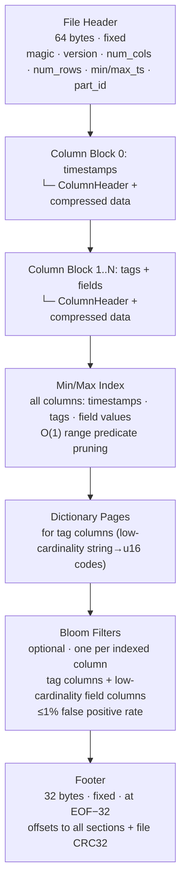
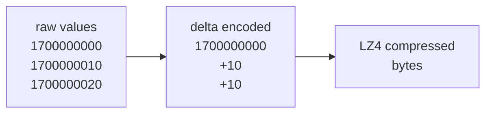
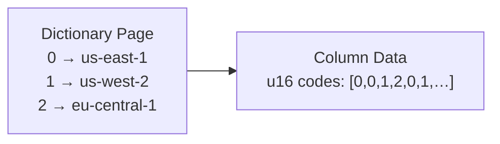
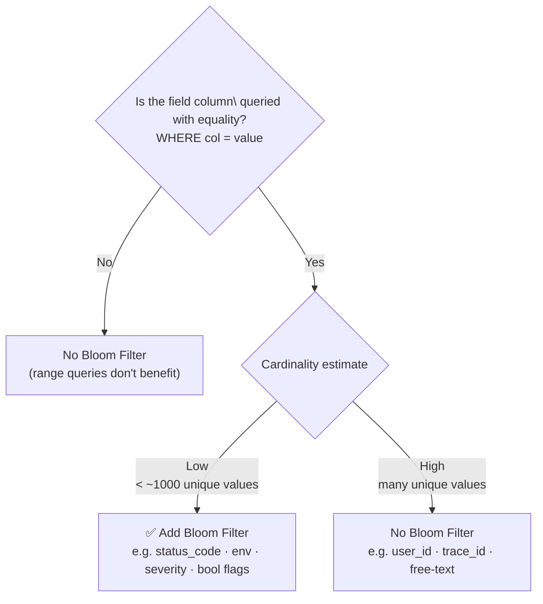
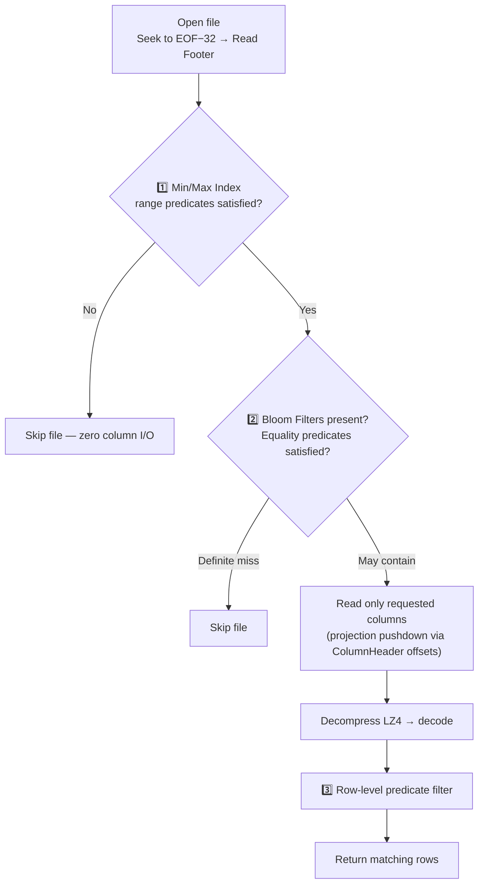

# RutSeriDB — Part File Format (`.rpart`)

> **Related:** [architecture.md](../architecture.md) · [components.md](../components.md) · [indexes.md](./indexes.md) · [io_uring.md](./io_uring.md)
> **Version:** 0.1 (Draft)

Specification of the binary layout for `.rpart` — the immutable, columnar, compressed storage unit of RutSeriDB.

---

## Design Goals

| Goal | Approach |
|------|----------|
| Column-oriented access | One contiguous block per column |
| Predicate pushdown | Per-file min/max index + bloom filters |
| Projection pushdown | Read only requested columns |
| Compression | Per-column LZ4 by default |
| Integrity verification | Per-file CRC32 in footer |
| Zero-copy reads *(future)* | Memory-map friendly alignment |

---

## Overall File Structure



---

## File Header (64 bytes)

| Offset | Size | Field | Description |
|--------|------|-------|-------------|
| 0 | 4 | `magic` | `RPRT` — sanity marker |
| 4 | 2 | `version` | Format version (currently `1`) |
| 6 | 2 | `flags` | Bitfield: `0x01` = bloom filter present |
| 8 | 4 | `num_columns` | Total column count (timestamp + tags + fields) |
| 12 | 8 | `num_rows` | Row count |
| 20 | 8 | `min_timestamp` | Minimum timestamp (nanoseconds) |
| 28 | 8 | `max_timestamp` | Maximum timestamp (nanoseconds) |
| 36 | 16 | `part_id` | UUID v4 |
| 52 | 8 | `created_at` | Unix timestamp (seconds) |
| 60 | 4 | `reserved` | Must be zero |

---

## Column Header (per column block)

| Field | Type | Description |
|-------|------|-------------|
| `name_len` | u16 | Length of column name |
| `name` | bytes (UTF-8) | Column name |
| `col_type` | u8 | `0`=Timestamp · `1`=TagStr · `2`=FieldFloat · `3`=FieldInt · `4`=FieldBool · `5`=FieldStr |
| `encoding` | u8 | `0`=Raw · `1`=DeltaI64 · `2`=DeltaDeltaI64 · `3`=GorillaDelta · `4`=Dictionary |
| `compression` | u8 | `0`=None · `1`=LZ4 · `2`=Zstd |
| `data_offset` | u64 | Byte offset of compressed data from file start |
| `data_len` | u32 | Compressed byte length |
| `uncompressed_len` | u32 | Uncompressed byte length |
| `null_bitmap_offset` | u64 | Offset of null bitmap (`0` if no nulls) |
| `null_bitmap_len` | u32 | Length of null bitmap |

---

## Column Encodings

### Timestamp — Delta Encoding

Consecutive timestamps are stored as differences from the previous value. The first value is absolute. After delta encoding, the array is LZ4-compressed.



### Integer Field — Delta-of-Delta

Useful for monotonically increasing counters. Compresses differences-of-differences, which are often small constant values.

### Float Field — Gorilla XOR

XOR of consecutive IEEE 754 `f64` values. Consecutive time-series floats are often close in value, yielding many leading/trailing zero bits that compress well.

### Tag Column — Dictionary Encoding



Dictionary codes are `u16` (max 65 535 unique values per Part). The dictionary page is stored in the dedicated **Dictionary Pages** section.

---

## Min/Max Index

Stored after all column blocks. Covers **all columns** — timestamps, tag columns, and field value columns. Enables **O(1) predicate pruning** at the file level before any column data is read.

| Field | Size | Description |
|-------|------|-------------|
| `col_idx` | u16 | Column index |
| `min_val` | 8 B | Minimum observed value (encoded) |
| `max_val` | 8 B | Maximum observed value (encoded) |

One entry per column, stored sequentially.

### Value Encoding by Type

| Column Type | Encoding of min/max |
|-------------|---------------------|
| `timestamp` / integer | Raw i64/u64 bits |
| Float | IEEE 754 f64 bits |
| Tag / string | xxHash64 of lexicographic min/max string |
| Bool | `0` (false) or `1` (true) |

### Example Pruning

| Query predicate | Check | Prune if |
|-----------------|-------|----------|
| `WHERE time > T` | `max_ts` column | `max_ts < T` |
| `WHERE cpu > 90` | `cpu` column | `max_cpu < 90` |
| `WHERE mem BETWEEN 512 AND 2048` | `mem` column | `min_mem > 2048 OR max_mem < 512` |

---

## Bloom Filters

| Property | Value |
|----------|-------|
| Algorithm | Blocked Bloom Filter (cache-line friendly) |
| Scope | One filter per **tag column** + per **low-cardinality field column** |
| False positive rate | ≤ 1% (configured) |
| Use | Equality predicate pushdown — skip files that cannot contain a value |

Bloom Filters are **not** useful for range predicates (`>`, `<`, `BETWEEN`) — those use the Min/Max Index instead.

### Which Field Columns Get a Bloom Filter?



### Example Pruning

| Query predicate | Bloom check | Result |
|----------------|-------------|--------|
| `WHERE host = 'web-01'` | `bloom[host].may_contain('web-01')` | Skip if definite miss |
| `WHERE status = 500` | `bloom[status].may_contain(500)` | Skip if definite miss |
| `WHERE env = 'prod' AND region = 'eu'` | Both bloom filters | Skip if either is a definite miss |

---

## Footer (32 bytes — at EOF − 32)

Readers seek to `EOF − 32` to read the footer first, avoiding a full file scan.

| Offset | Size | Field | Description |
|--------|------|-------|-------------|
| 0 | 4 | `magic` | `RPRT` — sanity check |
| 4 | 8 | `minmax_index_offset` | Byte offset of Min/Max Index section |
| 12 | 8 | `bloom_offset` | Byte offset of Bloom Filter (`0` if absent) |
| 20 | 8 | `dict_pages_offset` | Byte offset of Dictionary Pages |
| 28 | 4 | `file_crc32` | CRC32 of all bytes except the last 4 |

---

## Read Flow



---

## File Naming Convention

```
/data/<shard-id>/parts/<uuid>.rpart
```

Parts are **never renamed** after creation. Merge operations produce new UUIDs.

---

## Versioning & Compatibility

| Version | Description |
|---------|-------------|
| `1` | Initial format. Column block offsets are not aligned. Uses buffered I/O. |
| `2` *(Phase 3)* | Column block start offsets are padded to 4096-byte boundaries for `O_DIRECT` / io_uring reads. |

- Readers **must** check `version` and reject unsupported versions.
- A v2 reader can read v1 files by falling back to buffered I/O (no Direct I/O).
- Forward compatibility (v1 reader reading v2) is **not guaranteed** — v1 readers will reject.
- See [io_uring.md](./io_uring.md) for the full v2 migration design.
