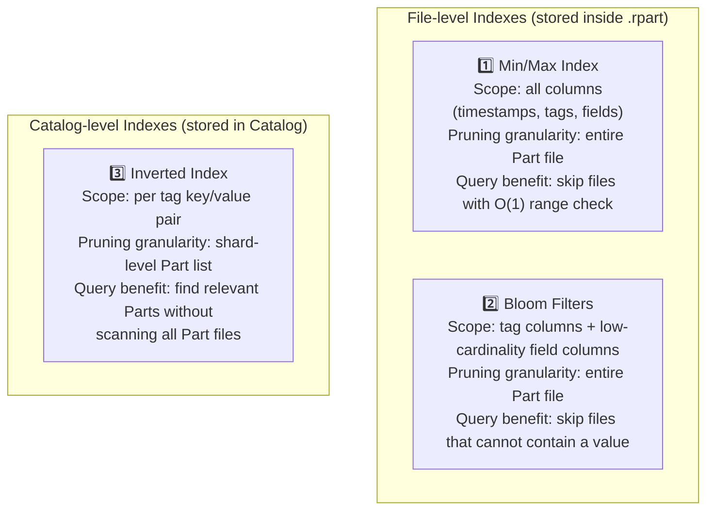
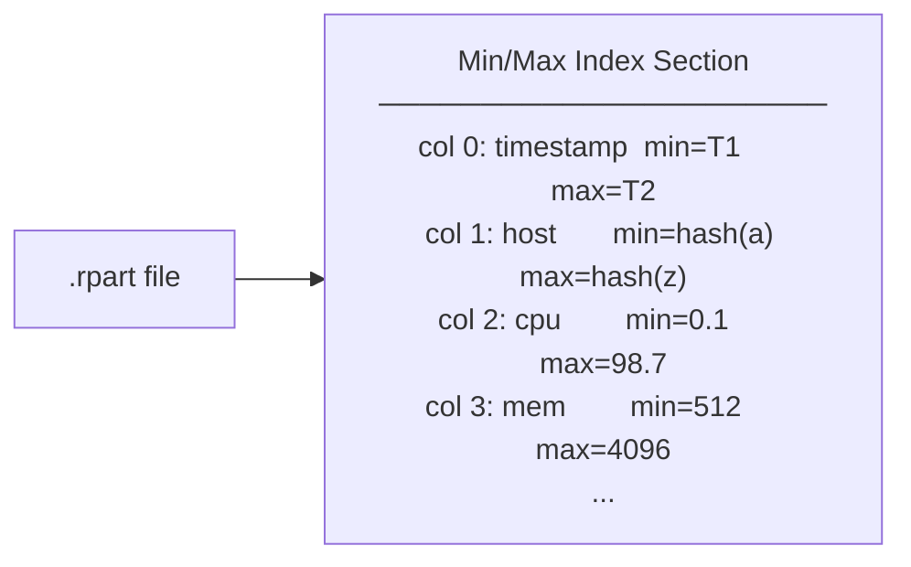
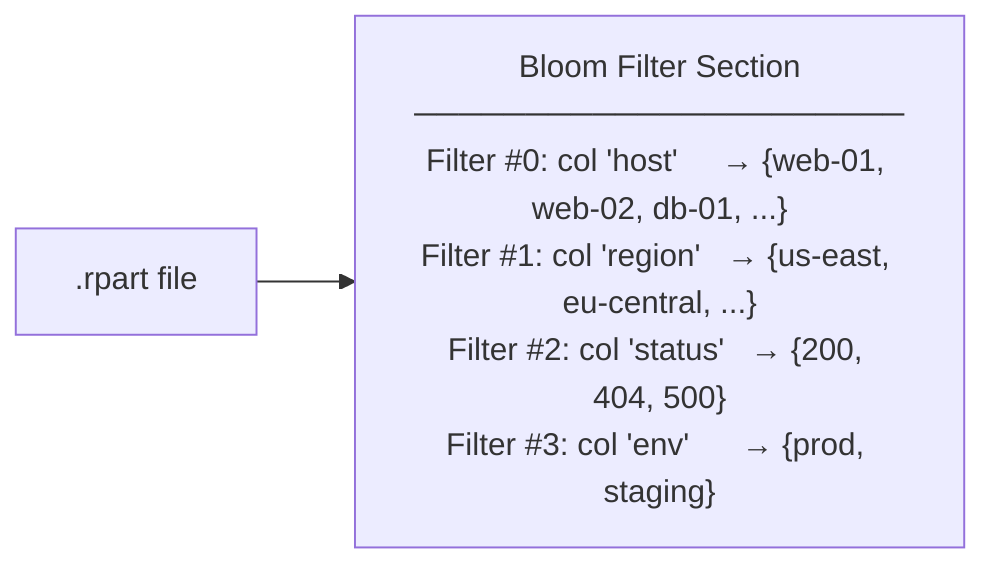
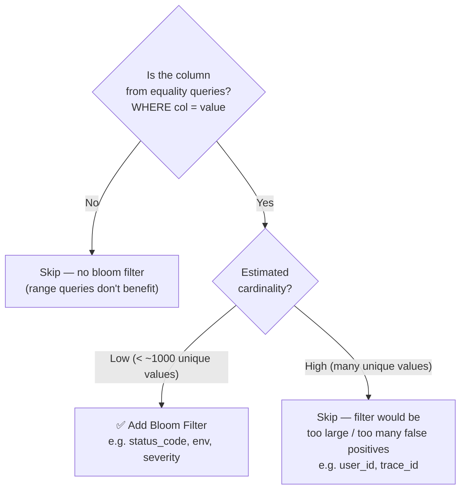
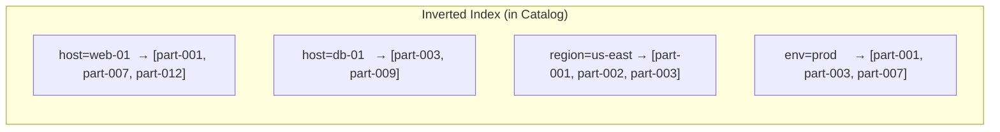
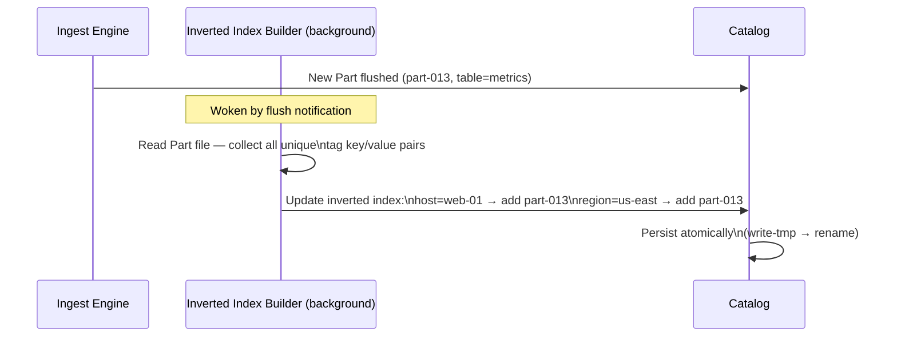
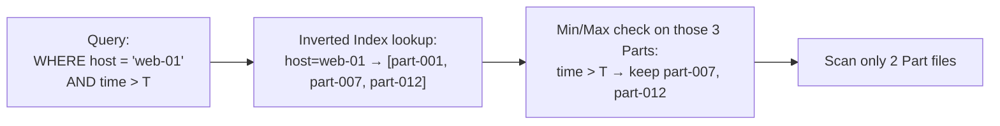
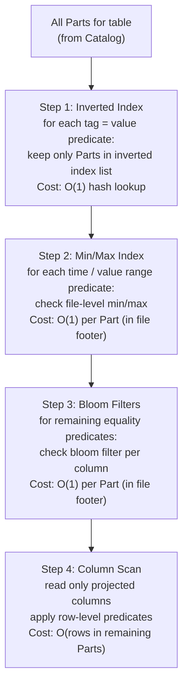

# RutSeriDB — Index Design

> **Related:** [architecture.md](../architecture.md) · [storage/format.md](./format.md) · [components.md](../components.md)
> **Version:** 0.1 (Draft)

RutSeriDB supports three index types. All are **read-path optimizations only** — they never affect the write path or Part immutability. Indexes are always built from existing data and can be backfilled over existing Parts by a background worker.

---

## Index Overview



---

## 1. Min/Max Index (all columns)

### What It Indexes

The Min/Max Index stores the minimum and maximum observed value for **every column** in a Part file — timestamps, tag columns, and field value columns.



### Query Pruning

| Query Predicate | Pruning Logic |
|----------------|---------------|
| `WHERE time > T` | Skip Part if `part.max_ts < T` |
| `WHERE time BETWEEN T1 AND T2` | Skip Part if `part.max_ts < T1 OR part.min_ts > T2` |
| `WHERE cpu > 90` | Skip Part if `part.max_cpu < 90` |
| `WHERE mem < 1024` | Skip Part if `part.min_mem > 1024` |
| `WHERE cpu BETWEEN 50 AND 80` | Skip Part if `part.max_cpu < 50 OR part.min_cpu > 80` |

### Storage Format

Stored as a flat table after all column blocks in the `.rpart` file:

| Field | Size | Description |
|-------|------|-------------|
| `col_idx` | u16 | Column index |
| `min_val` | 8 B | Minimum observed value (encoded as u64 bits, type-specific) |
| `max_val` | 8 B | Maximum observed value |

One entry per column × number of columns in the Part.

### Encoding of min/max values

| Column Type | Encoding |
|-------------|----------|
| `timestamp` / integer | Raw i64 / u64 |
| Float | IEEE 754 f64 bits (note: NaN ordering handled carefully) |
| Tag / string | xxHash64 of lexicographic min/max string |
| Bool | `0` (false) or `1` (true) |

---

## 2. Bloom Filters (tags + field values)

### What It Indexes

A Blocked Bloom Filter is stored per column for:
- **All tag columns** (existing behavior)
- **Low-cardinality field columns** (new — numeric enums, status codes, booleans, etc.)



### When to Add a Bloom Filter on a Field Column

Not every field column benefits from a Bloom Filter. Apply the following heuristic:



### Properties

| Property | Value |
|----------|-------|
| Algorithm | Blocked Bloom Filter (cache-line friendly) |
| False positive rate | ≤ 1% configured |
| Per-column | Yes — one filter per indexed column |
| Granularity | Entire Part file |
| Storage location | Dedicated Bloom Filter section in `.rpart` |

### Query Pruning

| Query Predicate | Pruning Logic |
|----------------|---------------|
| `WHERE host = 'web-01'` | Skip Part if `bloom[host].may_contain('web-01') == false` |
| `WHERE status = 500` | Skip Part if `bloom[status].may_contain(500) == false` |
| `WHERE host = 'x' AND status = 200` | Skip Part if either bloom filter returns definite miss |

> **Note:** Bloom Filters only help equality predicates. Range predicates (`>`, `<`, `BETWEEN`) rely on the Min/Max Index instead.

---

## 3. Inverted Index (tag → Part IDs)

### What It Indexes

The Inverted Index maps `(table, tag_key, tag_value)` tuples to the list of Part IDs that contain at least one row with that tag value. It lives in the **Catalog** (not inside Part files).



### Build Process



### Query Pruning

Without inverted index:
> Coordinator asks: "Which Parts for table `metrics` have `host=web-01`?" → must check all Parts via Bloom Filters.

With inverted index:
> Coordinator looks up `host=web-01` in inverted index → gets exact list of Part IDs → skips all others.



### Storage Schema (in Catalog)

The inverted index is an additional field in the Catalog JSON, per table:

```
table: metrics
  inverted_index:
    host:
      "web-01": ["part-001", "part-007", "part-012"]
      "db-01":  ["part-003", "part-009"]
    region:
      "us-east": ["part-001", "part-002", "part-003"]
    env:
      "prod": ["part-001", "part-003", "part-007"]
```

### Maintenance

| Event | Action |
|-------|--------|
| New Part flushed | Index Builder Worker adds Part ID to all relevant tag entries |
| Part deleted (merge) | Index Builder Worker removes Part ID from all entries |
| Merge produces new Part | Remove old IDs, add new ID |
| Node restart | Index is persisted in Catalog — no rebuild needed |

### Configuration

| Parameter | Default | Description |
|-----------|---------|-------------|
| `indexes.inverted.enabled` | `true` | Enable/disable inverted index |
| `indexes.inverted.tag_columns` | `[]` (= all tag columns) | Which tag columns to index |
| `indexes.inverted.max_values_per_key` | `10000` | Skip indexing a key with too many unique values |

---

## Index Interaction in the Query Planner

The query planner applies indexes in order of cheapest-to-evaluate first:



---

## Comparison Summary

| Index | Location | Granularity | Query Type | Write Impact |
|-------|----------|-------------|------------|--------------|
| Min/Max (all columns) | Inside `.rpart` | File | Range predicates | Built at flush time, zero extra I/O |
| Bloom Filter (tags + fields) | Inside `.rpart` | File | Equality predicates | Built at flush time, small memory overhead |
| Inverted Index (tag → Part IDs) | Catalog | Part list | Tag equality | Background worker after flush |

---

## Related Documents

| Document | Relevance |
|----------|-----------|
| [format.md](./format.md) | Min/Max and Bloom Filter binary layout inside `.rpart` |
| [components.md](../components.md) | Index Builder background worker |
| [architecture.md](../architecture.md) | Index mentions in C3 Storage Node diagram |
