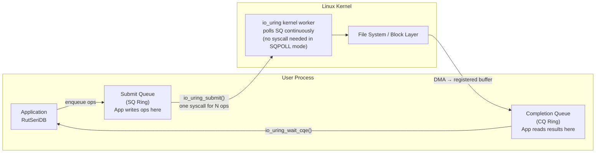
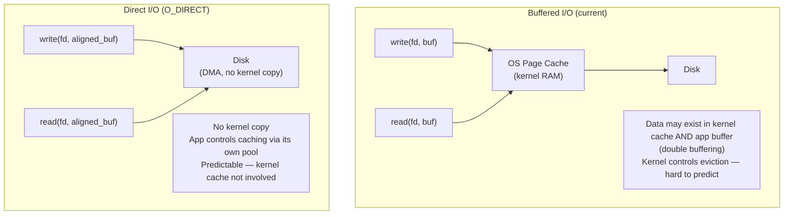
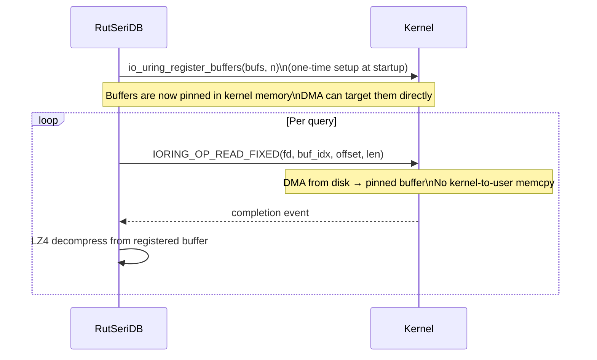
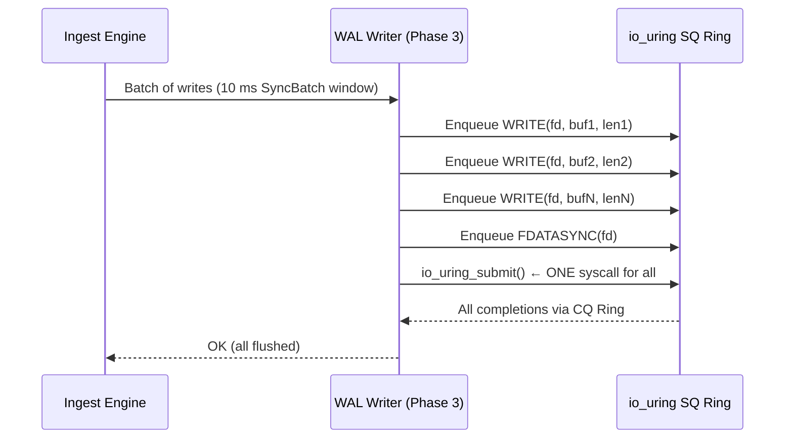
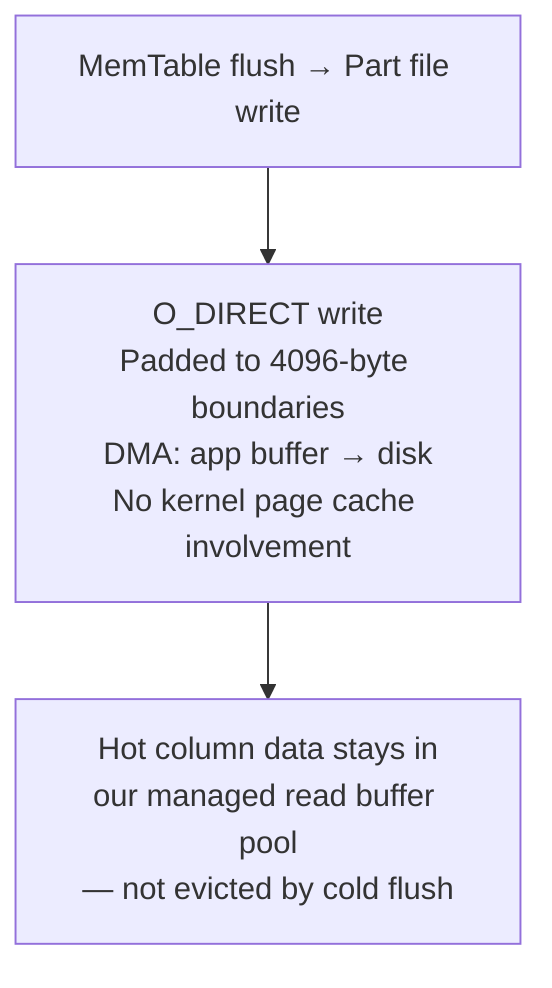
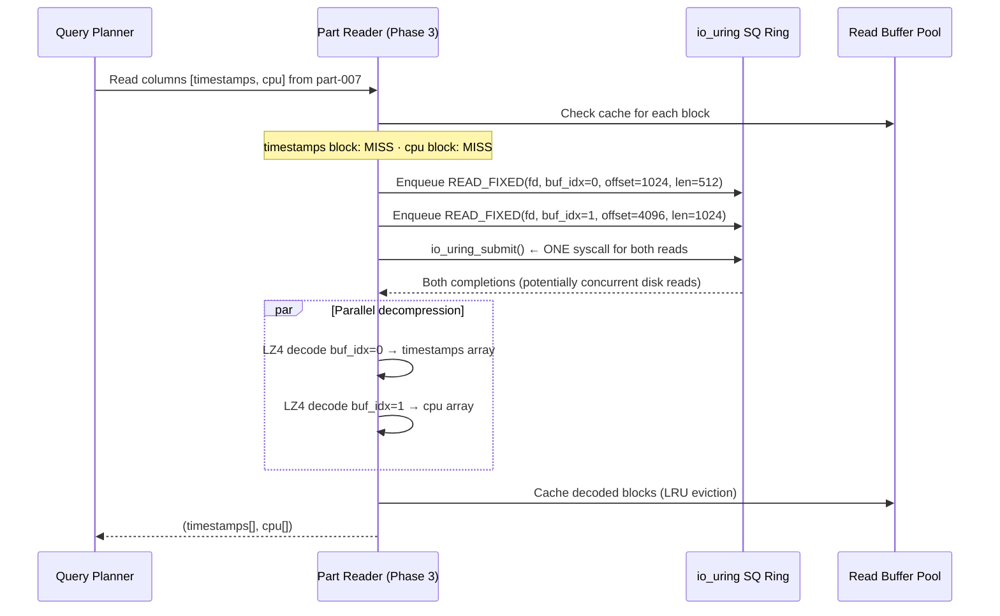
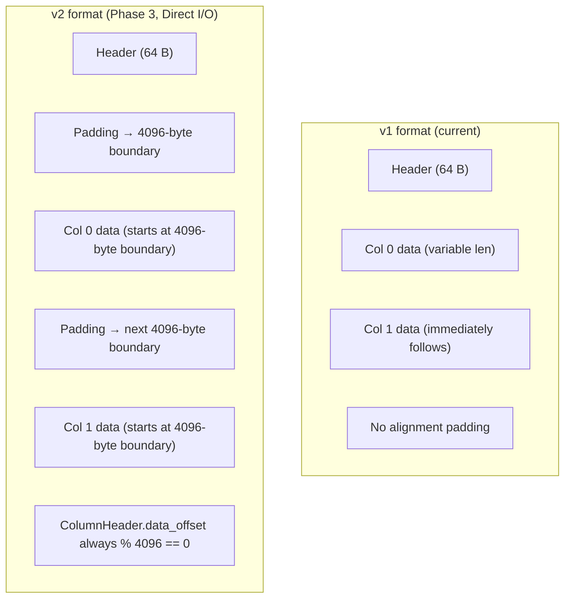
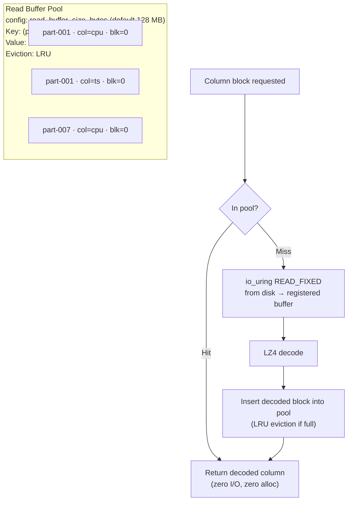
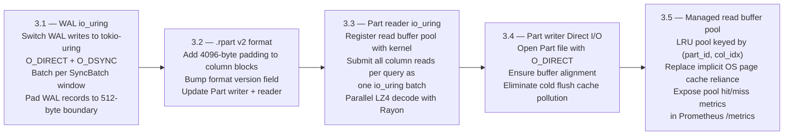

# RutSeriDB — io_uring + Direct I/O (Phase 3)

> **Related:** [architecture.md](../architecture.md) · [storage/format.md](./format.md) · [components.md](../components.md)
> **Status:** Planned — Phase 3
> **Linux kernel requirement:** ≥ 5.6 (registered buffers); ≥ 5.19 recommended

---

## Motivation

RutSeriDB's Phase 0–2 storage engine uses standard POSIX I/O via `tokio::fs` (which internally uses a blocking thread pool with `read()`/`write()`/`fsync()` syscalls). This is correct and portable, but leaves performance on the table in two areas:

| Bottleneck | Root Cause | Phase 3 Solution |
|-----------|-----------|-----------------|
| Syscall overhead per I/O | Every `read()`/`write()` is a context switch | io_uring ring buffer: batch N ops in 1 submit |
| WAL fsync under load | Sequential syscalls even for independent writes | Concurrent WAL submissions via io_uring |
| Part reads scan more files than necessary | OS page cache evicts hot columns when Parts flush | Direct I/O for Part writes: only our buffer pool is the cache |
| Multi-column reads are sequential | One `spawn_blocking` call per column block | Parallel column block reads via io_uring batch submit |

---

## io_uring Primer

io_uring uses two lock-free ring buffers shared between userspace and the kernel:

**SQPOLL mode** (optional): the kernel spins on the SQ ring when busy — completely eliminates the `io_uring_submit()` syscall too.

---

## Direct I/O (O_DIRECT)

Opening a file with `O_DIRECT` bypasses the OS page cache:

### Requirements for Direct I/O

| Requirement | Detail |
|-------------|--------|
| Buffer alignment | Buffer start address must be aligned to block size (512 B or 4096 B) |
| I/O size alignment | Read/write size must be a multiple of block size (512 B or 4096 B) |
| File offset alignment | Byte offset must be a multiple of block size |

This means `.rpart` column block boundaries must be padded to 4096-byte alignment (see [format.md § Alignment](./format.md)).

---

## io_uring Registered Buffers

The highest-performance mode: pre-register fixed buffers with the kernel so DMA can write directly into your buffer — true zero-copy from disk.

---

## Changes by Component

### WAL Writer

**File flags:** `O_WRONLY | O_APPEND | O_DIRECT | O_DSYNC`  
**Alignment:** WAL records padded to 512-byte boundaries

### Part File Writer (Flush)

Part files are written with `O_DIRECT` to prevent flushing cold data into the OS page cache — which would evict hot column data being actively queried.

### Part File Reader (Query)

---

## .rpart Format Change for Direct I/O (v2)

The `.rpart` format needs one change: **all column block start offsets must be aligned to 4096 bytes**.

- `version` field in header: `1` → `2`
- Backward compatible: v2 readers can still read v1 files (no Direct I/O on v1 files)
- v1 readers will refuse v2 files (version mismatch)

---

## Read Buffer Pool (Managed Cache)

With Direct I/O, the OS no longer caches anything. RutSeriDB must manage its own cache:

---

## Performance Impact Estimates

| Operation | Phase 0–2 | Phase 3 | Expected gain |
|-----------|----------|---------|--------------|
| WAL fsync per SyncBatch | 1 fsync syscall | 1 io_uring_submit for N writes + 1 fdatasync | N× write throughput |
| Part read — 2 columns | 2 sequential spawn_blocking | 2 concurrent io_uring READ_FIXED | ~1.5–2× for cold reads |
| Part write (flush) | Pollutes OS page cache | O_DIRECT — no cache pollution | Better cache hit rates on reads |
| Read buffer hit | OS page cache (uncontrolled) | Managed LRU pool (controlled) | More predictable latency |
| Syscall overhead under load | High (many context switches) | Near-zero (ring buffer) | 0.5–2 μs saved per op |

---

## Rust Crates

| Crate | Role |
|-------|------|
| `tokio-uring` | io_uring integration with Tokio runtime — minimal code change from `tokio::fs` |
| `io-uring` | Low-level bindings for buffer registration and advanced features |
| `aligned-vec` | `AlignedVec<u8>` for 4096-byte aligned Direct I/O buffers |

---

## Implementation Plan (Phase 3)

---

## Non-Goals for Phase 3

| Non-Goal | Reason |
|----------|--------|
| SQPOLL mode (kernel-side polling) | Extreme latency reduction; complex; adds CPU cost — revisit in v2 |
| io_uring for MemTable operations | MemTable is in-memory; no I/O involved |
| Removing LZ4 compression in favour of raw binary (QuestDB style) | Compression saves 2–5× disk and network bandwidth; critical for replication |
| mmap-based reads | mmap has TLB shootdown costs under concurrency; Direct I/O + managed pool is better for parallel multi-column reads |

---

## Related Documents

| Document | Relevance |
|----------|-----------|
| [format.md](./format.md) | v2 alignment changes to `.rpart` layout |
| [ingestion/wal.md](../ingestion/wal.md) | WAL I/O path and durability levels |
| [components.md](../components.md) | Part Writer/Reader component details |
| [../architecture.md](../architecture.md) | Phase 3 in Implementation Checklist |
