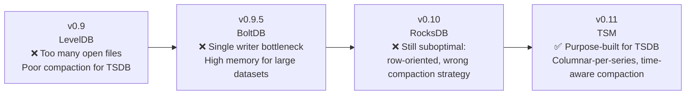
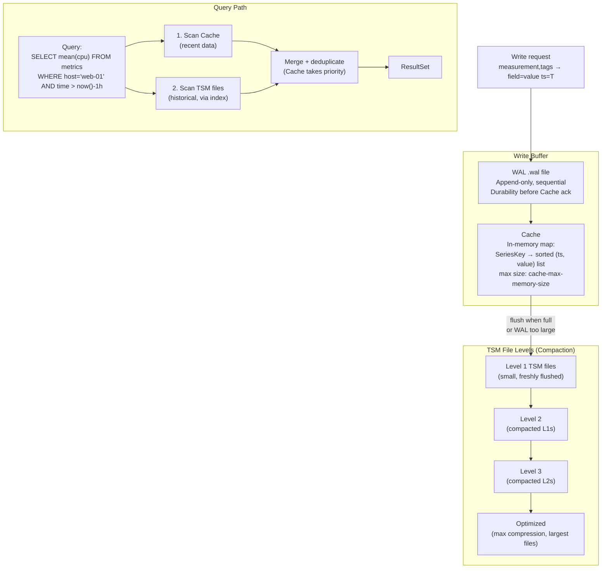
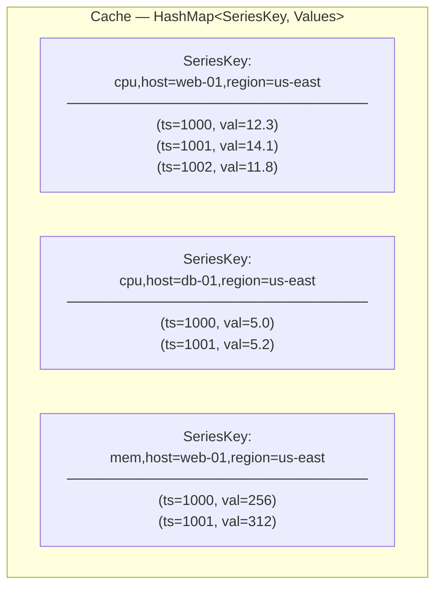
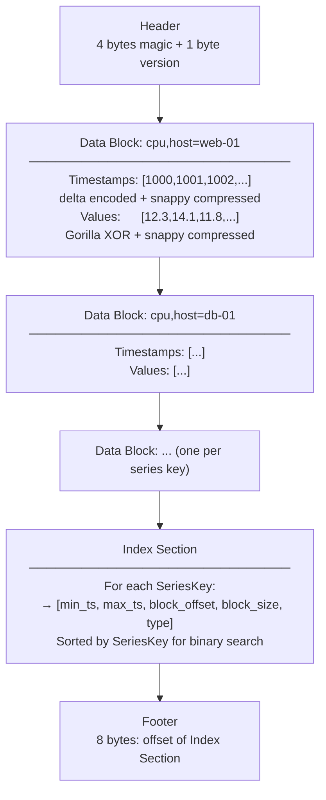
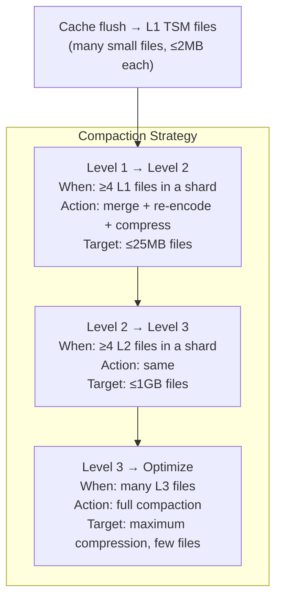
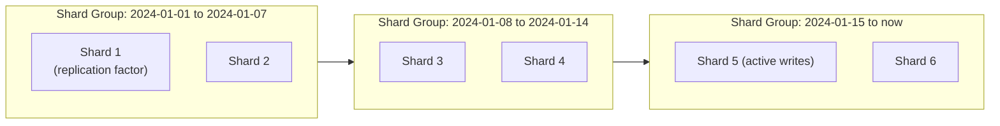
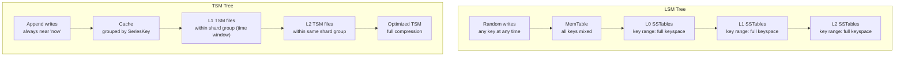
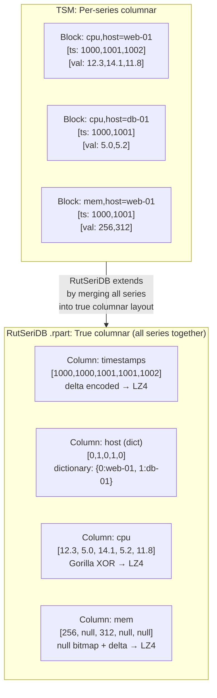
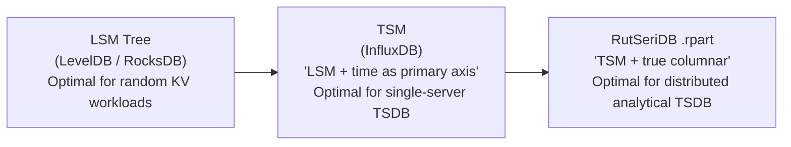

# TSM — Time-Structured Merge Tree

> **Context:** This document explains the TSM storage engine invented by InfluxDB and how it inspired RutSeriDB's storage design.
> **Version:** 0.1 (Reference)

---

## What Is TSM?

**TSM (Time-Structured Merge Tree)** is a custom storage engine developed by InfluxDB (around 2015–2016) to replace their earlier attempts using general-purpose key-value stores (BoltDB, then LevelDB/RocksDB). The core insight was:

> *LSM Tree was designed for random key-value workloads. Time-series data has a fundamentally different access pattern — time is always the dominant dimension. We should exploit that.*

TSM is best understood as **LSM Tree, restructured around time as the primary axis**.

---

## Why InfluxDB Built TSM

InfluxDB went through several storage engines before TSM:

The fundamental problems with general-purpose storage engines for TSDB:

| Problem | General KV Store (LSM) | TSM Solution |
|---------|----------------------|--------------|
| Keys are temporal | Treats timestamps as arbitrary keys → poor compression | Time is first-class; delta-encodes timestamps |
| Queries are range scans | Point-lookup optimized | Block index maps series → time range → offset |
| Data is append-only | Designs for updates + deletes | No tombstones; old data naturally falls off by time |
| Many distinct series | One bloom filter per SSTable | Per-series index within each TSM file |
| Column access (one field at a time) | Row-oriented storage | Per-series blocks = effectively columnar per metric |

---

## TSM Architecture

---

## TSM Core Data Structures

### 1. Cache (In-Memory)

A **SeriesKey** is the combination of measurement name + all tag key-value pairs. It uniquely identifies one time series. The cache maps each SeriesKey to a sorted list of `(timestamp, value)` pairs.

### 2. TSM File Format

### 3. Index Entry (per series per block)

| Field | Description |
|-------|-------------|
| `series_key` | Measurement + sorted tag set |
| `block_type` | Float, Integer, Bool, String |
| `min_ts` | Minimum timestamp in this block |
| `max_ts` | Maximum timestamp in this block |
| `offset` | Byte offset of block in the TSM file |
| `size` | Byte size of compressed block |

---

## TSM Encodings

| Data Type | Encoding |
|-----------|----------|
| Timestamps | Delta encoding → then `simple8b` (bit-packing) → Snappy |
| Floats | Gorilla XOR (same as Facebook Gorilla paper) |
| Integers | Zig-zag + `simple8b` or RLE if constant |
| Booleans | Bit-packing |
| Strings | Snappy compressed |

The encodings are chosen per-block based on the data characteristics (e.g., if all values are identical → RLE).

---

## TSM Compaction

LSM compacts to manage level overlap across the whole keyspace. TSM compacts to:
1. Reduce the number of files per shard (for query speed)
2. Increase compression (larger blocks compress better)
3. Deduplicate overlapping time ranges (from out-of-order writes)

**Key difference from LSM compaction:** TSM compacts *within a shard* (a time window, e.g. 1 week). It never re-organizes data across different time windows. Once a shard's data is outside the retention window, the entire shard directory is deleted — O(1) deletion regardless of data volume.

---

## Shard Groups (Time Partitioning)

TSM always partitions data by time into **shard groups**, analogous to RutSeriDB's time-window partitions:

- Each shard group covers a fixed time range (configurable, default 1 week for measurements, 1 day for short retention)
- Queries only touch shard groups whose time range overlaps the query's `WHERE time` clause
- Expired shard groups are dropped as a whole directory — infinitely faster than LSM tombstone compaction

---

## TSM vs LSM — Side-by-Side

| Dimension | LSM | TSM |
|-----------|-----|-----|
| Primary sort key | Arbitrary user key | SeriesKey (measurement + tags) |
| Secondary dimension | None | Time (within each series) |
| Compaction scope | Entire keyspace → complex level management | Single time-window shard → simple |
| Deletion of old data | Tombstones → expensive compaction | Shard group drop → O(1) |
| Write pattern | Random keys | Append-only to recent time window |
| Storage layout | Row-oriented | Per-series columnar (blocks) |
| Bloom filter use | Arbitrary key membership | Series key + time range index |

---

## How RutSeriDB Relates to TSM

RutSeriDB's design was inspired by TSM but takes the columnar idea further:

| Aspect | TSM | RutSeriDB |
|--------|-----|-----------|
| Column granularity | Per series per field (one block) | Per field across ALL series in a Part |
| Cross-series aggregation | Must read N series blocks | Reads one column block — true vectorized |
| Tag filtering | Series key lookup in index | Bloom filter + inverted index on tag column |
| Time partitioning | Shard groups (e.g. 1 week) | Time-window Parts (e.g. 1 hour) |
| Compaction | 4 levels within a shard | Merge Worker (flat, within a time partition) |
| Multi-node | Shards assigned to nodes | Shards with leader-follower WAL replication |
| WAL | Per-shard WAL | Per-shard WAL (same concept) |

---

## Key Takeaways

1. **LSM** solves random-write performance at the cost of compaction complexity
2. **TSM** exploits time ordering to simplify compaction and enable per-series compression
3. **RutSeriDB** goes further — merging all series into a true columnar layout (like Parquet) to enable vectorized aggregations across arbitrary tag groups, at the cost of slightly more complex merge logic

The progression is: **row store → per-series columnar (TSM) → true columnar (Parquet-style)** — each step trading write simplicity for query performance on analytical TSDB workloads.

---

## References

- [InfluxDB TSM design document (2016)](https://docs.influxdata.com/influxdb/v1/concepts/storage_engine/)
- [Gorilla: A Fast, Scalable, In-Memory Time Series Database (Facebook, 2015)](https://www.vldb.org/pvldb/vol8/p1816-teller.pdf)
- [Bitcask: A Log-Structured Hash Table (Riak, 2010)](https://riak.com/assets/bitcask-a-log-structured-hash-table-for-fast-key-value-data.pdf)
- [The Log-Structured Merge-Tree (O'Neil et al., 1996)](https://www.cs.umb.edu/~poneil/lsmtree.pdf)
