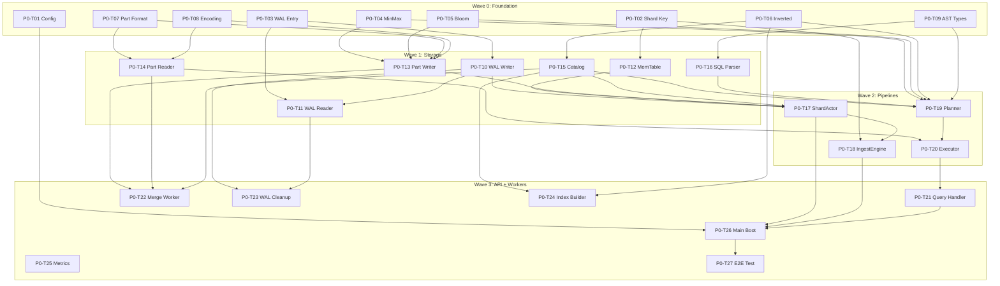

# RutSeriDB — Implementation Tasks

> **Purpose:** Actionable task breakdown for SWEs to implement RutSeriDB from skeleton → working system.
> **Status:** All skeleton code exists. Every file has `TODO(engineer)` markers. Zero business logic implemented.
> **Organization:** Tasks are grouped into **Waves** — all tasks within a wave can be worked on **in parallel** by different engineers.

---

## How to Use This Document

1. Pick a task from the current wave (all tasks in a wave are parallelizable)
2. Read the **Files**, **Deps**, and **Acceptance Criteria** sections
3. Implement the `TODO(engineer)` markers in the listed files
4. Ensure your code passes `cargo check` and unit tests before PR
5. Mark the task `[x]` when merged

### Convention
- `[ ]` — Not started
- `[/]` — In progress (add your name)
- `[x]` — Complete and merged

---

## Phase 0 — Single-Node Core

### Wave 0: Foundation (No Dependencies)

These tasks have **zero dependencies** on other implementation work. Start here.

---

#### P0-T01: Config Loading & Validation
- [ ] **Status:** Not started
- **Files:** [config.rs](../src/config/config.rs)
- **Deps:** None
- **Effort:** ~120 LOC
- **Description:**
  Implement TOML deserialization into `RutSeriConfig` and all sub-configs (`WalConfig`, `MemTableConfig`, `PartConfig`, `ServerConfig`, etc.). Add validation for invalid combinations (e.g., `flush_threshold = 0`).
- **Acceptance Criteria:**
  - [ ] `RutSeriConfig::load(path)` parses a TOML file successfully
  - [ ] `RutSeriConfig::default()` returns sane defaults matching `docs/architecture.md`
  - [ ] Invalid configs return `RutSeriError::Config` with descriptive messages
  - [ ] Add sub-configs: `GossipConfig`, `RaftConfig` (struct definitions only — Phase 1 will use them)
  - [ ] Unit test: round-trip TOML → struct → TOML

---

#### P0-T02: Shard Key Computation
- [ ] **Status:** Not started
- **Files:** [shard_key.rs](../src/common/shard_key.rs)
- **Deps:** None
- **Effort:** ~30 LOC
- **Description:**
  Implement `compute_shard_id(tags: &TagSet, num_shards: u32) -> ShardId`. Hash primary tags using xxhash64 over sorted `key=value\0` pairs, then modulo `num_shards`.
- **Acceptance Criteria:**
  - [ ] Deterministic: same tags always produce same shard ID
  - [ ] Sorted by key before hashing (BTreeMap guarantees this)
  - [ ] Unit test: verify hash stability across runs
  - [ ] Unit test: verify uniform distribution across shards (chi-squared or visual)

---

#### P0-T03: WAL Entry Serialization
- [ ] **Status:** Not started
- **Files:** [entry.rs](../src/storage/wal/entry.rs)
- **Deps:** None
- **Effort:** ~80 LOC
- **Description:**
  Implement binary serialization/deserialization for `WalEntry` and `WalRecord`. Each record has framing: `[magic: 4B][seq: 8B][len: 4B][payload: N B][crc32: 4B]`. Use `crc32fast` for checksums.
- **Acceptance Criteria:**
  - [ ] `WalRecord::to_bytes(&self) -> Vec<u8>` produces framed binary
  - [ ] `WalRecord::from_bytes(buf: &[u8]) -> Result<(WalRecord, usize)>` parses and verifies CRC
  - [ ] CRC mismatch returns `RutSeriError::WalCrcMismatch`
  - [ ] Unit test: round-trip serialization for `Write`, `Checkpoint` entry types
  - [ ] Unit test: corrupt a byte → CRC error detected

---

#### P0-T04: MinMax Index
- [ ] **Status:** Not started
- **Files:** [minmax.rs](../src/storage/index/minmax.rs)
- **Deps:** None
- **Effort:** ~60 LOC
- **Description:**
  Implement `MinMaxIndex` — per-column min/max values for time and numeric fields. Built at Part flush time, used by QueryPlanner to prune Parts.
- **Acceptance Criteria:**
  - [ ] `MinMaxIndex::build(rows: &[Row], columns: &[String]) -> Self`
  - [ ] `MinMaxIndex::may_contain(column, min_val, max_val) -> bool`
  - [ ] Handles `Timestamp`, `Float`, `Int` column types
  - [ ] Serializable with serde (for Part file footer)
  - [ ] Unit test: build from 1000 rows, check range prune works

---

#### P0-T05: Bloom Filter
- [ ] **Status:** Not started
- **Files:** [bloom.rs](../src/storage/index/bloom.rs)
- **Deps:** None
- **Effort:** ~100 LOC
- **Description:**
  Implement a blocked Bloom filter with configurable FPR ≤1%. Used for tag equality checks and configured field columns. Built at Part flush time.
- **Acceptance Criteria:**
  - [ ] `BloomFilter::build(values: &[&str], fpr: f64) -> Self`
  - [ ] `BloomFilter::may_contain(value: &str) -> bool`
  - [ ] False positive rate ≤ 1% (verified with test)
  - [ ] Serializable to/from bytes (for embedding in Part files)
  - [ ] Unit test: insert 10K values, check 0 false negatives, FPR within bounds

---

#### P0-T06: Inverted Index
- [ ] **Status:** Not started
- **Files:** [inverted.rs](../src/storage/index/inverted.rs)
- **Deps:** None
- **Effort:** ~60 LOC
- **Description:**
  Implement `InvertedIndex` — a `tag_key:tag_value → Set<PartId>` mapping. Used by Catalog for fast Part lookup by tag. Persisted as part of Catalog JSON.
- **Acceptance Criteria:**
  - [ ] `add(tag_key, tag_value, part_id)` and `remove(part_id)`
  - [ ] `lookup(tag_key, tag_value) -> Vec<Uuid>` returns matching Part IDs
  - [ ] Serializable with serde (Catalog stores this in JSON)
  - [ ] Unit test: add/remove/lookup with multiple tags and Parts

---

#### P0-T07: Part File Format Constants
- [ ] **Status:** Not started
- **Files:** [format.rs](../src/storage/part/format.rs)
- **Deps:** None
- **Effort:** ~80 LOC
- **Description:**
  Implement binary format constants and struct serialization for `.rpart` file layout: `FileHeader`, `ColumnHeader`, `Footer`. Define magic bytes, version, column type codes.
- **Acceptance Criteria:**
  - [ ] `FileHeader::to_bytes()`/`from_bytes()` round-trips
  - [ ] `ColumnHeader::to_bytes()`/`from_bytes()` round-trips
  - [ ] `Footer` includes MinMax index offsets, bloom filter offsets, column count
  - [ ] Magic bytes: `b"RPART\x01"` (or similar)
  - [ ] Unit test: round-trip all structs

---

#### P0-T08: Column Encoding/Decoding
- [ ] **Status:** Not started
- **Files:** [encoding.rs](../src/storage/part/encoding.rs)
- **Deps:** None
- **Effort:** ~150 LOC
- **Description:**
  Implement column-level compression codecs:
  - **Delta encoding** for timestamps (i64 delta-of-deltas)
  - **Gorilla XOR** for float fields
  - **Dictionary encoding** for tag string columns
  - **LZ4 block compression** as final pass (using `lz4_flex`)
- **Acceptance Criteria:**
  - [ ] `encode_i64_delta(values: &[i64]) -> Vec<u8>` + decode round-trips
  - [ ] `encode_f64_gorilla(values: &[f64]) -> Vec<u8>` + decode round-trips
  - [ ] `encode_dictionary(values: &[String]) -> Vec<u8>` + decode round-trips
  - [ ] `compress_lz4(data: &[u8]) -> Vec<u8>` + decompress round-trips
  - [ ] Unit test: encode→decode 10K values, verify exact match

---

#### P0-T09: SQL AST Types
- [ ] **Status:** Not started
- **Files:** [ast.rs](../src/query/ast.rs)
- **Deps:** None
- **Effort:** ~60 LOC, mostly types
- **Description:**
  Define the internal AST types that the parser produces and the planner consumes: `SelectStmt`, `Filter`, `Aggregation`, `OrderBy`, `Limit`, `Predicate`, `Column`, etc.
- **Acceptance Criteria:**
  - [ ] All AST nodes are `Debug + Clone`
  - [ ] `Predicate` enum covers: `Eq`, `Ne`, `Lt`, `Gt`, `Lte`, `Gte`, `Between`, `Regex`
  - [ ] `Aggregation` enum covers: `Count`, `Sum`, `Mean`, `Min`, `Max`
  - [ ] No business logic — pure data types
  - [ ] Documented with doc comments

---

### Wave 1: Storage Layer (Depends on Wave 0)

These tasks depend on specific Wave 0 tasks being complete.

---

#### P0-T10: WAL Writer
- [ ] **Status:** Not started
- **Files:** [writer.rs](../src/storage/wal/writer.rs)
- **Deps:** P0-T03 (WAL Entry Serialization)
- **Effort:** ~130 LOC
- **Description:**
  Implement the append-only WAL writer. Creates shard WAL directory, opens segment files, appends framed entries, handles fsync per durability level, and rotates segments at size threshold.
- **Acceptance Criteria:**
  - [ ] `WalWriter::new(dir, durability, max_segment_bytes)` creates dir if missing, finds/opens latest segment
  - [ ] `append(&mut self, entry)` writes framed bytes, returns seq number
  - [ ] `fsync()` calls `File::sync_data()` on active segment
  - [ ] `rotate_segment()` seals current segment, opens new numbered segment
  - [ ] Segment naming: `00000001.rwal`, `00000002.rwal`, etc.
  - [ ] Unit test: append 100 entries, verify seq numbers are sequential
  - [ ] Unit test: verify rotation triggers at `max_segment_bytes`

---

#### P0-T11: WAL Reader (Crash Recovery)
- [ ] **Status:** Not started
- **Files:** [reader.rs](../src/storage/wal/reader.rs)
- **Deps:** P0-T03, P0-T10
- **Effort:** ~80 LOC
- **Description:**
  Implement WAL replay for crash recovery. Reads all segment files in order, deserializes entries, verifies CRC, skips entries before last checkpoint.
- **Acceptance Criteria:**
  - [ ] `WalReader::new(shard_wal_dir)` finds all `.rwal` segment files
  - [ ] `replay(on_entry: F)` iterates entries in sequence order
  - [ ] Skips entries at or before last `Checkpoint` entry
  - [ ] Handles truncated last entry (partial write → skip, not error)
  - [ ] CRC mismatch → returns `RutSeriError::WalCrcMismatch`
  - [ ] Integration test: write 100 entries, checkpoint at 50, replay → get entries 51-100

---

#### P0-T12: MemTable Insert + Tag Hash
- [ ] **Status:** Not started
- **Files:** [memtable.rs](../src/storage/memtable/memtable.rs)
- **Deps:** P0-T02 (Shard Key for xxhash tag hashing)
- **Effort:** ~40 LOC (partially implemented)
- **Description:**
  Complete the `insert()` method: compute `tag_hash` from `row.tags` using xxhash64 (same hash function as shard key), and update `estimated_bytes` accurately.
- **Acceptance Criteria:**
  - [ ] `tag_hash` computed via xxhash64 over sorted `key=value\0` pairs
  - [ ] `estimated_bytes` accounts for key size + tag strings + field values
  - [ ] Rows with same `(timestamp, tag_hash)` overwrite (last-write-wins)
  - [ ] Existing tests still pass
  - [ ] New test: insert rows with same tags → verify dedup by timestamp

---

#### P0-T13: Part Writer (MemTable → .rpart)
- [ ] **Status:** Not started
- **Files:** [writer.rs](../src/storage/part/writer.rs)
- **Deps:** P0-T04, P0-T05, P0-T07, P0-T08
- **Effort:** ~150 LOC
- **Description:**
  Implement `PartWriter::flush()` — takes a MemTable snapshot, writes a columnar `.rpart` file with encoded columns, MinMax index in footer, and Bloom filters for tags.
- **Acceptance Criteria:**
  - [ ] Writes atomic: tmp file → fsync → rename to final path
  - [ ] Columns encoded per type: delta for timestamps, gorilla for floats, dictionary for string tags
  - [ ] LZ4 compressed after encoding
  - [ ] `MinMaxIndex` embedded in footer
  - [ ] `BloomFilter` for tag columns embedded in footer
  - [ ] Returns `PartMeta` with `id`, `path`, `min_ts`, `max_ts`, `size_bytes`, `row_count`
  - [ ] Unit test: flush 1000 rows → verify file exists and `PartMeta` correct

---

#### P0-T14: Part Reader (Projection + Predicate Pushdown)
- [ ] **Status:** Not started
- **Files:** [reader.rs](../src/storage/part/reader.rs)
- **Deps:** P0-T07, P0-T08 (format, encoding)
- **Effort:** ~120 LOC
- **Description:**
  Implement `PartReader::read()` — opens a `.rpart` file, reads only projected columns, decodes them, applies predicate filters, returns matching rows.
- **Acceptance Criteria:**
  - [ ] Only reads requested columns (projection pushdown — skips unrequested columns)
  - [ ] Decompresses LZ4 → decodes per-column codec
  - [ ] `read_minmax()` reads only the footer MinMax index (no column I/O)
  - [ ] `read_bloom()` reads only the footer Bloom filters
  - [ ] Integration test: write → read → verify all rows match
  - [ ] Integration test: project 2/5 columns → verify only those are returned

---

#### P0-T15: Catalog (Part Registry + Persistence)
- [ ] **Status:** Not started
- **Files:** [catalog.rs](../src/storage/catalog/catalog.rs)
- **Deps:** P0-T06 (Inverted Index)
- **Effort:** ~150 LOC
- **Description:**
  Implement the local Part registry: `add_part`, `remove_part`, `list_parts`, plus inverted index operations. Persists as atomic JSON replace (write tmp → rename).
- **Acceptance Criteria:**
  - [ ] `add_part(table, meta)` registers a Part and returns OK
  - [ ] `remove_part(table, part_id)` removes from registry + inverted index
  - [ ] `list_parts(table)` returns all Part metadata sorted by `min_ts`
  - [ ] `lookup_inverted(table, tag_key, tag_value)` returns matching Part UUIDs
  - [ ] `update_inverted(table, part_id, tag_entries)` adds to inverted index
  - [ ] `persist(shard_dir)` writes `catalog.json` atomically (tmp → fsync → rename)
  - [ ] `Catalog::load(shard_dir)` loads from JSON
  - [ ] Unit test: add 5 parts, persist, reload, verify equality

---

#### P0-T16: SQL Parser
- [ ] **Status:** Not started
- **Files:** [parser.rs](../src/query/parser.rs)
- **Deps:** P0-T09 (AST types)
- **Effort:** ~100 LOC
- **Description:**
  Wrap the `sqlparser` crate to parse SQL strings into our internal AST types. Handle `SELECT`, `WHERE`, `GROUP BY`, `ORDER BY`, `LIMIT`. Convert `sqlparser::ast` → `query::ast`.
- **Acceptance Criteria:**
  - [ ] `parse(sql: &str) -> Result<SelectStmt>` converts SQL to our AST
  - [ ] Supports: `SELECT col1, col2 FROM table WHERE tag = 'val' AND ts > 100`
  - [ ] Supports: `SELECT mean(cpu) FROM metrics GROUP BY time(5m)`
  - [ ] Supports: `ORDER BY timestamp DESC LIMIT 100`
  - [ ] Invalid SQL → `RutSeriError::QueryParse` with descriptive message
  - [ ] Unit test: parse 5+ varied SQL strings, verify AST structure

---

### Wave 2: Write + Query Paths (Depends on Wave 1)

These tasks assemble the storage components into working pipelines.

---

#### P0-T17: ShardActor — process_batch + trigger_flush
- [ ] **Status:** Not started
- **Files:** [shard_actor.rs](../src/ingest/shard_actor.rs)
- **Deps:** P0-T10 (WAL Writer), P0-T12 (MemTable), P0-T13 (Part Writer), P0-T15 (Catalog)
- **Effort:** ~60 LOC (actor loop already coded)
- **Description:**
  Implement the two remaining `todo!()` methods in `ShardActor`:
  1. `process_batch()` — WAL append + fsync + MemTable insert
  2. `trigger_flush()` — snapshot MemTable, spawn blocking flush, update Catalog, WAL checkpoint
- **Acceptance Criteria:**
  - [ ] `process_batch`: builds `WalEntry::Write`, calls `wal.append()` + `wal.fsync()` + `memtable.insert()`
  - [ ] `trigger_flush`: takes MemTable snapshot, clears MemTable, spawns `PartWriter::flush()` on `spawn_blocking`
  - [ ] After flush: calls `catalog.add_part()`, `catalog.persist()`, `wal.checkpoint()`
  - [ ] Group commit works: 10 concurrent writes → 1 fsync
  - [ ] Integration test: spawn ShardActor, send 100 writes via ShardHandle, verify MemTable has all rows

---

#### P0-T18: IngestEngine — Schema Validation + Shard Routing
- [ ] **Status:** Not started
- **Files:** [engine.rs](../src/ingest/engine.rs)
- **Deps:** P0-T02 (Shard Key), P0-T17 (ShardActor)
- **Effort:** ~80 LOC
- **Description:**
  Implement `IngestEngine::ingest()`:
  1. Lookup table schema from local schema registry
  2. Validate rows against schema (column types, required primary tags)
  3. Compute shard key per row
  4. Group rows by shard ID
  5. Dispatch each group to the correct `ShardHandle.write()` 
  6. Await all results
- **Acceptance Criteria:**
  - [ ] Missing primary tag → `RutSeriError::MissingPrimaryTag`
  - [ ] Unknown table → `RutSeriError::UnknownTable`
  - [ ] Type mismatch → `RutSeriError::SchemaValidation`
  - [ ] Multiple shards: rows are split and dispatched to correct actors
  - [ ] Unit test: mock ShardHandles, verify correct routing

---

#### P0-T19: Query Planner (Index-Aware Pruning)
- [ ] **Status:** Not started
- **Files:** [planner.rs](../src/query/planner.rs)
- **Deps:** P0-T04, P0-T05, P0-T06, P0-T09, P0-T15, P0-T16
- **Effort:** ~120 LOC
- **Description:**
  Implement `QueryPlanner::plan()` — takes AST + Catalog + indexes, produces a `PhysicalPlan` listing which Parts to scan with which predicates. Applies pruning in order:
  1. **Inverted Index** — tag equality → candidate Part IDs
  2. **MinMax Index** — time/value range → prune Parts
  3. **Bloom Filter** — remaining equality → prune Parts
- **Acceptance Criteria:**
  - [ ] `plan(ast, catalog, shard_dir) -> PhysicalPlan`
  - [ ] `PhysicalPlan` contains: `parts_to_scan: Vec<PartMeta>`, `projection`, `predicates`, `aggregation`
  - [ ] Inverted index prune: `WHERE host='web-01'` → only Parts containing `host=web-01`
  - [ ] MinMax prune: `WHERE ts > X` → skip Parts with `max_ts < X`
  - [ ] Bloom prune: `WHERE region='us-east'` → check bloom filter, skip if definitely absent
  - [ ] Unit test: create Catalog with 10 Parts, plan with filters → verify correct pruning

---

#### P0-T20: Query Executor (Scan + Filter + Aggregate)
- [ ] **Status:** Not started
- **Files:** [executor.rs](../src/query/executor.rs)
- **Deps:** P0-T14 (Part Reader), P0-T19 (Planner)
- **Effort:** ~120 LOC
- **Description:**
  Implement `QueryExecutor::execute()` — takes PhysicalPlan, reads Parts + MemTable snapshot, applies filters, computes aggregations, returns Arrow `RecordBatch`.
- **Acceptance Criteria:**
  - [ ] Reads from Part files using `PartReader::read()` with projection
  - [ ] Merges Part data with MemTable snapshot data
  - [ ] Applies remaining predicates (post-index)
  - [ ] Computes aggregations (`mean`, `sum`, `count`, `min`, `max`)
  - [ ] Handles `GROUP BY time(interval)` for downsampling
  - [ ] Returns `Vec<RecordBatch>` (Arrow format)
  - [ ] Integration test: ingest 1000 rows → query with filter → verify results

---

### Wave 3: API + Background Workers (Depends on Wave 2)

---

#### P0-T21: Query Handler — Connect API to QueryEngine
- [ ] **Status:** Not started
- **Files:** [query_handler.rs](../src/api/query_handler.rs), [server.rs](../src/api/server.rs)
- **Deps:** P0-T20 (Query Executor)
- **Effort:** ~50 LOC
- **Description:**
  Connect the `POST /api/v1/query` endpoint to the QueryEngine. Parse SQL from request, execute, convert Arrow RecordBatch to JSON, return response.
- **Acceptance Criteria:**
  - [ ] `handle_query()` calls `QueryEngine::execute(sql)`
  - [ ] Converts `RecordBatch` → JSON rows using `arrow::json::writer`
  - [ ] Returns `QueryResponse { rows, row_count }`
  - [ ] SQL parse errors → 400 Bad Request
  - [ ] Integration test: start server, POST query, verify JSON response

---

#### P0-T22: Background — Merge Worker
- [ ] **Status:** Not started
- **Files:** [merge_worker.rs](../src/background/merge_worker.rs)
- **Deps:** P0-T13, P0-T14, P0-T15
- **Effort:** ~80 LOC
- **Description:**
  Implement the background merge worker: periodically scans the Catalog for small Parts, merges N → 1 larger Part using PartReader + PartWriter, updates Catalog.
- **Acceptance Criteria:**
  - [ ] Selects merge candidates: Parts smaller than threshold, same table
  - [ ] Reads all candidate Parts, deduplicates rows (latest timestamp wins)
  - [ ] Writes merged Part via PartWriter
  - [ ] Updates Catalog: add merged Part, remove source Parts
  - [ ] Deletes source Part files from disk
  - [ ] Runs on configurable interval (default: 60s)
  - [ ] Unit test: create 5 small Parts, run merge, verify 1 larger Part

---

#### P0-T23: Background — WAL Cleanup
- [ ] **Status:** Not started
- **Files:** [wal_cleanup.rs](../src/background/wal_cleanup.rs)
- **Deps:** P0-T10, P0-T11
- **Effort:** ~40 LOC
- **Description:**
  Delete WAL segment files that are fully checkpointed. Reads the latest checkpoint from Catalog, deletes all segments where `max_seq <= checkpoint_seq`.
- **Acceptance Criteria:**
  - [ ] Identifies segments safe to delete (all entries checkpointed)
  - [ ] Deletes files from disk
  - [ ] Never deletes the active segment
  - [ ] Runs on configurable interval (default: 300s)
  - [ ] Unit test: create 3 segments, checkpoint at segment 2 → only segment 1 deleted

---

#### P0-T24: Background — Index Builder
- [ ] **Status:** Not started
- **Files:** [index_builder.rs](../src/background/index_builder.rs)
- **Deps:** P0-T15 (Catalog), P0-T06 (Inverted Index)
- **Effort:** ~50 LOC
- **Description:**
  Background worker that scans newly flushed Parts and updates the Catalog's inverted index. Receives Part IDs via channel from ShardActor's flush path.
- **Acceptance Criteria:**
  - [ ] Listens on `mpsc::Receiver<(table, PartMeta)>` for new Parts
  - [ ] Reads tag columns from the Part file
  - [ ] Calls `catalog.update_inverted(table, part_id, tag_entries)`
  - [ ] Persists updated Catalog
  - [ ] Unit test: send a Part notification → verify inverted index updated

---

#### P0-T25: Background — Metrics
- [ ] **Status:** Not started
- **Files:** [metrics.rs](../src/background/metrics.rs)
- **Deps:** None (can start anytime, but useful after Wave 2)
- **Effort:** ~50 LOC
- **Description:**
  Expose internal metrics as Prometheus-compatible gauges. Track: WAL size, MemTable size, Part count, query latency, ingest throughput.
- **Acceptance Criteria:**
  - [ ] Struct `Metrics` with atomic counters
  - [ ] `GET /metrics` endpoint returns Prometheus text format
  - [ ] Tracks: `rutseridb_wal_bytes_total`, `rutseridb_memtable_bytes`, `rutseridb_parts_total`, `rutseridb_ingest_rows_total`
  - [ ] Thread-safe (AtomicU64 or similar)

---

#### P0-T26: Main — Boot Sequence
- [ ] **Status:** Not started
- **Files:** [main.rs](../src/main.rs)
- **Deps:** P0-T01 (Config), P0-T17, P0-T18, P0-T21
- **Effort:** ~60 LOC
- **Description:**
  Wire everything together in `main()`:
  1. Parse CLI args (clap)
  2. Load config from TOML
  3. Initialize WAL, MemTable, Catalog per shard
  4. Spawn ShardActors
  5. Initialize IngestEngine with ShardHandles
  6. Initialize QueryEngine
  7. Start axum HTTP server
- **Acceptance Criteria:**
  - [ ] `cargo run -- --config config.toml` boots successfully
  - [ ] `GET /health` returns `OK`
  - [ ] `POST /api/v1/write` ingests and returns 200
  - [ ] `POST /api/v1/query` executes SQL and returns JSON
  - [ ] Graceful shutdown on SIGTERM
  - [ ] Integration test: full end-to-end write → query

---

## Phase 0 — End-to-End Integration Test

#### P0-T27: E2E Smoke Test
- [ ] **Status:** Not started
- **Files:** `tests/e2e_smoke.rs` (NEW)
- **Deps:** All of Phase 0
- **Effort:** ~100 LOC
- **Description:**
  Integration test that boots the entire system, writes data, queries it, verifies results, and shuts down cleanly.
- **Acceptance Criteria:**
  - [ ] Start server on random port
  - [ ] Write 1000 rows across 3 tables via HTTP API
  - [ ] Query each table with filters → verify correct row counts
  - [ ] Query with aggregation → verify correct values
  - [ ] Shutdown cleanly (no panics, no leaked temp files)

---

## Phase 1 — Distribution Layer

> **Prerequisite:** Phase 0 must be fully working before starting Phase 1.

### Wave 4: Cluster Foundation (Can Parallelize)

---

#### P1-T01: SWIM Gossip Protocol
- [ ] **Status:** Not started
- **Files:** [swim.rs](../src/gossip/swim.rs), [membership.rs](../src/gossip/membership.rs)
- **Deps:** Phase 0 complete
- **Effort:** ~250 LOC
- **Description:**
  Implement the SWIM protocol for failure detection:
  - Direct ping every `probe_interval` (1s default)
  - Indirect probe via K random peers if direct ping fails
  - Suspect → Dead state machine with configurable timeouts
  - UDP transport for protocol messages
- **Acceptance Criteria:**
  - [ ] `SwimNode::start(bind_addr, seed_peers)` begins protocol loop
  - [ ] Membership list converges within O(log N) probe intervals
  - [ ] Dead node detected within `suspect_timeout + dead_timeout` (~5s default)
  - [ ] `MembershipList` provides `alive_nodes()`, `on_event(callback)` for listeners
  - [ ] Unit test: 3-node cluster, kill 1, verify detection within timeout

---

#### P1-T02: Raft Metadata State Machine
- [ ] **Status:** Not started
- **Files:** [state_machine.rs](../src/raft/state_machine.rs), [log.rs](../src/raft/log.rs), [node.rs](../src/raft/node.rs)
- **Deps:** Phase 0 complete
- **Effort:** ~300 LOC
- **Description:**
  Integrate `openraft` for metadata consensus. Implement the `RaftStateMachine` that stores: table schemas, shard-to-node assignments, and shard leader elections. Implement `RaftLogStore` backed by on-disk log.
- **Acceptance Criteria:**
  - [ ] `MetadataStateMachine` implements `openraft::RaftStateMachine`
  - [ ] `RaftLogStore` implements `openraft::RaftLogStorage` (append-only log on disk)
  - [ ] Apply operations: `CreateTable`, `DropTable`, `AssignShard`, `PromoteLeader`
  - [ ] Snapshot: serialize full metadata state for new Raft members
  - [ ] Unit test: apply 10 operations, snapshot, restore, verify state matches

---

#### P1-T03: RPC Client — gRPC Calls
- [ ] **Status:** Not started
- **Files:** [client.rs](../src/rpc/client.rs)
- **Deps:** Phase 0 complete
- **Effort:** ~100 LOC
- **Description:**
  Implement the `StorageNodeClient` methods: `write_batch`, `execute_query`, `flush_shard`, `get_replication_offset`. Each wraps a tonic gRPC call to a remote StorageNode.
- **Acceptance Criteria:**
  - [ ] `write_batch(addr, request) -> Result<WriteBatchResponse>`
  - [ ] `execute_query(addr, request) -> Result<ExecuteQueryResponse>`
  - [ ] Connection pooling via `get_channel()` (reuse tonic channels per addr)
  - [ ] Timeout handling → `RutSeriError::RpcTimeout`
  - [ ] Unreachable node → `RutSeriError::NodeUnreachable`

---

#### P1-T04: RPC Server — gRPC Service
- [ ] **Status:** Not started
- **Files:** [server.rs](../src/rpc/server.rs)
- **Deps:** Phase 0 complete
- **Effort:** ~80 LOC
- **Description:**
  Implement the `StorageNodeServer` that receives gRPC calls from the Coordinator, delegates to the local IngestEngine and QueryExecutor.
- **Acceptance Criteria:**
  - [ ] `serve(addr)` starts tonic gRPC server
  - [ ] `handle_write_batch` delegates to `IngestEngine::ingest()`
  - [ ] `handle_execute_query` delegates to `QueryExecutor::execute()`
  - [ ] `handle_flush_shard` triggers shard flush
  - [ ] Integration test: start server, call via client, verify round-trip

---

### Wave 5: Coordinator (Depends on Wave 4)

---

#### P1-T05: Metadata Catalog (Raft-Replicated)
- [ ] **Status:** Not started
- **Files:** [metadata_catalog.rs](../src/coordinator/metadata_catalog.rs)
- **Deps:** P1-T02 (Raft)
- **Effort:** ~150 LOC
- **Description:**
  Implement `MetadataCatalog` — wraps the Raft state machine to provide a consistent view of cluster metadata (schemas, shard map). All writes go through Raft propose.
- **Acceptance Criteria:**
  - [ ] `get_table_schema(table) -> Option<TableSchema>` reads from local Raft state
  - [ ] `get_shard_assignment(shard_id) -> ShardAssignment` with leader + replicas
  - [ ] `propose_create_table(schema)` → Raft propose → applied on commit
  - [ ] `apply(op)` handles all `MetadataOp` variants
  - [ ] Consistent reads: always reads from committed Raft state

---

#### P1-T06: Write Router
- [ ] **Status:** Not started
- **Files:** [write_router.rs](../src/coordinator/write_router.rs)
- **Deps:** P1-T03 (RPC Client), P1-T05 (Metadata Catalog)
- **Effort:** ~80 LOC
- **Description:**
  Route write requests to the correct StorageNode:
  1. Extract primary tags from rows
  2. Compute shard key
  3. Lookup shard leader from MetadataCatalog
  4. Forward via `StorageNodeClient::write_batch()`
- **Acceptance Criteria:**
  - [ ] `route_write(batch) -> Result<()>` routes to correct leader
  - [ ] Multiple shards in one batch → fan-out to multiple nodes
  - [ ] Leader not found → `RutSeriError::LeaderNotFound`
  - [ ] Node unreachable → retry or return error

---

#### P1-T07: Distributed Query Planner + Read Router
- [ ] **Status:** Not started
- **Files:** [query_planner.rs](../src/coordinator/query_planner.rs), [read_router.rs](../src/coordinator/read_router.rs)
- **Deps:** P1-T03, P1-T05
- **Effort:** ~150 LOC
- **Description:**
  Fan-out queries to multiple StorageNodes:
  1. Parse SQL, determine which shards to query
  2. Send sub-queries to each StorageNode via gRPC
  3. Merge Arrow RecordBatches from all responses
  4. Apply final aggregations/ordering
  Support `consistency=ONE` (read from any replica) and `consistency=QUORUM`.
- **Acceptance Criteria:**
  - [ ] `execute(sql, consistency) -> Vec<RecordBatch>` fans out and merges
  - [ ] `ReadRouter::select_read_targets()` picks nodes based on consistency level
  - [ ] `merge_results()` correctly merges and de-duplicates
  - [ ] `consistency=ONE` → read from any single replica (fastest)
  - [ ] `consistency=QUORUM` → read from majority

---

#### P1-T08: Cluster Manager
- [ ] **Status:** Not started
- **Files:** [cluster_manager.rs](../src/coordinator/cluster_manager.rs)
- **Deps:** P1-T01 (Gossip), P1-T02 (Raft), P1-T05 (Metadata Catalog)
- **Effort:** ~120 LOC
- **Description:**
  Orchestrates cluster membership changes:
  - Listens for SWIM gossip events (node dead/alive)
  - On node death: query replicas for replication offsets, promote best replica via Raft
  - Manages node registration and shard assignment
- **Acceptance Criteria:**
  - [ ] `run()` event loop consuming gossip events
  - [ ] `handle_node_dead(node_id)` triggers leader failover
  - [ ] `query_replica_offsets()` fans out to replicas to find most-caught-up
  - [ ] `propose_promote(shard_id, new_leader)` proposes to Raft
  - [ ] Integration test: simulate node death → verify failover

---

### Wave 6: Replication (Depends on Wave 5)

---

#### P1-T09: WAL Replication Manager
- [ ] **Status:** Not started
- **Files:** [manager.rs](../src/replication/manager.rs)
- **Deps:** P1-T03, P1-T04, P0-T10
- **Effort:** ~150 LOC
- **Description:**
  Implement leader-to-replica WAL streaming over custom TCP:
  - Leader: push new WAL entries to all replicas after fsync
  - Replica: receive entries, append to local WAL, insert into MemTable
  - Length-prefixed framing for low overhead
- **Acceptance Criteria:**
  - [ ] `ReplicationManager::start_streaming(shard_id, replica_addr)` opens TCP connection
  - [ ] `push_entries(entries)` sends batch of entries to all replicas
  - [ ] `add_replica(addr)` connects and starts streaming
  - [ ] `remove_replica(addr)` disconnects gracefully
  - [ ] Tracks replication lag per replica (leader seq vs replica ack seq)

---

#### P1-T10: Snapshot Sync
- [ ] **Status:** Not started
- **Files:** [snapshot.rs](../src/replication/snapshot.rs)
- **Deps:** P1-T09
- **Effort:** ~80 LOC
- **Description:**
  Full snapshot sync for re-joining replicas that are too far behind for WAL catchup:
  - Leader: send all Part files + Catalog snapshot
  - Replica: receive, write to disk, update local state
- **Acceptance Criteria:**
  - [ ] `send_snapshot(shard_id, replica_addr)` sends all Part files + Catalog
  - [ ] `receive_snapshot(shard_id)` receives and writes to local shard dir
  - [ ] After snapshot: replica can resume normal WAL streaming
  - [ ] Progress reporting via tracing

---

## Dependency Graph

---

## Engineer Assignment Recommendations

| Engineer | Suggested Tasks | Domain |
|----------|----------------|--------|
| **A** | P0-T03, P0-T10, P0-T11, P0-T23 | WAL (write, read, cleanup) |
| **B** | P0-T07, P0-T08, P0-T13, P0-T14 | Part files (format, encoding, read, write) |
| **C** | P0-T04, P0-T05, P0-T06, P0-T24 | Indexes (MinMax, Bloom, Inverted, Builder) |
| **D** | P0-T02, P0-T12, P0-T17, P0-T18 | Ingest path (shard key, MemTable, Actor, Engine) |
| **E** | P0-T09, P0-T16, P0-T19, P0-T20 | Query path (AST, parser, planner, executor) |
| **F** | P0-T01, P0-T21, P0-T26, P0-T27 | Config, API, boot, E2E test |
| **G** | P0-T22, P0-T25 | Background workers, metrics |
| **H** | P1-T01, P1-T08 | Gossip + Cluster Manager |
| **I** | P1-T02, P1-T05 | Raft + Metadata Catalog |
| **J** | P1-T03, P1-T04, P1-T06, P1-T07 | RPC + Coordinator routing |
| **K** | P1-T09, P1-T10 | Replication |

> **Note:** This is a suggestion. Tasks within the same Wave can be worked on by anyone. The key constraint is the dependency graph above.

---

## Definition of Done (per task)

1. ✅ All `TODO(engineer)` markers in listed files are replaced with working code
2. ✅ `cargo check` passes with no errors from your files
3. ✅ `cargo clippy` passes with no warnings from your files
4. ✅ Unit tests pass (each task specifies which tests)
5. ✅ Docstrings on all public APIs
6. ✅ PR reviewed by at least one other engineer
